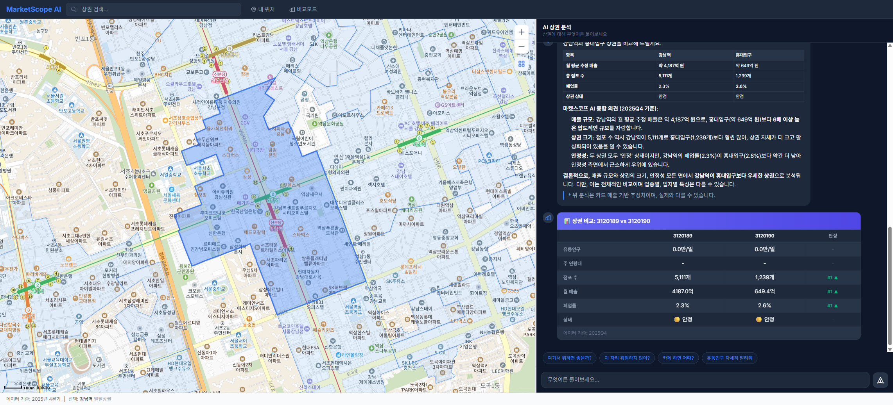
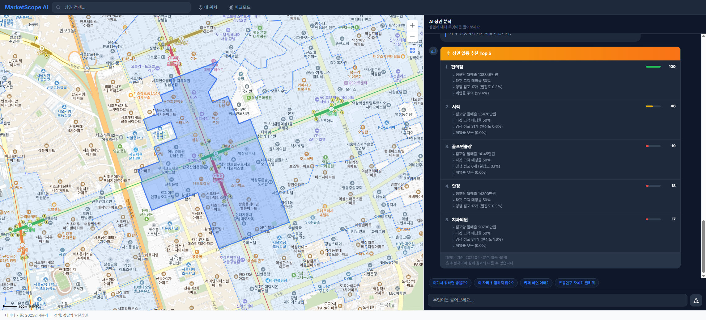

# MarketScope AI - 상권분석 AI 서비스

> 지도 기반 AI 챗봇으로 서울시 1,650개 상권을 분석하는 Freemium SaaS

소상공인/부동산 투자자가 **"지도에서 상권 선택 → AI가 분석/추천"** 하는 서비스입니다.
자연어 질문만으로 유동인구, 매출, 경쟁 현황, 업종 추천, 리스크 분석까지 한 번에 확인할 수 있습니다.

### [QuickStart Guide (처음이라면 여기부터)](docs/ops/quickstart.md)

> **5분 안에 실행**: 환경 설정 → DB 세팅 → 서비스 기동까지 한 문서로 정리했습니다.
> Mock 모드(DB 없이 바로), Seed 복원(실데이터 5분), Full ETL(API 수집) 3가지 경로를 제공합니다.

---

## 스크린샷

### 다크 테마 (기본)

*강남역 상권 선택 → AI 자동 분석 → SummaryCard (유동인구 바 차트 + Top 5 업종)*

### 라이트 테마

*업종 추천 카드 — 점수 바 + 추천 근거*

### 상권 비교 · 업종 추천


*두 상권 지표 비교표 / AI 추천 업종 Top 5 + 근거*

---

## 시스템 아키텍처

```
┌──────────────── CLIENT (Next.js 14, App Router) ────────────────┐
│  Map Panel (Kakao Map + 폴리곤/히트맵)  │  Chat Panel (SSE + Rich Card) │
└───────────────────────────┬─────────────────────────────────────┘
                            │  REST + SSE (POST /api/chat)
┌───────────────────────────▼─────────────────────────────────────┐
│  API Server (FastAPI) ── /api/chat(SSE) · /api/districts · /api/map-data │
└──────────────┬──────────────────────────────┬───────────────────┘
               ▼                              ▼
   AI Agent (v2 loop + Trust Kernel)   Data Layer
   Claude/Gemini · model-driven tools   PostgreSQL+PostGIS · Redis · 서울 열린데이터
```

> 전체 다이어그램·레이어별 상세: [docs/architecture/overview.md](docs/architecture/overview.md).

---

## 데이터 플로우

### 1. 데이터 수집 (ETL)

```
서울 열린데이터 API ── Batch ETL (분기별) ──► PostgreSQL + PostGIS
  ├ 유동인구 (VwsmTrdarFlpopQq)              ├ districts (1,650개)
  ├ 추정매출 (VwsmTrdarSelngQq)              ├ floating_population (9,888행)
  ├ 점포현황 (VwsmTrdarStorQq)               ├ estimated_sales (21,333행)
  └ 직장인구 (VwsmTrdarWrcPopltnQq)          ├ stores (75,985행)
SHP 폴리곤 ── geopandas 파싱 ──► districts.boundary (EPSG:4326)   └ resident_population (39,288행)
```

### 2. 사용자 질의 처리 (실시간)

기본 경로는 **v2 agentic loop**(모델 주도 function-calling + Trust Kernel)로, LLM 이 필요한 Tool 을 스스로
호출(예산 6턴 / 12콜 / 90초)하고, **Trust Kernel** 이 응답의 모든 수치를 Tool 반환값에 ±5% 바인딩 검증한 뒤
SSE 로 스트리밍합니다. Mock 모드(`LLM_PROVIDER=mock`)는 레거시 PAE 그래프로 폴백합니다.
SSE 이벤트 순서·계약은 [docs/architecture/agent.md](docs/architecture/agent.md) 참조.

### 3. 지도-채팅 양방향 동기화

Zustand 4 스토어(map/chat/district/toast)가 지도·채팅 상태를 공유합니다:

| 방향 | 트리거 | 결과 |
|------|--------|------|
| 지도 → 채팅 | 상권 폴리곤 클릭 | 프리뷰 카드(LLM 무호출) 즉시 표시 → "AI 분석 보기"로 전체 분석 진입 |
| 채팅 → 지도 | "홍대 보여줘" 입력 | `map_cmd` 이벤트로 지도 이동 + 폴리곤 하이라이트 |
| 양방향 | "시간대별 유동인구" | 채팅에 바 차트 + 지도에 히트맵 레이어 |

---

## 사용자 시나리오

- **① 기본 분석** — 강남역 폴리곤 클릭 → 프리뷰 카드 → "AI 분석 보기" → **SummaryCard**(분기 유동인구 바 차트 + 피크 시간대 + 월 환산 매출 + Top 5 업종) + 추천 질문 칩.
- **② 업종 추천** — "여기서 뭐하면 좋을까?" → `recommend_business` → **RecommendCard**(Top 5 + 55~95 상대 밴드 점수 + 근거 + 면책).
- **③ 상권 비교** — "강남역이랑 홍대 비교해줘" → `compare_districts` 병렬 조회 → **CompareCard**(유동인구/매출/폐업률/안정성) + 지도 동시 하이라이트.
- **④ 리스크 분석** — "이 자리 위험하지 않아?" → `get_store_history` → **RiskCard**(안정성 게이지 + 업종별 생존 기간 + 폐업 트렌드).
- **⑤ 매출 시뮬레이션** — "카페 하면 매출 얼마나 나와?" → `simulate_revenue` → **SimulationCard**(p25/평균/p75 월매출 범위 + 서울 평균 대비 + 면책).

---

## 프로젝트 구조

```
MarketScope-AI/
├── frontend/     # Next.js 14 (app/ · components/{map,chat,cards,layout} · stores · hooks · lib)  → frontend/CLAUDE.md
├── server/       # FastAPI — server/server/{main,config,agent,api,data/etl,repositories,models,services}  → server/CLAUDE.md
│                 #   agent/: runtime.py(디스패치) · loop/(v2 engine+trust) · graph.py(PAE) · tools/(9종)
├── data/         # SHP 폴리곤 + seed 덤프
├── scripts/      # 운영 스크립트 (deploy/, eval/, verify_sales_units, setup_db, …)
├── nginx/        # 내장 + 외부 리버스 프록시
├── docs/         # architecture · spec · ops · plan · qa · status  (문서 네비게이션)
└── docker-compose{,.prod,.e2e}.yml · .env.example · CLAUDE.md
```

> 레이어별 코드 가이드는 [frontend/CLAUDE.md](frontend/CLAUDE.md) · [server/CLAUDE.md](server/CLAUDE.md), 설계는 [docs/architecture/](docs/architecture/).

---

## 기술 스택

Next.js 14 · Kakao Map SDK · deck.gl · Zustand · Recharts · Tailwind (Frontend) /
FastAPI (Python 3.12, async) · **v2 Agentic Loop + Trust Kernel** (레거시 PAE=LangGraph 폴백) · Claude Sonnet → OpenAI GPT → Gemini 2.5 preferred-first fallback chain (Backend) /
PostgreSQL 16 + PostGIS · Redis 7 · Docker Compose (Infra).

> 버전·역할 상세표: [docs/architecture/overview.md §3](docs/architecture/overview.md).

---

## AI Agent Tools

등록 Tool **9종**(`@register_tool`): `get_district_summary` · `get_floating_population` · `get_estimated_sales` ·
`get_store_info` · `get_population_info` · `get_store_history` · `compare_districts` · `recommend_business` · `simulate_revenue`.
v2 루프는 여기에 메타 Tool 3종(`resolve_district` / `compute` / `abstain`)을 더해 **총 12개 스키마**를 LLM 에 제공합니다.

> 입출력·Card 매핑 상세표: [docs/architecture/agent.md §5](docs/architecture/agent.md).

---

## 빠른 시작

**사전 요구사항**: Node.js 18+ · Python 3.12+ · Docker (Real 모드) · API 키(LLM `GOOGLE_API_KEY` 또는 `ANTHROPIC_API_KEY`, Kakao Map, 서울 열린데이터).

```bash
cp .env.example .env          # API 키 입력
```

### 2A. Mock 모드 (DB 없이 빠른 실행)

```bash
# .env 에서 USE_MOCK=true 확인
cd server && pip install -e ".[dev]" && uvicorn server.main:app --reload --port 8000
cd frontend && npm install && npm run dev     # 새 터미널
```

`http://localhost:3000` → 5개 샘플 상권(강남역·홍대·건대·명동·서울역)으로 전체 기능 체험.

### 2B. Real 모드 (실제 데이터)

```bash
# .env 에서 USE_MOCK=false + 서울 열린데이터 API 키 입력
docker compose up -d db redis                 # PostGIS + Redis
cd server && alembic upgrade head             # DB 마이그레이션
python -m server.data.etl.runner run 2025Q4   # ETL 적재
uvicorn server.main:app --reload --port 8000
cd frontend && npm run dev                    # 새 터미널
```

`http://localhost:3000` → 서울시 1,650개 실제 상권 데이터로 분석.

---

## 참고 (상세 문서 링크)

- **SSE 이벤트 타입** (v2 7종 + PAE `plan`/`warning` + chat.py `map_cmd`): [docs/architecture/backend.md §4](docs/architecture/backend.md)
- **DB 스키마** (districts · floating_population · estimated_sales · stores · resident_population · …): [docs/architecture/data.md](docs/architecture/data.md)
- **개발 로드맵 / Phase** (1A·1B·3 완료 · Phase 2 Premium 미착수 · Prod 라이브): [docs/spec/feature-list.md](docs/spec/feature-list.md)
- **현재 상태 / 미결·블로커**: [docs/status/current-status.md](docs/status/current-status.md)

> 최근(2026-07-06): backend pytest 225 passed / 6 deselected(@real) · Mock E2E 131 passed(2026-07-02) · 프로덕션 배포 완료(marketscope.robitlabs.co.kr).

---

## 개발 명령어

```bash
# 린트/포맷
npx prettier --write .                   # TypeScript
cd server && ruff check --fix . && ruff format .   # Python

# 테스트
cd frontend && npm run test:e2e          # E2E (Playwright) — `npm test` 아님
cd server && pytest                      # Backend 테스트

# Docker
docker compose up -d                     # 전체 서비스 기동
docker compose up -d db redis            # DB + Redis만 기동
```

---

## 데이터 소스

| 소스 | 제공 데이터 | 갱신 주기 |
|------|-------------|-----------|
| [서울 열린데이터](https://data.seoul.go.kr) | 상권 폴리곤, 유동인구, 추정매출, 직장인구 | 분기 |
| [공공데이터포털](https://data.go.kr) | 점포 정보, 점포 이력 | 분기 |

---

## 라이선스

Private project.
