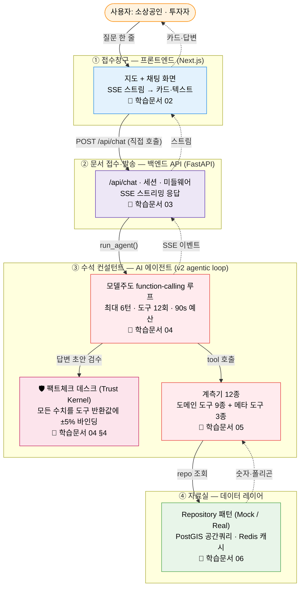

# 학습 자료: 시작하기 — MarketScope AI 전체 지도

> 대상: 이 리포지토리(`Catchment-Area-Analysis` = MarketScope AI) 전체
> 목적: 비개발자를 포함한 신규 합류자가 "이 서비스가 무엇을, 어떻게, 어떤 코드로 동작시키는가"를 처음부터 따라올 수 있도록 학습 경로를 안내한다.
> 다음: [01 큰 그림 — 한 질문의 여정](01-큰그림-한질문의여정.md)

---

## MarketScope AI 한 문단 소개

**MarketScope AI**는 서울시 **1,650개 상권**을 분석해 주는 **지도 기반 AI 챗봇 서비스**입니다. 소상공인이나 부동산 투자자가 지도에서 상권을 고른 뒤 "강남역 카페 어때?", "홍대랑 성수 비교해줘" 같은 질문을 던지면, AI가 공공데이터(유동인구·추정매출·점포 현황 등)를 해석해 **요약·비교·추천·리스크 분석**을 카드와 글로 돌려줍니다. 기술적으로는 화면(Next.js) + 서버(FastAPI) + AI 에이전트(v2 agentic loop + Trust Kernel) + 자료실(PostgreSQL/PostGIS·Redis)의 4개 계층으로 이루어져 있습니다.

---

## §0 큰 그림 — "상권 분석 컨설팅 회사"

이 서비스 전체를 **작은 컨설팅 회사 하나**라고 상상하면 머릿속에 그림이 그려집니다.

- **접수창구(프론트엔드)** — 손님을 맞는 사무실 1층. 지도와 채팅 화면을 띄워 두고, 손님의 질문을 받아 적어 서버로 올려보내고, 분석 결과가 한 줄씩 도착하는 대로 손님 테이블(화면)에 실시간으로 차려 줍니다.
- **문서 접수·발송 담당(백엔드 API)** — 질문서를 정식으로 접수하고, 이 손님이 단골인지(세션) 확인한 뒤, 컨설턴트에게 일감을 넘깁니다. 컨설턴트가 내놓는 결과를 다시 한 줄씩 손님에게 흘려보냅니다.
- **수석 컨설턴트(AI 에이전트, v2 루프)** — 회사의 심장. 미리 짜인 절차서 없이, 질문을 읽고 **계측기 12종**(유동인구 측정기·매출 스캐너·계산기·기권 버튼 …) 중 필요한 것을 그때그때 직접 골라 데이터를 모으고, 충분해지면 보고서를 씁니다. 단, 보고서는 곧바로 나가지 않습니다 — **팩트체크 데스크(Trust Kernel)** 가 보고서의 **모든 숫자**를 계측기 기록과 대조해, 근거 없는 숫자는 고치게 하거나 가리거나 보고서를 계측기 기록만으로 다시 씁니다.
- **자료실(데이터 레이어)** — 계측기가 자료를 꺼내 가는 곳. 같은 청구서식(인터페이스)에 두 종류의 캐비닛(연습용 견본 = Mock / 진짜 데이터베이스 = Real)이 있고, 사서(캐시)가 자주 찾는 자료는 미리 책상에 꺼내 둡니다.
- **품질기록실(관측, Langfuse)** — 상담 하나가 끝날 때마다 서류철(trace)과 성적표(score)가 기록실에 남습니다. 상담을 방해하지 않으면서 "얼마나 잘했는가"를 계속 재는 층 — 학습문서 07 에서 다룹니다.

아래 그림은 이 네 계층과 그것을 다루는 학습 문서를 한눈에 보여 줍니다. **각 박스를 클릭하면 해당 학습 문서로 이동**합니다(또는 아래 [읽는 순서 표](#읽는-순서)의 링크를 이용하세요).



> 용어 풀이 — **SSE(Server-Sent Events)**: 서버가 응답을 한 번에 주지 않고 한 줄씩 밀어 보내 주는 스트리밍 방식. AI가 글을 타이핑하듯 화면에 차오르는 효과의 정체입니다. **v2 agentic loop**: LLM이 스스로 도구를 골라 호출하며 데이터를 모으는 모델주도 루프. **Trust Kernel**: 최종 답변의 모든 수치가 도구 반환값에 근거하는지 검사하는 하드 게이트 — 이 프로젝트 에이전트 설계의 핵심 불변식입니다.

---

## 공통 색상 범례

이 학습 문서들(00~07 · ARCHITECTURE-MAP)의 모든 Mermaid 도식은 아래 **공통 팔레트**를 사용합니다. 어느 문서를 펼치든 같은 색은 같은 계층을 뜻합니다.

| 색 | classDef | 계층 | 대표 코드 |
|---|---|---|---|
| 🔵 파랑 | `fe` | 프론트엔드 (Next.js) | `frontend/src/` |
| 🟣 보라 | `be` | 백엔드 API (FastAPI) | `server/server/api/` · `main.py` |
| 🔴 빨강 | `agent` | AI 에이전트 v2 루프 | `server/server/agent/loop/` |
| 🩷 분홍 | `gate` | Trust Kernel 검수 게이트 | `agent/loop/trust.py` |
| 🟢 초록 | `data` | 데이터 레이어 (Repository·DB·캐시) | `server/server/repositories/` |
| 🟠 주황 | `ext` | 외부 — 사용자·LLM(Claude/Gemini)·공공데이터 | — |

Mermaid는 문서 간 스타일 공유가 안 되므로, 각 도식이 아래 `classDef` 블록을 복붙해 사용합니다(이 표가 정본):

```
classDef fe    fill:#e3f2fd,stroke:#1e88e5,color:#000   %% 프론트엔드
classDef be    fill:#ede7f6,stroke:#5e35b1,color:#000   %% 백엔드(FastAPI)
classDef agent fill:#ffebee,stroke:#e53935,color:#000   %% 에이전트 v2 루프
classDef data  fill:#e8f5e9,stroke:#43a047,color:#000   %% 데이터 레이어
classDef ext   fill:#fff3e0,stroke:#fb8c00,color:#000   %% 외부·LLM
classDef gate  fill:#fce4ec,stroke:#c2185b,color:#000   %% Trust Kernel 게이트
```

> `sequenceDiagram`은 `classDef`를 지원하지 않으므로 같은 hex 값을 `rect rgba(...)` / `box rgb(...)` 로 적용합니다.

---

## 읽는 순서

처음 보는 분은 **번호 순서대로** 읽으면 됩니다. 01에서 전체 흐름을 한 바퀴 훑은 뒤, 02→06에서 각 계층을 코드까지 파고들고, 07에서 이 모든 실행이 어떻게 기록·측정되는지로 마무리합니다.

| # | 문서 | 무엇을 배우나 | 비유 |
|---|---|---|---|
| 01 | [큰 그림 — 한 질문의 여정](01-큰그림-한질문의여정.md) | "강남역 카페 어때?" 한 줄이 화면→서버→AI→데이터→화면으로 도는 **전체 여정** (오리엔테이션) | 주문서 한 장이 홀→주방→창고를 거쳐 요리로 돌아오는 길 |
| 02 | [프론트엔드 화면](02-프론트엔드-화면.md) | 지도+챗 화면, Zustand 스토어, **SSE 스트림을 화면으로 바꾸는 파서** | 주방에서 한 글자씩 나오는 응답을 손님 테이블에 차리는 홀 직원 |
| 03 | [백엔드 접수창구](03-백엔드-접수창구.md) | FastAPI 기동, `/api/chat`, 인메모리 세션, SSE 응답, 미들웨어 순서 | 손님을 맞고 단골 기록을 꺼내 컨설턴트에 넘기는 접수창구 |
| 04 | [AI 에이전트 — v2 루프와 Trust Kernel](04-AI에이전트-v2루프.md) | **모델주도 function-calling 루프 + 수치 검증 하드 게이트** — 서비스의 심장 (가장 깊은 문서) | 계측기 12종을 든 수석 컨설턴트 + 팩트체크 데스크 |
| 05 | [도구 12종 — 전문 계측기](05-도구12종-전문계측기.md) | `@register_tool` 자기등록 도메인 9종 + v2 메타 도구 3종(resolve/compute/abstain) | 컨설턴트의 연장통 속 12개 전문 계측기 |
| 06 | [데이터 레이어 — 자료실](06-데이터레이어-자료실.md) | Repository 패턴, `USE_MOCK` 토글, PostGIS, Redis 캐시, 매출 월환산 | 같은 청구서식에 두 캐비닛을 둔 자료실 |
| 07 | [관측 — 품질기록실](07-관측-품질기록실.md) | Langfuse trace/observation/score, v2 요약지 19키·성적표 6종, graceful degrade, **무음사망 가시화** | 모든 상담이 기록되고 성적표가 매겨지는 품질기록실 |

---

## 더 깊이 들어가려면 (참조 문서)

이 학습 자료는 **처음 따라오는 사람**을 위해 비유와 줄별 해설에 집중합니다. 정확한 표·스키마·전체 목록이 필요하면 아래 **아키텍처 문서**를 보세요. (학습 문서들은 중복을 피하려고 이 문서들을 재서술하지 않고 링크로 인용합니다.)

| 영역 | 참조 문서 |
|---|---|
| 시스템 전체 요약 | [`docs/architecture/overview.md`](../architecture/overview.md) |
| 백엔드 상세 (설정·엔드포인트·SSE 이벤트 표) | [`docs/architecture/backend.md`](../architecture/backend.md) |
| 프론트엔드 상세 (컴포넌트·스토어 전체) | [`docs/architecture/frontend.md`](../architecture/frontend.md) |
| 에이전트 상세 (v2 루프·Tool·LLM 프로바이더 표) | [`docs/architecture/agent.md`](../architecture/agent.md) |
| 데이터 상세 (DB 스키마·PostGIS·ETL·캐시 키) | [`docs/architecture/data.md`](../architecture/data.md) |
| 기능 목록 (F01~F13) | [`docs/spec/feature-list.md`](../spec/feature-list.md) |

---

## 이 커리큘럼이 가르치는 핵심 설계 원칙

일곱 문서를 다 읽고 나면 다음 설계 결정들이 코드 어디에서 어떻게 구현됐는지 설명할 수 있게 됩니다.

1. **SSE 직접 호출** — 채팅은 Next.js rewrite 프록시를 거치지 않고 백엔드를 직접 호출한다(스트림 버퍼링 방지). → 02·03
2. **모델주도 루프 + 예산 통제** — LLM이 매 턴 도구를 직접 고르되, budget governor(최대 6턴 / 도구 12회 / 90초)가 폭주를 막고 마지막 턴은 도구 없이 답변을 강제한다. 인사·범위 밖 질문은 단축 경로(정규식 / `abstain` 도구)로 즉시 응답. → 04
3. **Trust Kernel — 검증-후-방출** — 답변의 모든 수치는 도구 반환값(또는 `compute` 파생값)에 ±5% 이내로 바인딩되어야 한다. 바인딩 안 되는 수치는 교정 → 마스킹 → 결정론적 대체 순으로 집행된다. 검증 동안의 침묵은 옵션 B 진행 이벤트("응답 작성 중 n%")가 메운다. → 04
4. **Tool 자기등록 + 이층 구조** — 도메인 도구 9종이 `@register_tool` 로 스스로 명부에 등록되고, v2 메타 도구 3종(resolve/compute/abstain)이 일반성과 신뢰를 더한다. → 05
5. **Mock/Real 토글** — `USE_MOCK` 한 플래그로 DB 없이도(연습용 견본) 전체 흐름을 돌릴 수 있다. Repository 패턴이 두 구현을 같은 인터페이스 뒤에 숨긴다. → 06
6. **데이터 정확성 가드** — 매출 단위 월환산, 유동인구=분기합계 표기, 저점포수 추천 아티팩트 방어 등 "숫자를 믿게 만드는" 장치. → 06
7. **장애에 무너지지 않기(graceful degradation)** — 캐시·LLM 장애 시 죽지 않고 기능을 낮춰 계속 동작(LLM 폴백 체인·Circuit Breaker·캐시 None 폴백). → 03·04·06

8. **관측은 설계다** — 모든 요청이 trace·요약지 19키·성적표 6종으로 기록되되 서비스는 방해하지 않고(no-op degrade), 기록 시스템 자체의 죽음은 별도 창구(health·metrics)로 감시한다. → 07
