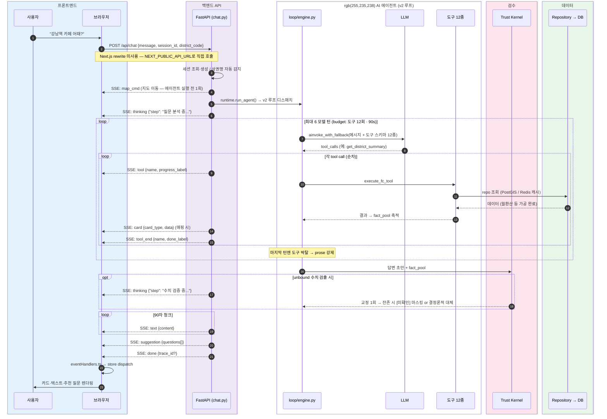

# 학습 자료: 큰 그림 — 한 질문의 여정

> 대상: `frontend/src/hooks/useChat.ts` · `server/server/api/routes/chat.py` · `server/server/agent/runtime.py` · `agent/loop/engine.py`
> 목적: "강남역 카페 어때?" 한 줄이 화면→서버→AI→데이터→화면으로 한 바퀴 도는 여정을 추적한다.
> 선행 문서: (없음 — 이 문서가 첫 번째) · 다음: [02 프론트엔드 화면](02-프론트엔드-화면.md)

---

## §0 큰 그림

### 레스토랑 비유

손님(사용자)이 홀(브라우저)에 앉아 주문서 한 장을 내민다. "강남역 카페 어때요?"

주문서는 홀 담당(FastAPI `/api/chat`)에게 전달된다. 담당은 주문서를 읽어 손님이 어느 테이블(상권)에 앉아 있는지 확인하고, **주방장 한 명(v2 루프의 LLM)** 에게 넘긴다. 이 주방장은 레시피 카드를 미리 받지 않는다 — 주문을 읽고 스스로 판단해 창고 심부름꾼(도구 12종)을 부린다. "유동인구 꺼내와. 매출도. 비율은 계산기로 뽑아." 재료(도구 결과)가 쌓이면 요리(답변 초안)를 만든다.

그런데 이 주방에는 마지막 관문이 있다. **위생 검사대(Trust Kernel)** — 요리에 들어간 **모든 숫자**가 창고에서 실제로 꺼내 온 재료인지 검사한다. 출처 불명의 재료가 섞였으면 다시 만들게 하고, 그래도 남으면 그 재료만 빼고, 심하면 요리를 폐기하고 창고 재료만으로 안전한 요리를 다시 만든다. 검사를 통과해야만 홀로 나간다.

요리가 홀에 오는 방식도 특별하다. 진행 상황이 실시간으로 전해지는 것이다. "질문 분석 중"(thinking) → "데이터 수집 중"(tool) → "카드 완성"(card) → "최종 설명"(text) → "이런 것도 물어봐요"(suggestion) → "다 됐어요"(done). 손님은 요리가 완성되기 전에 이미 중간 결과(카드)를 받아 본다.

이것이 MarketScope AI가 사용하는 **SSE(Server-Sent Events, 서버가 한 줄씩 밀어 보내는 스트리밍 방식)** 와 **v2 agentic loop + Trust Kernel** 의 핵심이다.

### 핵심 흐름 다이어그램



> 색상 범례는 [00 시작하기 §공통 색상 범례](00-시작하기.md#공통-색상-범례) 참조 (sequenceDiagram 은 classDef 미지원 → `box rgb(...)` 로 동일 팔레트 적용).

---

## §1 브라우저에서 시작 — `useChat.ts`

**비유**: 손님이 직접 주문서를 작성하고 홀 담당에게 건네는 순간.

사용자가 ChatInput에 텍스트를 입력하고 전송하면, React 컴포넌트는 `useChat` 훅의 `sendMessage` 함수를 호출한다.

```ts
// frontend/src/hooks/useChat.ts:52-56
await useChatStore.getState().sendMessage(
  message,
  selected?.code,   // 현재 지도에서 선택된 상권 코드
  onMapCmd          // map_cmd 이벤트 수신 시 지도를 움직일 콜백
);
```

`useChat`은 얇은 조율자다. 세 개의 Zustand 스토어(chatStore · districtStore · mapStore)를 묶어 하나의 `sendMessage` 인터페이스로 노출한다. 실제 HTTP 요청과 SSE 파싱은 `chatStore.sendMessage` 안에 위임된다.

**중요 설계 결정**: Next.js의 `/api/*` rewrite 프록시를 경유하지 않고 `NEXT_PUBLIC_API_URL`로 백엔드를 직접 호출한다. 이유는 Next.js 프록시가 SSE 스트림을 버퍼링해 실시간성을 해치기 때문이다. (상세: `docs/architecture/frontend.md §2`, `MEMORY.md::feedback_sse_buffering.md` 참조)

`map_cmd` 이벤트가 도착하면 `onMapCmd` 콜백이 즉시 `mapStore.setView()`와 `districtStore.select()`를 호출해 지도를 상권 위치로 이동시킨다. 이것이 "챗봇에서 상권을 언급하면 지도가 따라 움직이는" 양방향 동기화의 핵심이다.

자세한 스토어 구조와 SSE 파서는 [02 프론트엔드 화면](02-프론트엔드-화면.md)에서 다룬다.

---

## §2 서버 진입 — `chat.py`

**비유**: 홀 담당이 주문서를 받아 테이블 번호를 확인하고 주방에 올려 보내는 과정.

`POST /api/chat` 핸들러(`server/server/api/routes/chat.py:186`)는 요청을 받은 즉시 `EventSourceResponse`를 반환한다. 이때 실제 응답은 `event_generator()` 제너레이터가 나중에 한 줄씩 밀어 보내는 방식이다.

**핸들러가 하는 세 가지 준비 작업**:

1. **세션 복원**: `_get_session(session_id)`로 이전 대화 맥락(상권 코드·대화 이력)을 불러온다.

2. **상권 자동 감지** (district_code 없을 때): 메시지 본문에서 상권명을 추출한다.
   - `da.districts.detect_district_by_name(body.message)` — 퍼지 매칭
   - 탐지 점수 < `STRONG_TOP1_MIN(0.70)` 이면 거부 — 서울 외 지역이 엉뚱한 상권으로 매핑되는 것을 막는 방어선
   - 탐지 실패 시 세션의 `last_district_code`로 폴백
   - 여기서도 못 찾으면? 괜찮다 — v2 루프의 모델이 `resolve_district` 도구로 스스로 찾는다([04](04-AI에이전트-v2루프.md) 참조)

3. **인사 단축 경로**: `_GREETING_PATTERN`이 매칭되면 에이전트 파이프라인 전체를 건너뛰고 즉시 `text`·`suggestion`·`done` 세 이벤트만 반환한다(`<1s` 응답).

준비가 끝나면 `run_agent()`를 호출하고, 루프가 yield 하는 이벤트를 하나씩 SSE로 흘려보낸다:

```python
# server/server/api/routes/chat.py:346-375 (요약)
async for event in run_agent(message=body.message, district_code=...):
    yield {"data": json.dumps(event, ensure_ascii=False, default=str)}
```

동시에 20개 이상의 채팅이 들어오면 `_chat_semaphore`가 대기를 걸고, 같은 세션에서 두 번째 요청이 오면 `_claim_session_slot`이 이전 스트림을 취소한다(지도에서 상권을 빠르게 바꿀 때 발생하는 레이스 컨디션 방어).

API 계층의 전체 엔드포인트 목록과 미들웨어 순서는 [docs/architecture/backend.md](../architecture/backend.md)를 참조한다.

---

## §3 AI 루프 기동 — `runtime.py` → `loop/engine.py`

**비유**: 로비 안내판이 손님을 주방장에게 안내하고, 주방장이 일을 시작하는 과정.

**① 단일 진입점 — `agent/runtime.py`**: chat.py 는 어느 구현이 도는지 모른다. `runtime.run_agent` 하나만 import 하고(chat.py:15), 안내판이 경로를 정한다.

```python
# server/server/agent/runtime.py:16-17
def _use_v2() -> bool:
    return settings.agent_loop_version == "v2" and settings.llm_provider != "mock"
```

`agent_loop_version`(기본 `"v2"`, config.py:80)이면서 mock 프로바이더가 아니면 v2 루프(`agent/loop/engine.py`)다. (레거시 각주: mock 모드는 가짜 LLM이 tool-call 을 못 해 레거시 경로(`graph.py`)를 탄다.)

**② 루프 본체 — `agent/loop/engine.py`**: 시스템 프롬프트 + 최근 히스토리 6턴 + 질문으로 대화를 조립하고, 도구 스키마 12종을 바인딩해 모델 턴을 돈다.

```python
# server/server/agent/loop/engine.py:166-173 (발췌)
for iteration in range(settings.agent_loop_max_iterations):   # 최대 6턴
    over_budget = (
        tool_calls_made >= settings.agent_loop_max_tool_calls  # 도구 12회
        or (time.monotonic() - started) >= settings.agent_loop_wall_clock  # 90s
    )
    allow_tools = not over_budget and iteration < settings.agent_loop_max_iterations - 1
```

모델이 도구를 부르면 실행 결과가 대화에 쌓이며 다음 턴으로 이어지고, 도구 없이 산문을 내놓으면 루프가 끝난다. 예산(6턴/12회/90s)이 바닥나면 마지막 턴에서 도구를 박탈해 **반드시 산문으로 종결**시킨다.

**이벤트가 브라우저에 도달하는 경로**:
```
engine.py 가 이벤트 dict 를 yield → runtime.run_agent 통과 → chat.py 가 JSON 직렬화해 SSE 로 방출
```
중간 큐 없이 async generator 를 **직통으로 연결**한 단순한 배관이다.

루프 내부(예산 통제, fact_pool, Trust Kernel 집행)는 [04 AI 에이전트: v2 루프](04-AI에이전트-v2루프.md)에서 줄별로 해설한다.

---

## §4 각 단계에서 브라우저가 받는 것

| 단계 | SSE 이벤트 | 브라우저 동작 |
|------|------------|--------------|
| 서버 진입 후 상권 확정 | `map_cmd` | 지도가 강남역으로 이동 (chat.py 방출) |
| 루프 시작 | `thinking` ("질문 분석 중...") | 로딩 표시 |
| 첫 도구 라운드 진입 | `thinking` ("데이터 수집 중...") | 진행 표시 갱신 |
| 도구 시작 | `tool` | 도구 진행 라벨 표시 |
| 카드 매핑 도구 성공 | `card` | SummaryCard / RecommendCard 등 렌더링 |
| 도구 완료 | `tool_end` | 완료 마킹 |
| 2번째 이후 모델 턴 | `thinking` ("결과 분석 중...") | 침묵 구간 진행 표시 |
| Trust 교정 진입 시 | `thinking` ("수치 검증 중...") | 진행 표시 |
| 검증 통과한 답변 방출 | `text` (90자 청크 연사) | 글자가 차오름 |
| 스트림 종료 직전 | `suggestion` | "이런 것도 물어봐요" 칩 표시 |
| 완료 | `done` | 로딩 해제, Langfuse trace_id 저장 |

`plan` 이벤트는 없다 — v2 는 계획을 미리 세우지 않으므로 보여줄 계획이 없다(프론트 타입 유니온에는 방어 코드로 남아 있다 — [02](02-프론트엔드-화면.md)).

브라우저에서 이 이벤트들을 처리하는 파서와 핸들러는 `frontend/src/lib/sseParser.ts`와 `frontend/src/lib/eventHandlers.ts`다. 자세한 내용은 [02 프론트엔드 화면](02-프론트엔드-화면.md) 참조.

---

## §5 단축 경로 — 풀 루프를 건너뛰는 두 가지 경우

풀 v2 루프는 LLM 2회 이상 + 도구 실행을 거치므로 수십 초가 걸릴 수 있다. 다음 두 경우는 이를 건너뛴다.

**① 인사 단축 (에이전트 진입 전)**: `chat.py`의 `_GREETING_PATTERN`(chat.py:126)이 "안녕", "hi" 등을 감지하면 `run_agent()`를 호출하지 않고 즉시 3개 이벤트(`text`·`suggestion`·`done`)만 반환한다. 응답 시간 < 1초, LLM·DB 비용 0.

**② `abstain` 도구 (루프 안 1급 기권)**: "부산 해운대 알려줘"(서울 외)나 데이터가 없는 질문이면, 모델이 `abstain(reason)` 도구를 호출한다. 엔진은 즉시 루프를 끊고 고정 템플릿으로 정중히 거절한다 — 그럴듯한 숫자를 지어내는 경로 자체가 닫혀 있다. 시스템 프롬프트("추측하지 마세요")가 약속하고, 이 도구가 그 약속의 출구다. ([04 §3](04-AI에이전트-v2루프.md) · [05 §3-3](05-도구12종-전문계측기.md))

추가로, "PDF 저장해줘" 요청은 서버에 오지도 않는다 — 프론트가 로컬에서 감지해 PDF 생성 이벤트로 처리한다([02](02-프론트엔드-화면.md)).

---

## §6 이 문서가 가르치는 핵심 원칙

1. **SSE 직접 호출**: Chat 스트림은 Next.js 프록시를 우회하고 `NEXT_PUBLIC_API_URL`로 직접 백엔드를 호출한다. 프록시 버퍼링이 실시간성을 망가뜨리기 때문이다.

2. **SSE 이벤트의 순서**: `map_cmd` → `thinking` → `tool`/`card`/`tool_end` (반복) → `thinking`(분석/검증) → `text`(90자 청크) → `suggestion` → `done`. 이 순서가 사용자가 보는 점진적 로딩 경험을 만든다. (프론트 타입 정의는 10종 — v2 미발생 `plan` 방어 코드와 프론트 측 `error` 포함.)

3. **모델주도 루프의 목적**: 계획을 미리 세우지 않고 LLM이 매 턴 도구를 직접 고른다. 열린 후속 질문("거기 중 더 많은 곳은?")이 특수 처리 없이 풀리는 일반성의 원천이다. 폭주는 budget governor(6턴/12회/90s)가 구조로 막는다.

4. **검증-후-방출**: 답변의 모든 수치는 Trust Kernel의 바인딩 검사(±5%)를 통과해야 방출된다. `text` 가 토큰 스트림이 아니라 90자 청크인 이유 — 이미 완성·검증된 텍스트를 잘라 보내는 것이다.

5. **세션 격리와 레이스 방어**: 같은 `session_id`에서 두 번째 요청이 오면 첫 번째 스트림이 취소된다(`_claim_session_slot`). 사용자가 지도에서 상권을 빠르게 바꿀 때 두 AI 응답이 뒤섞이는 문제를 막는다.

6. **단축 경로 우선**: 인사는 에이전트 진입 전 정규식으로, 범위 밖·데이터 없음은 루프 안 `abstain` 1급 기권으로. 비용과 지연을 줄이면서 날조 가능성도 함께 닫는 설계다.

7. **LLM 폴백 체인**: 역할별 모델 분담 대신 **단일 tool-calling 모델 + per-invoke 폴백**(Claude Sonnet → Gemini pro → flash)이다. 모델 ID는 전부 설정(env)에서 오므로 은퇴 모델도 배포 없이 교체한다. 상세는 [04 §5](04-AI에이전트-v2루프.md).

---

*다음 문서: [02 프론트엔드 화면](02-프론트엔드-화면.md) — chatStore의 sendMessage, sseParser, eventHandlers를 줄별로 해설.*
