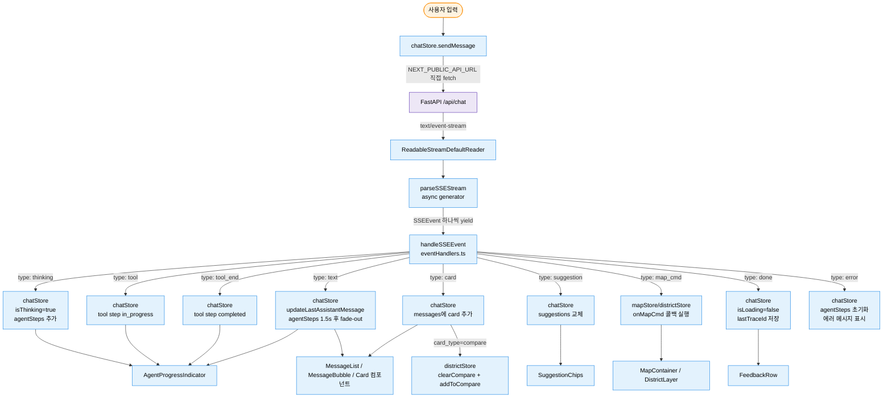
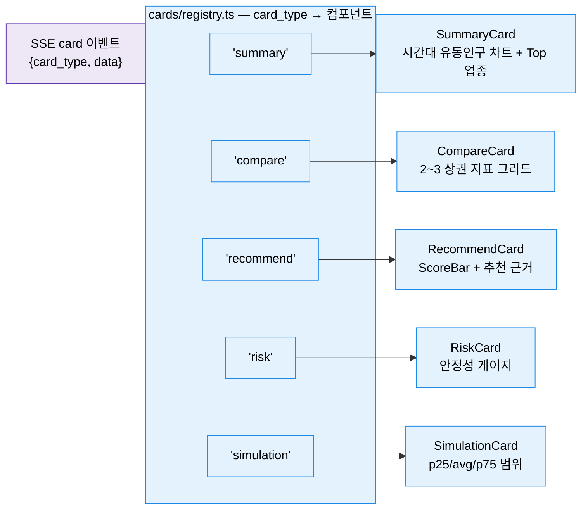

# 학습 자료: 프론트엔드 화면 — SSE 스트림을 화면으로 바꾸는 법

> 대상: frontend/src/lib/sseParser.ts · eventHandlers.ts · stores/chatStore.ts
> 목적: 서버에서 한 글자씩 흘러오는 SSE 스트림이 어떻게 채팅 화면의 카드·텍스트·진행 표시기로 변환되는지 이해한다.
> 선행 문서: [01 큰 그림: 한 질문의 여정](01-큰그림-한질문의여정.md) · 다음: [03 백엔드 접수창구](03-백엔드-접수창구.md)

---

## §0 큰 그림

### 비유: 홀 직원과 주방

레스토랑을 상상해 보자.

손님(사용자)이 주문을 넣으면 주방(FastAPI + v2 에이전트 루프)이 요리를 시작한다. 주방은 다 만들고 나서 한꺼번에 내오는 게 아니라, 재료를 씻는 중인지, 볶는 중인지, 플레이팅하는 중인지를 **실시간으로 알려주고** 완성된 요리를 한 접시씩 내온다. 이 알림이 SSE(Server-Sent Events, 서버가 먼저 밀어보내는 단방향 이벤트 스트림)다.

홀 직원(`sendMessage` + `parseSSEStream` + `handleSSEEvent`)은 주방에서 나오는 신호를 하나씩 받아 손님 테이블(Zustand store → React 컴포넌트)에 실시간으로 차린다. 직원은 주방 문이 한 번 열릴 때마다(`for await` 루프 1회) 어떤 신호인지 확인하고(`switch(event.type)`), 해당 자리에 놓는다(store `set()`).

### 처리 흐름 요약



> 컴포넌트 전체 목록과 디렉토리 구조는 [frontend.md](../architecture/frontend.md) §1 참조. 색상 범례는 [00 시작하기 §공통 색상 범례](00-시작하기.md#공통-색상-범례).

### 이벤트 타입 계약 — `types.ts` 의 SSEEvent 유니온

프론트가 알아듣는 이벤트의 정의는 `lib/types.ts` 한 곳에 있다:

```typescript
// frontend/src/lib/types.ts:163-173
export type SSEEvent =
  | { type: 'thinking'; step?: string; icon?: string }
  | { type: 'plan'; intent?: string; steps?: string[] }
  | { type: 'tool'; name: string; input?: Record<string, unknown>; icon?: string; progress_label?: string }
  | { type: 'tool_end'; name: string; icon?: string; done_label?: string }
  | { type: 'text'; content: string }
  | { type: 'card'; card_type: string; data: Record<string, unknown> }
  | { type: 'map_cmd'; action: string; params?: Record<string, unknown>; district_code?: string; district_name?: string; district_type?: string }
  | { type: 'suggestion'; questions: string[] }
  | { type: 'done'; trace_id?: string }
  | { type: 'error'; message?: string };
```

**10종이 정의돼 있지만 전부 서버가 보내는 것은 아니다.** 현행 v2 루프가 방출하는 것은 7종(`thinking`/`tool`/`tool_end`/`card`/`text`/`suggestion`/`done`) + chat.py 계층의 `map_cmd` 다. `plan` 은 v2 에서 발생하지 않는다 — `eventHandlers.ts` 의 `case 'plan'` 은 **방어 코드**로만 남아 있다(계획을 미리 세우지 않는 루프에는 보여줄 계획이 없다; mock 모드의 레거시 경로에서만 실제 발생). `error` 는 파서/네트워크 오류용 프론트 측 정의다. 이렇게 **수신부를 발신부보다 넓게** 잡아 두면 서버가 이벤트를 추가·롤백해도 프론트가 깨지지 않는다.

---

## §1 SSE 파서 — `sseParser.ts`

### 역할 한 줄 요약

서버에서 흘러오는 원시 바이트(Uint8Array) 덩어리를 텍스트로 디코딩하고, `data: {...}` 형식의 SSE 행을 파싱해 `SSEEvent` 객체를 **하나씩** 꺼내 주는 **async generator(값을 하나씩 꺼내 쓸 수 있는 비동기 함수)**다.

### 전체 코드 (verbatim)

```typescript
export async function* parseSSEStream(
  reader: ReadableStreamDefaultReader<Uint8Array>,
  inactivityTimeoutMs: number = 30_000,
): AsyncGenerator<SSEEvent> {
  const decoder = new TextDecoder();
  let buffer = '';

  try {
    while (true) {
      const readPromise = reader.read();
      const timeoutPromise = new Promise<{ done: true; value: undefined }>(
        (resolve) => setTimeout(() => resolve({ done: true, value: undefined }), inactivityTimeoutMs)
      );

      const { done, value } = await Promise.race([readPromise, timeoutPromise]);
      if (done) break;

      buffer += decoder.decode(value, { stream: true });
      const lines = buffer.split('\n');
      buffer = lines.pop() || '';

      for (const line of lines) {
        const event = parseLine(line);
        if (event) yield event;
      }
    }

    // Process remaining buffer
    if (buffer) {
      const event = parseLine(buffer);
      if (event) yield event;
    }
  } finally {
    try {
      reader.releaseLock();
    } catch {
      // Already released or in an invalid state — safe to swallow.
    }
  }
}
```

### 줄별 해설

**함수 시그니처**

```typescript
export async function* parseSSEStream(
  reader: ReadableStreamDefaultReader<Uint8Array>,
  inactivityTimeoutMs: number = 30_000,
): AsyncGenerator<SSEEvent>
```

이 코드는 `function*` 기호로 generator 함수임을 선언한다.
왜? 호출자(`sendMessage`)가 `for await (const event of parseSSEStream(reader))` 로 이벤트를 **하나씩** 처리할 수 있게 하기 위해서다. 전체 스트림이 끝날 때까지 기다렸다가 배열로 반환하면 스트리밍 의미가 없어진다.
주의: `inactivityTimeoutMs` 기본값은 30초(30_000ms)다. 이 시간 동안 서버에서 아무 데이터도 오지 않으면 연결이 죽은 것으로 간주하고 루프를 종료한다.

**무활동 타임아웃 — Race 패턴**

```typescript
const readPromise = reader.read();
const timeoutPromise = new Promise<{ done: true; value: undefined }>(
  (resolve) => setTimeout(() => resolve({ done: true, value: undefined }), inactivityTimeoutMs)
);

const { done, value } = await Promise.race([readPromise, timeoutPromise]);
if (done) break;
```

이 코드는 `Promise.race`(경주)로 두 가지 결과 중 먼저 오는 것을 선택한다.

- `readPromise`: 서버에서 다음 바이트 청크(chunk, 데이터 조각)가 도착하면 이긴다.
- `timeoutPromise`: 30초 안에 아무 데이터도 없으면 `done: true`를 반환해 루프를 종료시킨다.

왜? 프록시 서버나 로드 밸런서는 조용한 연결을 강제 끊는 경우가 있다. 무한 대기를 막고 사용자에게 "응답이 없다"는 상태를 빠르게 알리기 위해서다.

**버퍼 관리**

```typescript
buffer += decoder.decode(value, { stream: true });
const lines = buffer.split('\n');
buffer = lines.pop() || '';
```

이 코드는 네트워크 청크가 행(line) 경계와 정확히 일치하지 않을 수 있다는 점을 처리한다. 예를 들어 한 청크에 `"data: {\"ty"`, 다음 청크에 `"pe\":\"thinking\"}\n"` 이 올 수 있다.

- `decoder.decode(value, { stream: true })`: `stream: true`는 멀티바이트 UTF-8 문자(한글 포함)가 청크 경계에서 잘리지 않도록 디코더 내부 상태를 유지한다.
- `lines.pop()`: 마지막 요소를 꺼내 `buffer`에 남긴다. 줄바꿈 없이 끊긴 미완성 행이기 때문이다.

주의: 한글은 UTF-8로 3바이트다. `stream: true` 없이 `decode()`를 호출하면 청크 경계에서 한글이 깨진다(문자 깨짐 버그).

**`parseLine` 헬퍼**

```typescript
function parseLine(line: string): SSEEvent | null {
  if (!line.startsWith('data: ')) return null;
  const data = line.slice(6).trim();
  if (!data || data === '[DONE]') return null;
  try {
    return JSON.parse(data) as SSEEvent;
  } catch {
    return null;
  }
}
```

이 코드는 SSE 프로토콜의 `data: ` 접두사를 제거하고 JSON을 파싱한다.
왜 `[DONE]`을 무시하나? OpenAI 호환 스트림 일부가 종료 신호로 `[DONE]`을 보낸다. 이 프로젝트는 `done` 타입 이벤트 객체를 따로 쓰므로 혼동을 막기 위해 무시한다.

**`finally` 블록**

```typescript
} finally {
  try {
    reader.releaseLock();
  } catch {
    // Already released or in an invalid state — safe to swallow.
  }
}
```

이 코드는 함수가 어떤 이유(정상 종료, 타임아웃, 예외, `AbortController` 취소)로 끝나든 항상 실행된다.
왜? `ReadableStream`(읽기 가능한 스트림)은 `reader`가 Lock(잠금)을 가지고 있는 동안 다른 코드가 접근할 수 없다. `releaseLock()`을 호출하지 않으면 스트림이 GC(가비지 컬렉션, 메모리 자동 회수)되지 않아 메모리 누수가 발생한다. 이미 해제된 상태에서 호출하면 예외가 나므로 `try/catch`로 감싼다.

---

## §2 이벤트 핸들러 — `eventHandlers.ts`

### 역할 한 줄 요약

파서가 꺼내 준 `SSEEvent` 하나를 받아 `event.type`에 따라 어떤 store를 어떻게 갱신할지 결정하는 **디스패처(dispatcher, 분배기)**다.

### 선행 보호 장치 — Staleness Gate (발췌)

```typescript
function isStale(ctx: EventHandlerContext): boolean {
  return ctx.requestId !== ctx.get().currentRequestId;
}

export function handleSSEEvent(event: SSEEvent, ctx: EventHandlerContext): void {
  if (isStale(ctx)) return;
  // ...
}
```

이 코드는 **낡은 스트림(stale stream)**의 이벤트를 조용히 버린다.
왜? 사용자가 상권 A를 클릭한 뒤 0.3초 만에 B를 클릭하면 두 SSE 스트림이 동시에 진행된다. A 스트림의 늦게 도착한 `done` 이벤트가 B 스트림의 `isLoading=true`를 `false`로 바꿔 버리면 화면이 멈춰 보인다. `requestId`를 단조 증가 카운터(monotonic counter)로 관리해 이를 방지한다.

### `thinking` 이벤트 (발췌)

```typescript
case 'thinking': {
  set({ isThinking: true });
  const currentSteps = get().agentSteps;
  if (currentSteps.length === 0) {
    get().addAgentStep({ id: 'thinking', label: thinkStep || '질문 분석 중...', status: 'in_progress' });
  } else {
    const hasResponseStep = currentSteps.some((s) => s.id === 'response');
    if (!hasResponseStep) {
      get().addAgentStep({ id: 'response', label: thinkStep || '응답 작성 중...', status: 'in_progress' });
    }
  }
  break;
}
```

이 코드는 에이전트가 "지금 생각 중"임을 나타내는 단계를 `agentSteps`에 추가한다. `AgentProgressIndicator` 컴포넌트가 이 배열을 구독해 스피너를 표시한다.
왜 분기? v2 루프는 고비마다 `thinking` 을 여러 번 보낸다 — 첫 이벤트("질문 분석 중...", 배열이 비었을 때)와 도구 라운드 이후 이벤트("결과 분석 중..."/"수치 검증 중...", 배열에 이미 항목이 있을 때)를 구분해 진행 표시기가 올바른 레이블을 보여주게 한다. v2 의 답변은 검증-후-방출이라 첫 텍스트까지 침묵이 길 수 있는데, 이 반복 `thinking` 이 그 구간을 메운다.

### `text` 이벤트 — 타이핑 효과 (발췌)

```typescript
case 'text': {
  if (!ctx.firstTextReceived.current) {
    ctx.firstTextReceived.current = true;
    // 진행 중인 step 모두 완료로 전환
    for (const step of steps) {
      if (step.status === 'in_progress') {
        get().updateAgentStepStatus(step.id, 'completed');
      }
    }
    get().addAgentStep({ id: 'final', label: '분석 완료', status: 'completed' });
    const myReq = ctx.requestId;
    setTimeout(() => {
      if (myReq !== ctx.get().currentRequestId) return;
      set({ agentSteps: [], isThinking: false });
    }, 1500);
  }
  get().updateLastAssistantMessage(event.content);
  break;
}
```

이 코드는 LLM 응답 토큰이 하나씩 도착할 때마다 `updateLastAssistantMessage`로 기존 메시지 뒤에 이어붙인다. 사용자 눈에는 AI가 실시간으로 타이핑하는 것처럼 보인다.
첫 번째 토큰이 도착하는 순간 진행 표시기(agentSteps)를 "완료"로 전환하고 1.5초 후 화면에서 사라지게 한다.
주의: `setTimeout` 내부에서 `requestId`를 다시 확인한다. 1.5초 안에 새 질문이 들어오면 새 스트림의 `agentSteps`를 지워선 안 되기 때문이다.

### `card` 이벤트 — compare 특수 처리 (발췌)

```typescript
case 'card': {
  const cardMessage: ChatMessage = {
    id: generateId(),
    role: 'assistant',
    content: '',
    type: 'card',
    cardType: event.card_type,
    cardData: event.data,
    timestamp: new Date(),
  };
  set({ messages: [...get().messages, cardMessage] });

  if (event.card_type === 'compare') {
    const store = useDistrictStore.getState();
    store.clearCompare();
    if (!store.isCompareMode) store.toggleCompareMode();
    for (const code of codes.slice(0, 3)) {
      useDistrictStore.getState().addToCompare(district);
    }
  }
  break;
}
```

이 코드는 카드 메시지를 채팅 목록에 추가한 뒤, `compare` 카드일 때는 `districtStore`도 동기화해 지도에 비교 상권 하이라이트가 자동으로 표시되게 한다.
왜? 사용자가 "강남이랑 홍대 비교해 줘"라고 말하면 챗에는 비교 카드가, 지도에는 두 상권의 다색 폴리곤이 동시에 나타나야 자연스럽다. AI가 채팅 의도를 감지해 도구를 실행했을 때 지도 하이라이트도 자동으로 갱신하는 것이 이 로직이다.

**카드가 컴포넌트가 되는 길**: 백엔드에서 card_type 을 가진 도구 5종이 발행한 `card` 이벤트는, 프론트 `components/chat/cards/registry.ts` 의 매핑 하나로 React 컴포넌트가 된다. 새 카드를 추가할 때 스위치문을 고치는 게 아니라 매핑에 한 줄을 더하는 구조다.



> 발신 측 매핑(도구 → card_type)은 [05 도구 12종 §2](05-도구12종-전문계측기.md) 참조 — 두 registry(백엔드 도구 명부·프론트 카드 명부)의 5개 키가 1:1 로 맞물린다.

### `map_cmd` 이벤트

```typescript
case 'map_cmd': {
  if (event.district_code) {
    set({ lastDistrictCode: event.district_code });
  }
  ctx.onMapCmd?.(event);
  break;
}
```

이 코드는 Agent가 지도를 움직이라는 명령(`map_cmd` 이벤트)을 보냈을 때, `sendMessage`의 세 번째 인수로 넘긴 `onMapCmd` 콜백을 호출한다. 콜백이 없으면(`?. optional chaining`) 조용히 무시한다.
왜 콜백으로? `chatStore`는 지도 컴포넌트를 직접 참조하지 않아도 된다. `useChat` 훅이 `onMapCmd`를 주입해 `mapStore`를 갱신한다(스토어 간 직접 의존성 없음).

### `done` 이벤트

```typescript
case 'done':
  set({ isLoading: false });
  if (!ctx.firstTextReceived.current) {
    set({ isThinking: false, agentSteps: [] });
  }
  if (event.trace_id) {
    set({ lastTraceId: event.trace_id });
  }
  break;
```

이 코드는 스트림이 공식 종료됐음을 기록한다. `lastTraceId`를 저장해 두면 `FeedbackRow`(👍👎 피드백 버튼)가 이 값을 참조해 Langfuse에 스코어를 제출할 수 있다.

---

## §3 메시지 전송 — `chatStore.ts::sendMessage`

### 역할 한 줄 요약

사용자 메시지를 받아 SSE 연결을 열고, 파서·핸들러를 조율하며, 재시도·취소·에러를 처리하는 **진행 총괄 매니저**다.

### 메모리 교훈 — SSE 직접 호출 설계

> `feedback_sse_buffering`: Chat SSE는 Next.js rewrite 프록시를 미사용하고 백엔드를 직접 호출한다.

`next.config.mjs`의 `rewrites()`는 `/api/*` 요청을 내부 백엔드 URL로 전달하지만, **채팅 SSE 요청은 이 경로를 우회한다.**

```typescript
// next.config.mjs (참고 — sendMessage 내부 코드 아님)
// rewrites: [{ source: '/api/:path*', destination: BACKEND_INTERNAL_URL }]
// Chat API는 rewrite 미사용 — NEXT_PUBLIC_API_URL 로 직접 호출(버퍼링 방지)
```

왜? Next.js의 Node.js 프록시 레이어는 응답을 내부 버퍼에 모은 뒤 전달하는 경우가 있어, SSE처럼 실시간 청크가 중요한 경우 수 초씩 지연될 수 있다. `NEXT_PUBLIC_API_URL`(`:8000`)으로 브라우저가 직접 FastAPI에 연결하면 청크가 도착하는 즉시 화면에 반영된다.

### 전처리 — 중복 전송 방지 · PDF 감지 (발췌)

```typescript
if (state.isLoading && state.currentAbortController) {
  state.currentAbortController.abort();
}
```

이 코드는 이전 스트림이 아직 진행 중이면 즉시 취소한다. `AbortController`는 `fetch`의 네트워크 요청과 `ReadableStreamDefaultReader` 양쪽을 동시에 취소한다.

```typescript
const isPdfRequest =
  trimmed.length <= 30 &&
  PDF_PATTERNS.test(trimmed) &&
  !PDF_NEGATIVE_GUARD.test(trimmed);
if (isPdfRequest) {
  window.dispatchEvent(new CustomEvent('marketscope:generate-pdf'));
  return;
}
```

이 코드는 "PDF 저장해 줘" 같은 요청을 서버에 보내기 전 클라이언트에서 가로챈다. `marketscope:generate-pdf` 커스텀 이벤트를 발행하면 `useReportExport` 훅이 이를 받아 `@react-pdf/renderer`로 PDF를 생성한다. 불필요한 LLM 호출 0건.

### 핵심 루프 — 재시도 + SSE 소비 (발췌)

```typescript
const MAX_RETRIES = 2;
const BASE_DELAY_MS = 1000;

for (let attempt = 0; attempt <= MAX_RETRIES; attempt++) {
  try {
    const response = await sendChatMessage(
      message.trim(),
      state.sessionId,
      resolvedDistrictCode,
      controller.signal
    );

    reader = response.body?.getReader();
    if (!reader) throw new Error('No response body');

    for await (const event of parseSSEStream(reader)) {
      resetStreamTimer();
      handleSSEEvent(event, ctx);
    }

    succeeded = true;
    break;
  } catch (err) {
    const isAbort = err instanceof DOMException && err.name === 'AbortError';
    if (isAbort) throw err;           // 의도적 취소 — 재시도 안 함

    if (attempt === MAX_RETRIES) {
      // 에러 메시지를 채팅에 추가 후 break
    }

    const delay = BASE_DELAY_MS * Math.pow(2, attempt);  // 1s → 2s 지수 백오프
    await new Promise((r) => setTimeout(r, delay));
  }
}
```

이 코드는 일시적 네트워크 오류(5xx)에 대해 최대 2회 재시도한다. `AbortError`(사용자가 취소하거나 새 메시지로 선점)는 재시도하지 않는다. 4xx 클라이언트 오류도 재시도하지 않는다.

`for await (const event of parseSSEStream(reader))` 한 줄이 파서와 핸들러를 연결한다. 파서가 이벤트를 `yield`할 때마다 핸들러가 store를 갱신하고, store 변경이 React 컴포넌트를 리렌더링한다.

### `finally` — 리소스 해제

```typescript
// finally block (always runs)
{
  if (reader) {
    try { await reader.cancel(); } catch { /* ignore */ }
  }
  if (get().currentAbortController === controller) {
    set({
      currentAbortController: null,
      isLoading: false,
      isThinking: false,
      agentSteps: [],
    });
  }
}
```

이 코드는 성공·실패·취소 모든 경로에서 실행된다. `get().currentAbortController === controller` 조건을 확인하는 이유는 이미 새로운 `sendMessage`가 호출돼 `controller`가 교체된 경우, 새 스트림의 `isLoading=true` 상태를 건드리지 않기 위해서다.

---

## §마지막 — 이 문서가 가르치는 핵심 원칙

1. **SSE는 Next.js 프록시를 우회해 백엔드에 직접 연결한다.** rewrite를 타면 Node.js 내부 버퍼링으로 스트리밍이 지연된다. `NEXT_PUBLIC_API_URL`(`:8000`)로 브라우저가 직접 FastAPI에 접속하는 것이 설계 의도다.

2. **단방향 스트림 → 상태 갱신 → 컴포넌트 리렌더** 흐름은 세 파일이 나누어 담당한다.
   - `sseParser.ts`: 바이트 → `SSEEvent` 객체 (I/O 레이어)
   - `eventHandlers.ts`: `SSEEvent.type` → store `set()` 호출 (비즈니스 로직 레이어)
   - `chatStore.ts`: 전체 생명주기(연결·취소·재시도·상태) 관리 (오케스트레이션 레이어)

3. **`requestId` 단조 카운터로 선점(pre-emption)을 처리한다.** 사용자가 빠르게 다른 상권을 클릭해도 낡은 스트림의 이벤트가 새 화면을 덮어쓰지 않는다.

4. **`finally`의 `releaseLock()`은 생략하면 메모리 누수가 발생한다.** `ReadableStream`은 `reader`가 Lock을 가진 동안 GC되지 않는다.

5. **`async generator`(`function*`)는 스트리밍 파서에 최적이다.** 전체를 버퍼에 모으지 않고 이벤트 하나가 준비되는 즉시 소비자에게 전달할 수 있다.

6. **컴포넌트 전체 목록, 레이아웃 구조, Zustand 스토어 필드 목록은 [frontend.md](../architecture/frontend.md)를 참조하라.** 이 문서는 데이터 흐름 원리에 집중하며 구조 재서술을 생략한다.
