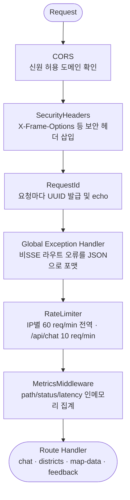

# 학습 자료: 백엔드 접수창구 — FastAPI 요청 수신·세션·SSE 스트리밍

> 대상: server/server/api/routes/chat.py · main.py (lifespan)
> 목적: FastAPI 앱 기동 순서, `/api/chat` 라우트의 세션 관리·에이전트 호출·SSE 스트리밍 흐름을 "접수창구" 비유로 설명한다.
> 선행 문서: [02 프론트엔드 화면](02-프론트엔드-화면.md) · 다음: [04 AI 에이전트: 분석팀](04-AI에이전트-분석팀.md)

---

## §0 큰 그림

### 접수창구 비유

상권 분석 서비스를 **분석 전문 회사**에 비유해 보자.

- **손님(요청)** 이 대문을 들어서면 여러 **검문소(미들웨어)**를 차례로 통과한다.  
  신분 확인(CORS) → 보안 스탬프(SecurityHeaders) → 접수번호 발급(RequestId) → 클레임 처리 부스(Global Exception) → 방문 횟수 체크(RateLimiter) → 방문 통계 기록(Metrics) 순서다.
- 검문소를 모두 통과하면 **접수창구(Route Handler)** 가 손님을 맞는다.  
  창구 직원은 먼저 **단골 기록(세션)** 을 꺼내 "이전에 어떤 상권을 보셨는지" 확인한다.
- 분석 의뢰가 접수되면 직원은 서류를 **분석팀(LangGraph PAE Agent)** 에 넘긴다.  
  분석팀은 결과를 **한 줄씩 메모지(SSE 이벤트)** 에 써서 창구로 보내고, 창구는 그 메모지를 **실시간으로 손님에게 전달**한다.

이 흐름을 코드 수준에서 따라가는 것이 이 문서의 목표다.

### 핵심 Mermaid — 미들웨어 파이프라인



> 미들웨어는 **마지막에 추가한 것이 가장 먼저 실행된다** (Starlette 스택 구조).  
> `main.py` 에서 CORS → SecurityHeaders → RequestId → Exception → RateLimiter → Metrics 순으로 `add_middleware`를 호출하므로, 실행 순서는 위 다이어그램과 같다.

---

## §1 앱 기동 — lifespan (main.py 발췌)

lifespan(앱이 켜질 때 한 번 실행되는 초기화 구간)은 FastAPI 에 `lifespan=lifespan` 으로 등록된다.  
서버가 뜰 때 `yield` 이전 블록이 실행되고, 셧다운 때 `yield` 이후 블록이 실행된다.

```python
# main.py:21-99 (핵심 발췌)
@asynccontextmanager
async def lifespan(app: FastAPI):
    """Initialize DataAccess, CacheService, and Agent singleton at startup."""

    # --- Cache ---
    if settings.use_mock:
        cache = MemoryCacheService()
    else:
        cache = RedisCacheService(settings.redis_url)
    set_cache_service(cache)

    # --- DataAccess ---
    if settings.use_mock:
        da = build_mock_data_access()
    else:
        engine = create_async_engine(
            settings.database_url,
            pool_size=settings.db_pool_size,
            max_overflow=settings.db_max_overflow,
            pool_pre_ping=settings.db_pool_pre_ping,
            pool_recycle=settings.db_pool_recycle,
            ...
        )
        session_factory = async_sessionmaker(engine, ...)
        da = build_real_data_access(session_factory)
    set_data_access(da)

    # --- CategoryResolver ---
    resolver = CategoryResolver()
    if settings.use_mock:
        resolver.load_defaults()
    else:
        await resolver.load_from_db(session_factory)
    set_category_resolver(resolver)

    app.state.db_engine = engine   # /api/health/detail 에서 풀 통계 노출
    yield
    # --- Shutdown ---
    await cache.close()
    if engine is not None:
        await engine.dispose()
```

이 코드는 앱이 첫 요청을 받기 **전에** 세 가지를 준비한다:

| 초기화 대상 | Mock 모드 | Real 모드 |
|---|---|---|
| **CacheService** | 인메모리 dict (`MemoryCacheService`) | Redis 연결 (`RedisCacheService`, 지수 백오프) |
| **DataAccess (Repository)** | JSON fixture 기반 10개 레포 번들 | SQLAlchemy async 세션풀 (pool 10 + overflow 20) |
| **CategoryResolver** | 13종 하드코딩 기본값 | `category_metadata` 테이블에서 동적 로드 → 싱글톤 |

왜? — 요청마다 DB 연결을 새로 만들면 지연이 크다. 풀을 미리 열어두면 요청 시 바로 연결을 빌려 쓸 수 있다. `USE_MOCK=true` 일 때는 DB/Redis 없이 FastAPI 단독으로 뜰 수 있어 로컬 개발이 편하다.

주의: 셧다운 시 `await cache.close()` · `await engine.dispose()` 를 반드시 호출해야 연결 자원이 누수 없이 반납된다. `Langfuse` flush 도 이 시점에 시도한다 (실패해도 서버 종료를 막지 않는 best-effort).

---

## §2 미들웨어 등록 순서 (main.py:109-141)

```python
# main.py:109-141 (핵심 발췌)
# --- Middleware (order matters: last added = first executed) ---

# 1. CORS
app.add_middleware(CORSMiddleware, allow_origins=settings.cors_origins, ...)

# 2. Security headers
app.add_middleware(SecurityHeadersMiddleware)
app.add_middleware(RequestIdMiddleware)

# 3. Global exception handler (non-SSE routes)
register_global_exception_handler(app)

# 4. Rate limiting
register_rate_limiter(app)

# 5. Metrics (lightweight, no external dependency)
app.add_middleware(MetricsMiddleware)
```

이 코드는 미들웨어(요청이 핸들러에 닿기 전 거치는 중간 처리 단계)를 스택에 쌓는다.  
Starlette 는 **나중에 추가된 미들웨어를 먼저 실행**하므로, MetricsMiddleware(마지막 추가) → RateLimiter → Exception → RequestId → SecurityHeaders → CORS 순으로 실제 실행된다.

왜 순서가 중요한가? — CORS 는 가장 바깥에서 preflight(`OPTIONS`) 를 처리해야 한다. RateLimiter 는 Exception 핸들러보다 안쪽에 있어야 429 응답도 동일한 JSON 포맷으로 감쌀 수 있다. Metrics 는 가장 안쪽(핸들러에 가장 가까운)에서 실제 처리 지연을 측정한다.

---

## §3 세션 저장소 — 단골 기록 (chat.py:27-43)

```python
# chat.py:27-43
_sessions: dict[str, dict] = {}
_SESSION_TTL = 1800  # 30 minutes
_sessions_lock = asyncio.Lock()
_PRUNE_INTERVAL = 60  # seconds
_last_prune_time: float = 0.0
_MAX_CONCURRENT_CHATS = 20
_chat_semaphore = asyncio.Semaphore(_MAX_CONCURRENT_CHATS)

_session_inflight: dict[str, asyncio.Task] = {}
_session_inflight_lock = asyncio.Lock()
_INFLIGHT_CANCEL_TIMEOUT = 2.0
```

이 코드는 FastAPI 프로세스 메모리 안에 세션을 dict 로 보관한다.

- `_sessions`: `session_id → {last_district_code, last_district_name, last_active, history}` 매핑.
- `_SESSION_TTL = 1800`: 마지막 활동 후 30분이 지나면 만료. 60초마다 한 번씩 pruning(가지치기).
- `_chat_semaphore`: 동시 스트리밍을 최대 20개로 제한. 초과 요청은 세마포어(공유 자원에 대한 동시 접근 제한 메커니즘)를 얻을 때까지 대기한다.
- `_session_inflight`: 같은 세션에서 새 요청이 오면 이전 스트리밍 태스크를 선제 취소하기 위한 레지스트리. 사용자가 지도에서 상권을 빠르게 클릭할 때 두 개의 SSE 스트림이 동시에 흐르는 것을 방지한다.

주의: `_sessions` 는 서버 재시작 시 **완전히 초기화**된다. 세션 지속성이 필요하면 Redis 또는 PostgreSQL 이관이 필요하다(현재는 out of scope).

---

## §4 세션 조회·생성 (_get_session, chat.py:83-119)

```python
# chat.py:83-119 (핵심 발췌)
async def _get_session(session_id: str) -> dict:
    """Get or create session, pruning expired entries."""
    global _last_prune_time
    now = time.time()

    async with _sessions_lock:
        # 쓰로틀 pruning (60초에 1회)
        if now - _last_prune_time > _PRUNE_INTERVAL:
            expired = [k for k, v in _sessions.items()
                       if now - v.get("last_active", 0) > _SESSION_TTL]
            for k in expired:
                del _sessions[k]
            _last_prune_time = now

        if session_id not in _sessions:
            # Evict oldest session if at capacity
            if len(_sessions) >= settings.session_max_count:
                oldest_key = min(_sessions,
                                 key=lambda k: _sessions[k].get("last_active", 0))
                del _sessions[oldest_key]

            _sessions[session_id] = {
                "last_district_code": None,
                "last_district_name": None,
                "last_active": now,
                "history": ConversationHistory(
                    max_turns=settings.max_history_turns,
                    content_limit=settings.history_content_limit,
                ),
            }
        else:
            _sessions[session_id]["last_active"] = now

        return _sessions[session_id]
```

이 코드는 "단골 기록을 꺼내거나 새로 만드는" 창구 직원의 동작을 구현한다.

- `async with _sessions_lock`: dict 를 여러 코루틴이 동시에 수정하면 데이터가 꼬인다. `asyncio.Lock`(비동기 뮤텍스)으로 한 번에 하나의 코루틴만 접근하게 막는다.
- Pruning: 매 요청마다 전체 스캔은 낭비다. `_PRUNE_INTERVAL=60초` 쓰로틀로 최근 가지치기 시각 이후 60초가 지났을 때만 정리한다.
- 용량 초과 Eviction: `session_max_count`(기본 10,000)를 초과하면 `last_active` 가 가장 오래된 세션을 즉시 제거한다. LRU(Least Recently Used, 가장 오래 사용하지 않은 항목 우선 퇴출) 정책이다.
- `ConversationHistory`: 최근 `max_history_turns` 턴(기본 10)과 응답 300자 요약을 보관하는 경량 히스토리 객체다.

왜? — 히스토리가 있어야 "거기서 카페는?" 같은 follow-up 질문에서 에이전트가 "거기"가 어떤 상권인지 추론할 수 있다.

---

## §5 요청 수신 핸들러 (chat, chat.py:183-259)

```python
# chat.py:183-259 (핵심 발췌)
@router.post("/chat")
async def chat(request: Request, body: ChatRequest) -> EventSourceResponse:
    """Chat endpoint with SSE streaming via LangGraph agent."""

    session_id = body.session_id or secrets.token_urlsafe(32)
    session = await _get_session(session_id)
    da = get_data_access()

    # Resolve district info if code provided
    district_name = "미선택"
    if body.district_code:
        d = await da.districts.resolve_district(body.district_code)
        if d:
            district_name = d["name"]
            ...
        session["last_district_code"] = body.district_code
        session["last_district_name"] = district_name

    # Auto-detect district from message text — ONLY when no explicit code.
    if not body.district_code:
        detected = await da.districts.detect_district_by_name(body.message)
        if detected:
            det_score = detected.get("score") or 0.0
            if not det_in_excluded and det_score >= STRONG_TOP1_MIN:
                body.district_code = detected["code"]
                ...
        # Detection missed → fall back to session's last district.
        if not body.district_code and session.get("last_district_code"):
            body.district_code = session["last_district_code"]
            ...

    history: ConversationHistory = session["history"]
    conversation_history = history.get_recent()
    ...
    return EventSourceResponse(event_generator(), ping=int(settings.sse_heartbeat_interval))
```

이 코드는 창구 직원이 손님을 응대하는 세 단계를 구현한다:

1. **세션 조회**: `body.session_id` 가 없으면 `secrets.token_urlsafe(32)` 로 새 세션 ID를 발급한다.
2. **상권 코드 해석**: 프론트에서 `district_code` 를 명시했으면 DB에서 상권명·좌표·분기를 조회. 없으면 메시지 텍스트에서 퍼지 매칭(fuzzy matching, 완전히 같지 않아도 유사도로 찾는 방식)으로 탐지한다.  
   - 탐지 점수가 `STRONG_TOP1_MIN`(0.70) 미만이면 거부 — 서울 외 지역명이 서울 상권으로 잘못 매칭되는 것을 막는 두 번째 보호층이다.  
   - 탐지도 실패하면 세션의 `last_district_code` 를 재사용한다("이전에 보던 강남역 계속 분석").
3. **히스토리 준비**: `history.get_recent()` 로 최근 N 턴을 꺼내 에이전트에 전달할 준비를 마친다.
4. **SSE 응답 반환**: `EventSourceResponse(event_generator(), ping=...)` 를 즉시 반환. 여기서 핵심은 **데이터를 기다리지 않고 응답 객체를 먼저 반환**한다는 점이다. 실제 데이터는 `event_generator` 코루틴이 비동기로 생성한다.

---

## §6 SSE 스트리밍 — 한 줄씩 전달하는 파이프 (chat.py:264-413)

SSE(Server-Sent Events, 서버가 클라이언트에게 단방향으로 이벤트를 밀어주는 HTTP 스트리밍 방식)는 긴 분석 결과를 토큰 단위로 실시간 전송할 때 사용한다.

```python
# chat.py:264-278 (세션 선점 + 태스크 등록)
async def event_generator():
    sse_connection_opened()
    # Pre-empt any prior in-flight chat for this session.
    await _claim_session_slot(session_id)
    current_task = asyncio.current_task()
    if current_task is not None:
        await _register_session_task(session_id, current_task)
    try:
        async for event in _event_generator_inner():
            yield event
    finally:
        if current_task is not None:
            await _release_session_task(session_id, current_task)
        sse_connection_closed()
```

이 코드는 "이전 분석이 아직 진행 중이면 먼저 취소하고 새 분석을 시작"하는 동작이다. 사용자가 지도에서 다른 상권을 빠르게 클릭했을 때 두 개의 SSE 스트림이 충돌하지 않도록 보장한다.

```python
# chat.py:280-316 (세마포어 획득 + 인사 단축 경로)
async def _event_generator_inner():
    async with _chat_semaphore:
        if await request.is_disconnected():
            return

        # 인사 단축 (Agent 파이프라인 스킵 → <1s)
        if _GREETING_PATTERN.match(body.message.strip()):
            yield {"data": json.dumps({"type": "text", "content": "안녕하세요! ..."}, ensure_ascii=False)}
            yield {"data": json.dumps({"type": "suggestion", "questions": [...]}, ensure_ascii=False)}
            yield {"data": json.dumps({"type": "done"}, ensure_ascii=False)}
            return
```

이 코드에서 주목할 점:
- `async with _chat_semaphore`: 동시 스트리밍 20개 상한. 초과 요청은 이 줄에서 대기한다.
- `await request.is_disconnected()`: 손님이 이미 자리를 떴으면 에이전트 실행 전에 즉시 종료한다. 불필요한 LLM 비용을 막는 조기 탈출이다.
- `_GREETING_PATTERN`: "안녕하세요", "hi" 등 인사말은 에이전트 전체 파이프라인을 건너뛰고 1초 미만으로 응답한다.

```python
# chat.py:340-408 (에이전트 호출 + 이벤트 스트리밍)
        try:
            async with asyncio.timeout(settings.sse_connection_max_duration):
                async for event in run_agent(
                    message=body.message,
                    district_code=body.district_code or "",
                    district_name=district_name,
                    data_quarter=data_quarter,
                    conversation_history=conversation_history,
                    session_id=session_id,
                    request_id=getattr(request.state, "request_id", ""),
                ):
                    if await request.is_disconnected():
                        return

                    if event.get("type") == "text":
                        collected_text += event.get("content", "")

                    yield {"data": json.dumps(event, ensure_ascii=False, default=str)}

        except TimeoutError:
            yield {"data": json.dumps({"type": "text",
                   "content": "\n\n(응답 시간이 초과되어 종료합니다.)"}, ...)}
            yield {"data": json.dumps({"type": "done"}, ...)}

        # Save conversation turns
        history.add_turn(role="user", content=body.message, ...)
        if collected_text:
            history.add_turn(role="assistant", content=collected_text, ...)
```

이 코드가 SSE의 핵심이다:

- `run_agent(...)` 는 `async generator`(비동기 제너레이터, 값을 하나씩 생산하는 코루틴)다. `async for` 로 이벤트를 하나씩 받아 `yield` 로 즉시 클라이언트에 전송한다. 에이전트가 "thinking" 이벤트를 생산하면 그 순간 브라우저에 나타나고, 이어서 "plan", "tool", "text" 토큰이 차례로 흐른다.
- `asyncio.timeout(settings.sse_connection_max_duration)`: 전체 스트리밍 최대 시간 제한. 초과 시 `TimeoutError` 를 잡아 정중한 오류 메시지를 전송하고 `done` 이벤트로 스트림을 닫는다.
- `collected_text += event.get("content", "")`: 스트리밍 중 흘러나오는 텍스트 토큰을 모아 스트림이 끝난 뒤 `history.add_turn` 으로 히스토리에 저장한다. 스트리밍과 히스토리 저장이 분리되어 있다.
- `yield {"data": json.dumps(event, ...)}`: `sse_starlette` 라이브러리가 이 dict 의 `"data"` 키를 읽어 `data: <json>\n\n` 형식으로 클라이언트에 전송한다.

### 메모리 교훈 연결 — SSE 직접 호출

`feedback_sse_buffering` 교훈에 따르면, Chat SSE는 **Next.js rewrite 프록시를 사용하지 않고** 브라우저가 백엔드(`:8000`)를 직접 호출한다. 이유는 Next.js 프록시가 응답을 버퍼에 모아두다가 한꺼번에 전달하기 때문이다 — 스트리밍의 의미가 없어진다. 백엔드 관점에서는 `EventSourceResponse` 가 `Transfer-Encoding: chunked` 로 응답을 열어두고 `yield` 할 때마다 즉시 네트워크로 플러시한다.  
프론트엔드의 `sseParser.ts` 는 `ReadableStreamDefaultReader` 로 이 청크를 한 줄씩 읽어 이벤트로 파싱한다.

---

## §7 최종 응답 객체 (chat.py:410-413)

```python
# chat.py:410-413
    return EventSourceResponse(
        event_generator(),
        ping=int(settings.sse_heartbeat_interval),  # keep-alive interval (seconds)
    )
```

이 코드는 핸들러가 반환하는 유일한 줄이다.

- `EventSourceResponse`: `sse_starlette` 가 제공하는 응답 타입. HTTP 헤더 `Content-Type: text/event-stream` 을 자동으로 설정한다.
- `ping=int(settings.sse_heartbeat_interval)`: 기본 25초 간격으로 빈 `: ping` 주석 줄을 전송한다. 중간에 있는 역방향 프록시(Nginx, CDN 등)가 "활성 연결 없음"으로 판단해 연결을 끊는 것을 방지한다.
- `event_generator()` 는 아직 이벤트를 하나도 생산하지 않은 상태다. `EventSourceResponse` 가 반환된 뒤 Starlette ASGI 레이어가 제너레이터를 구동(iterate)하면서 클라이언트로 데이터를 흘려보낸다.

---

## §마지막 — 이 문서가 가르치는 핵심 원칙

1. **인메모리 세션의 한계**: `_sessions` dict 는 서버 프로세스에만 존재한다. 서버가 재시작되면 모든 대화 맥락이 사라진다. 동일 세션을 여러 프로세스에서 공유하려면 Redis 또는 PostgreSQL 이관이 필요하다.

2. **미들웨어 순서의 의미**: Starlette 는 `add_middleware` 호출 순서를 역순으로 실행한다. CORS 가 가장 먼저 처리되어야 하므로 가장 먼저 `add_middleware` 를 호출한다. 순서를 바꾸면 보안 헤더가 누락되거나 rate-limit 응답이 JSON 오류 포맷으로 감싸지지 않는 버그가 생긴다.

3. **SSE 스트리밍 구조**: 핸들러는 `EventSourceResponse` 를 즉시 반환하고, 실제 데이터는 `async generator` 가 비동기로 생산한다. 에이전트 이벤트를 `async for` 로 받아 `yield` 로 즉시 클라이언트에 전달하므로 "첫 토큰까지의 시간(TTFT)"이 빠르다.

4. **직접 호출 원칙**: 프론트엔드가 Next.js rewrite 프록시를 통하면 버퍼링으로 스트리밍이 깨진다. Chat SSE 는 브라우저가 백엔드 URL을 직접 호출해야 한다.

5. **세션 선점(preemption)**: `_session_inflight` 레지스트리가 같은 세션의 이전 스트리밍 태스크를 선제 취소한다. 사용자가 지도에서 상권을 빠르게 바꿀 때 두 스트림이 충돌하지 않도록 보장한다.

6. **세마포어 보호**: `_chat_semaphore(20)` 이 동시 스트리밍 수를 제한한다. 이 값을 높이면 메모리와 LLM 비용이 함께 오르므로 `settings.session_max_count` 와 함께 조율해야 한다.

7. **엔드포인트 전체 목록·SSE 이벤트 타입 표·환경 설정 표**: [backend.md §4](../architecture/backend.md) 참조. 이 문서에서 재서술하지 않는다.
