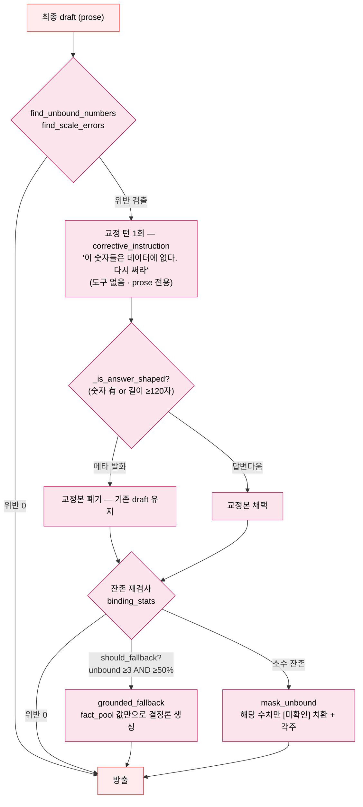

# 학습 자료: AI 에이전트 — 계측기 12종을 든 수석 컨설턴트와 팩트체크 데스크

> 대상: server/server/agent/runtime.py · agent/loop/ (engine · trust · tools_fc · models · prompts)
> 목적: v2 모델주도 function-calling 루프가 어떻게 사용자 질문을 공공데이터 분석 보고서로 바꾸고, Trust Kernel이 어떻게 "모든 숫자에 근거가 있음"을 구조적으로 보장하는지 이해한다.
> 선행 문서: [03 백엔드 접수창구](03-백엔드-접수창구.md) · 다음: [05 도구 12종: 전문 계측기](05-도구12종-전문계측기.md)

---

## §0 큰 그림 — "수석 컨설턴트 + 팩트체크 데스크" 비유

사용자가 "강남역 카페 창업 어때?" 라고 보내는 순간, 서버는 **계측기 12종을 든 수석 컨설턴트** 한 명을 부른다.

- 컨설턴트(LLM)는 미리 짜인 조사 절차서를 받지 않는다. 질문을 읽고 **스스로 판단해** 연장통에서 계측기(도구)를 꺼낸다. "상권 코드부터 찾자(resolve_district) → 종합 요약을 떼자(get_district_summary) → 비율은 계산기로(compute)."
- 계측기를 쓸 때마다 기록지(**fact_pool**)에 측정값이 쌓인다.
- 자료가 충분해지면 보고서(prose)를 쓴다. 하지만 보고서는 곧장 손님에게 가지 않는다 — **팩트체크 데스크(Trust Kernel)** 가 보고서의 **모든 숫자**를 기록지와 대조한다. 기록에 없는 숫자가 있으면 ① 다시 쓰게 하고(교정), ② 그래도 남으면 그 숫자만 가리고(`[미확인]` 마스킹), ③ 날조가 과반이면 보고서를 폐기하고 기록지 값만으로 기계가 다시 쓴다(grounded_fallback).
- 폭주 방지 장치(**budget governor**)도 있다: 컨설턴트는 최대 6번만 생각할 수 있고, 계측기는 총 12회, 시간은 90초까지다. 마지막 턴에는 연장통을 빼앗겨서 무조건 답변을 써야 한다.

### 왜 조직을 개편했나 — 구(舊) 4단 그래프에서 v2 루프로

이전 아키텍처는 PAE(Planner-Actor-Evaluator + Respond)라는 4단 그래프였다: 기획 담당이 도구 실행 계획을 미리 세우고, 실행 담당이 돌리고, 검토 담당이 "충분한가"를 판정해 부족하면 재계획했다. 세 가지 구조적 한계가 개편 이유다.

1. **경직성** — 계획은 의도(intent) 분류에서 나온다. 정규식/LLM이 의도를 잘못 잡으면 그 뒤 전체가 엉뚱한 도구를 돌린다. "거기 중 유동인구 더 많은 곳은?" 같은 열린 후속 질문은 미리 정의된 계획 프리셋에 없다.
2. **재계획 비용** — 부족 판정이 나면 기획→실행→검토를 통째로 다시 돈다(최대 3라운드). 라운드마다 LLM 호출이 겹겹이 쌓인다.
3. **사후 경고의 한계** — 수치 검증(numeric_sanity)이 "경고 로그"였다. 모델이 숫자를 날조해도 답변은 이미 나간 뒤였다 (2026-06 S7 coref 수치 날조 사건).

v2는 이 세 가지를 각각 **일반성**(모델이 매 턴 도구를 직접 고름 — 계획 프리셋 자체가 없음), **단일 루프**(재계획이 아니라 같은 대화 컨텍스트에 도구 결과를 쌓으며 이어감), **하드 게이트**(검증을 통과해야만 방출 — Trust Kernel)로 바꾼 것이다.

> (레거시 각주) 구 그래프(`agent/graph.py`)는 삭제되지 않았다 — mock 모드(가짜 LLM은 tool-call 불가)와 `AGENT_LOOP_VERSION=pae` 롤백 스위치용 폴백으로만 남아 있으며, 이 학습 코스의 범위 밖이다.

### v2 루프 상태도

```mermaid
stateDiagram-v2
    direction TB

    [*] --> 모델턴 : 시스템 프롬프트 + 히스토리(6턴) + 질문

    모델턴 --> 도구실행 : tool_calls 반환
    도구실행 --> 모델턴 : ToolMessage 로 결과 회신<br/>(fact_pool 축적)
    모델턴 --> Trust검사 : prose 답변 반환
    도구실행 --> Trust검사 : abstain 호출 시 즉시 종료

    state "budget governor" as 예산 {
        [*] --> 감시
        감시 : 턴 ≤ 6 · 도구 ≤ 12 · 90s
        감시 : 마지막 턴 = 도구 박탈(prose 강제)
    }

    state "Trust Kernel (팩트체크 데스크)" as Trust검사 {
        [*] --> 바인딩검사
        바인딩검사 : 모든 수치 ↔ fact_pool ±5%
        바인딩검사 --> 교정1회 : unbound·자릿수 오기 검출
        교정1회 --> 재검사
        재검사 --> 마스킹 : 소수 잔존
        재검사 --> 결정론대체 : 날조 과반 (3개 이상 그리고 50% 이상)
    }

    Trust검사 --> 방출 : 통과/마스킹/대체 완료
    방출 --> [*] : text(90자 청크) → suggestion → done

    classDef agent fill:#ffebee,stroke:#e53935,color:#000
    classDef gate fill:#fce4ec,stroke:#c2185b,color:#000
    classDef ext fill:#fff3e0,stroke:#fb8c00,color:#000
    class 모델턴 ext
    class 도구실행 agent
    class 예산 agent
    class 방출 agent
    class Trust검사 gate
```

> 색상 범례는 [00 시작하기 §공통 색상 범례](00-시작하기.md#공통-색상-범례) 참조. 🔴 = 루프 본체, 🩷 = Trust 게이트, 🟠 = LLM 호출.

---

## §1 입구 — `agent/runtime.py` 디스패치

**비유**: 회사 로비의 안내판. 접수창구(chat.py)는 "에이전트 실행해줘(`run_agent`)"라고만 말하고, 어느 방(신형 루프인지 레거시인지)으로 갈지는 안내판이 정한다.

```python
# server/server/agent/runtime.py:16-36 (전문에 가까운 발췌)

def _use_v2() -> bool:
    return settings.agent_loop_version == "v2" and settings.llm_provider != "mock"


def effective_loop_version() -> str:
    """The loop actually serving requests ("v2" | "pae")."""
    return "v2" if _use_v2() else "pae"


async def run_agent(*args: Any, **kwargs: Any) -> AsyncGenerator[dict[str, Any], None]:
    if _use_v2():
        from server.agent.loop.engine import run_agent as _impl
    else:
        from server.agent.graph import run_agent as _impl
    async for event in _impl(*args, **kwargs):
        yield event
```

**이 코드는** 단 두 조건으로 경로를 정한다: 설정이 `v2`(기본값, `config.py:80`)이고, LLM 프로바이더가 mock이 아니면 → v2 루프. mock 프로바이더의 가짜 LLM(FakeListChatModel)은 tool-call을 못 하므로 그 경우엔 레거시 경로(`graph.py`)로 보낸다 — Mock E2E가 계속 도는 이유다(레거시 각주).

**왜 `*args/**kwargs` 통짜 전달인가?** 두 구현이 **완전히 같은 시그니처와 SSE 이벤트 계약**을 지키기 때문이다. 덕분에 chat.py는 한 글자도 안 바꾸고 `AGENT_LOOP_VERSION` 환경변수 하나로 신형↔레거시를 오갈 수 있다(운영 롤백 스위치).

`effective_loop_version()`은 관측용이다 — 설정값이 아니라 **실제로 서빙 중인 루프**를 `/api/health/detail`과 Langfuse 메타데이터에 보고한다(mock 폴백 시 설정은 v2인데 실제는 레거시인 오라벨 방지).

---

## §2 루프 본체 해부 — `agent/loop/engine.py`

### 2-1. 어댑터로서의 시그니처

```python
# server/server/agent/loop/engine.py:124-132
async def run_agent(
    message: str,
    district_code: str,
    district_name: str,
    data_quarter: str,
    conversation_history: list[dict] | None = None,
    session_id: str = "",
    request_id: str = "",
) -> AsyncGenerator[dict[str, Any], None]:
```

레거시 `run_agent`와 **의도적으로 동일한 시그니처**다. 내부 아키텍처를 통째로 갈아끼우면서도 바깥(chat.py·프론트엔드·E2E 테스트)이 눈치채지 못하게 하는 어댑터 패턴 — 큰 전환을 안전하게 만드는 고전적 기법이다.

### 2-2. 메시지 조립 — 컨설턴트에게 주는 서류철

```python
# engine.py:145-150
schemas = tool_schemas()
messages: list = [
    _system_message(district_code, district_name, data_quarter),
    *_history_messages(conversation_history),
    HumanMessage(content=message),
]
```

- `_system_message` (engine.py:78-90): 시스템 프롬프트(`LOOP_SYSTEM_PROMPT`) 뒤에 **현재 컨텍스트**를 덧붙인다. 상권이 이미 선택돼 있으면 "이 코드를 바로 쓰세요"(되묻기 금지), 없으면 "resolve_district 로 코드를 먼저 확보하세요". 열린 질문 일반성이 여기서 시작된다.
- `_history_messages` (engine.py:64-75): 세션 히스토리 중 **최근 6턴**만 Human/AI 메시지로 변환한다(히스토리 저장소 자체는 10턴 보관 — [03](03-백엔드-접수창구.md) 참조. 루프가 소비하는 건 6턴).
- `schemas`: 도구 12종의 function-calling 스키마([05](05-도구12종-전문계측기.md) 참조). 곧 `bind_tools`로 LLM에 바인딩된다.

### 2-3. 반복 루프와 budget governor

```python
# engine.py:166-190 (발췌)
for iteration in range(settings.agent_loop_max_iterations):        # 최대 6턴
    over_budget = (
        tool_calls_made >= settings.agent_loop_max_tool_calls      # 도구 12회
        or (time.monotonic() - started) >= settings.agent_loop_wall_clock  # 90s
    )
    # On the last allowed turn (or over budget) ask for a final answer
    # with no tools so the loop always terminates with prose.
    allow_tools = not over_budget and iteration < settings.agent_loop_max_iterations - 1

    ai = await ainvoke_with_fallback(
        messages,
        schemas if allow_tools else None,     # ← "도구 박탈"이 여기서 일어난다
        callbacks=callbacks,
        timeout=settings.llm_timeout_slow,
    )
    messages.append(ai)

    tool_calls = getattr(ai, "tool_calls", None) or []
    if not tool_calls or not allow_tools:
        final_text = _text_of(ai)
        break
```

**이 코드는** 루프가 반드시 산문(prose)으로 끝나도록 3중 예산을 건다.

| 한도 | 값 | 출처 | 초과 시 |
|---|---|---|---|
| 모델 턴 | 6 | `agent_loop_max_iterations` (config.py:82) | 마지막 턴 도구 박탈 |
| 도구 실행 총량 | 12 | `agent_loop_max_tool_calls` (config.py:83) | 다음 턴부터 도구 박탈 |
| wall clock | 90s | `agent_loop_wall_clock` (config.py:84) | 다음 턴부터 도구 박탈 |

**"도구 박탈"의 우아함**: 예산이 바닥나도 루프를 강제로 끊지 않는다. 대신 `schemas` 자리에 `None`을 넘겨 **도구 없는 호출**을 한 번 더 한다. 도구를 못 쓰는 LLM은 자연스럽게 지금까지 모은 결과로 답변을 쓴다 — "무한 도구 호출" 문제를 프롬프트 애원이 아니라 **구조**로 막는 것이다.

**종료 조건은 3가지뿐이다:**

| 종료 조건 | 코드 위치 | 의미 |
|---|---|---|
| 모델이 도구 없이 prose 반환 | engine.py:188-190 | 정상 종료 — "자료 충분, 답변 작성" |
| `abstain` 도구 호출 | engine.py:237-238 (`break`) | 1급 기권 — "데이터 없음/서울 외, 추측 안 함" |
| 예산 소진 → 도구 박탈 턴 | engine.py:173 | 강제 마무리 — 그래도 prose 로 끝남 |

### 2-4. 도구 실행과 fact_pool — 팩트의 원장(元帳)

```python
# engine.py:195-235 (발췌)
for tc in tool_calls:
    yield {"type": "tool", "name": name, "input": args, "progress_label": progress}
    result, error = await execute_fc_tool(name, args)

    if name == ABSTAIN:
        abstain_reason = (result or {}).get("reason") or "데이터가 없습니다."
    elif name == RESOLVE_DISTRICT and result and result.get("name"):
        resolved_name = str(result["name"])          # suggestion 개인화용
    elif name == COMPUTE and result and "result" in result:
        computed.append(float(result["result"]))     # 계산 결과도 바인딩 풀로
    elif result and not error:
        fact_idx += 1
        fact_pool[f"{name}#{fact_idx}"] = result     # ← 무절단 원본 저장
        card = card_for_tool(name, result)
        if card:
            yield {"type": "card", "card_type": card["card_type"], "data": card["data"]}

    yield {"type": "tool_end", "name": name, "done_label": done}
    messages.append(ToolMessage(content=json.dumps(payload, ...), tool_call_id=call_id))
```

**두 개의 흐름이 갈라진다는 점이 핵심이다.**

- **LLM에게**: 도구 결과가 `ToolMessage`로 대화에 append된다. 다음 턴의 컨설턴트는 이 결과를 읽고 다음 행동을 정한다.
- **Trust Kernel에게**: 같은 결과가 `fact_pool["get_district_summary#1"] = {...}` 식으로 별도 축적된다. 이 풀은 **LLM에 전달되지 않는다**(토큰 비용 0) — 오직 §4의 수치 대조에만 쓰인다.

주석에 박힌 교훈도 눈여겨보라: fact_pool에는 **절단하지 않은 원본**을 넣는다(engine.py:216-221). 과거에 풀을 절단본으로 채웠더니, 리스트 상한 밖의 값을 인용한 정직한 답변이 "근거 없음"으로 오판됐다(eval Round 3 RC3).

`computed` 리스트도 주목 — `compute` 도구의 계산 결과는 카드도 없고 fact_pool 항목도 아니지만, 별도 리스트로 모여 **바인딩 풀에 합류**한다. "두 상권 유동인구 비율은 2.9배"라는 파생 수치도 근거 있는 숫자로 인정받는 경로다.

### 2-5. 진행 표시 — 침묵 구간 메우기

v2는 검증-후-방출 구조라 토큰 단위 스트리밍이 없다(§4-3에서 설명). 대신 루프가 고비마다 `thinking` 이벤트를 쏴서 침묵을 메운다: `"질문 분석 중..."`(engine.py:163) → `"데이터 수집 중..."`(:193) → `"결과 분석 중..."`(:177, 2턴째부터) → `"수치 검증 중..."`(:255, 교정 패스 진입 시). 프론트 진행 표시기가 이 라벨을 그대로 보여준다.

---

## §3 계측기 12종 개요

컨설턴트의 연장통에는 두 층이 있다 — **도메인 계측기 9종**(기존 `@register_tool` 레지스트리 재사용: 요약/유동인구/매출/점포/이력/인구/비교/추천/시뮬레이션)과 v2가 새로 만든 **메타 계측기 3종**:

| 메타 도구 | 역할 | 설계 의도 |
|---|---|---|
| `resolve_district(name)` | 상권명 → 코드 | 상권 미선택 열린 질문의 **일반성** |
| `compute(expression)` | AST 안전 산술 평가 | **암산 금지 계약의 집행** — 결과가 바인딩 풀 합류 |
| `abstain(reason)` | 1급 기권 | "모른다"를 도구 호출로 — 추측 대신 선언 |

스키마·실행기·카드 매핑의 정본 해설은 [05 도구 12종: 전문 계측기](05-도구12종-전문계측기.md)에서 다룬다.

---

## §4 팩트체크 데스크 — Trust Kernel (`agent/loop/trust.py`)

### 4-1. 불변식

> **최종 답변의 모든 수치 주장은, 도구가 실제로 반환한 값(또는 compute 가 파생한 값)에 ±5% 이내로 바인딩되어야 한다.**

모델이 기억에서 만들어낸 숫자는 대응하는 팩트가 없으므로 *unbound*로 검출된다. 허용오차는 `trust_numeric_tolerance = 0.05`(config.py:86) — "4,106,209명"을 "약 410만 명"으로 반올림해 쓰는 정상적 표현은 통과시키되, 자릿수가 다르거나 지어낸 값은 걸러내는 균형점이다.

검출 엔진은 새로 만들지 않았다. 한국어 수치 표기("1,450만 원", "410만 명")를 파싱하고 ±5% 매칭하는 로직은 이미 `agent/utils/numeric_sanity.py`에 있었다 — **사후 경고용으로 만들었던 것을 하드 게이트로 승격**한 것이 Trust Kernel이다(trust.py 모듈 docstring).

```python
# server/server/agent/loop/trust.py:41-61 (발췌)
def find_unbound_numbers(text, tool_results, computed=None) -> list[ExtractedNumber]:
    """Return the above-threshold numbers in ``text`` that no fact backs."""
    numbers = extract_numbers(text)
    _matched, unmatched = match_numbers_to_tools(
        numbers,
        _pool(tool_results, computed),      # fact_pool + computed 합류
        tol=settings.trust_numeric_tolerance,
    )
    return unmatched
```

`_pool()`(trust.py:34-38)이 `computed` 리스트를 `__computed__`라는 합성 키로 풀에 끼워 넣는다 — compute 결과가 바인딩에 참여하는 배관이다. 순위 라벨("1위")·퍼센트·작은 개수 같은 맥락 수치는 공유 임계 로직이 알아서 채점 대상에서 제외한다.

여기에 자매 검사가 하나 더 붙는다: `find_scale_errors`(trust.py:87) — 값 자체는 풀에 있는데 **만/억 축약 자릿수를 틀린** 경우(×10/×100 오기)를 잡는다. 실사례: 14,503,839원을 "145만 원"으로 축약(10배 축소).

### 4-2. 집행 — 교정 → 마스킹 → 결정론적 대체

집행부는 trust.py가 아니라 engine.py의 루프 종료 직후에 있다(engine.py:240-299).



각 단계에 실전 교훈이 박혀 있다.

**① 교정 턴은 prose 전용이다** (engine.py:263-269 주석). 처음엔 교정 턴에도 도구를 줬다. 그러자 모델이 "지적 감사합니다, 다시 확인하겠습니다"라는 도구 호출 **서두만** 텍스트로 남겼고, 이 루프는 교정 후 재루프하지 않으므로 그 메타 발화가 최종 답변으로 유출됐다(2026-07-02 QA HIGH 결함). 재작성은 컨텍스트에 이미 있는 도구 결과만으로 한다.

**② `_is_answer_shaped` 가드** (engine.py:113-121). 같은 사건의 2차 방어선 — 교정본에 숫자가 하나도 없고 120자도 안 되면 "답변"이 아니라 메타 발화로 보고 채택하지 않는다. 그러면 기존 draft가 재검사로 넘어가 마스킹/대체 경로를 탄다.

**③ 집행은 계단식(graduated)이다** (trust.py:122-126). 처음엔 위반 하나만 있어도 draft 전체를 폐기했다. 그랬더니 멀쩡한 분석까지 날아가는 **가용성 손실**이 컸다(eval Round 3 P1 — 과잉 방어). 현재 기준:

```python
def should_fallback(unbound_count: int, scored_total: int) -> bool:
    """at least 3 unbound AND ≥50% of all scored numbers unbound."""
    return unbound_count >= 3 and unbound_count * 2 >= scored_total
```

- 잔존 위반이 **소수**면: `mask_unbound`(trust.py:106)가 해당 숫자만 `[미확인]`으로 치환하고 각주 한 줄을 붙인다. draft의 분석 서사는 살아남는다. (긴 raw부터 치환해 부분 문자열 오염을 막는 디테일도 눈여겨보라.)
- **날조가 과반**이면(엔티티 착오급): draft를 폐기하고 `grounded_fallback`으로 간다.

**④ `grounded_fallback` 은 날조가 불가능한 문장 생성기다** (trust.py:268-282). fact_pool을 순회하며 "홍대입구역(홍대) 분기 유동인구: 4,106,209명" 식의 라인을 뽑는데, 라벨은 **코드에 박힌 캡션 테이블**(`_LABELED_FIELDS`, trust.py:161)에서, 수치와 상권명은 **도구 페이로드**에서만 온다. 모델 출력이 한 글자도 섞이지 않는다. 카드를 이미 발행했다면 기권 문구 대신 "핵심 지표는 위 카드에 정리되어 있습니다"로 안내한다(카드는 도구 데이터 그 자체라 항상 신뢰 가능).

### 4-3. 왜 90자 청크인가 — 검증-후-방출의 대가

토큰 단위 실시간 스트리밍을 하려면 답변을 **쓰면서 내보내야** 한다. 그러나 Trust Kernel은 **완성된 draft**가 있어야 검사할 수 있다. v2는 신뢰를 택했다: draft 완성 → 검증/교정 → 그제서야 `_chunks(final_text)`(engine.py:108-110)로 90자씩 잘라 `text` 이벤트를 연사한다. 사용자 눈에는 빠른 타이핑처럼 보이지만 실제로는 이미 완성·검증된 텍스트다. §2-5의 `thinking` 진행 이벤트가 그 앞의 침묵을 메운다. (진짜 스트리밍 + 검증의 양립은 알려진 향후 과제다.)

---

## §5 LLM 폴백 체인 — `agent/loop/models.py`

### 5-1. "죽은 모델 ID" 교훈

2026-06, 코드에 하드코딩돼 있던 `claude-sonnet-4-20250514`가 은퇴(404)하면서 응답 생성이 전량 실패한 사건이 있었다. models.py 는 그 교훈의 구조적 답이다 (models.py:1-11 docstring).

```python
# server/server/agent/loop/models.py:38-53 (발췌)
def _candidate_chain() -> list[ModelCandidate]:
    """Anthropic first (best tool_use accuracy) when a key is present, then
    Gemini pro, then Gemini flash. All IDs from settings → env-overridable."""
    chain: list[ModelCandidate] = []
    if settings.anthropic_api_key:
        chain.append(ModelCandidate("anthropic", settings.anthropic_model))
    if settings.google_api_key:
        chain.append(ModelCandidate("gemini", settings.gemini_model_pro))
        chain.append(ModelCandidate("gemini", settings.gemini_model_flash))
    return chain
```

1. **모델 ID 하드코딩 금지** — 전부 settings(env)에서 온다(`anthropic_model="claude-sonnet-4-6"` config.py:42). 또 모델이 은퇴하면 **코드 배포 없이** 환경변수로 핫픽스한다.
2. **per-invoke 폴백** — `ainvoke_with_fallback`(models.py:76)은 매 호출마다 체인을 순회한다. 1순위가 404/인증 실패/타임아웃이면 다음 후보로 넘어가고, 요청 자체는 살아남는다. 전 후보 실패 시에만 Circuit Breaker에 실패를 기록한다(연속 실패 시 OPEN → 즉시 거부로 과부하 방지).

### 5-2. 프롬프트가 약속, Trust Kernel이 집행

`agent/loop/prompts.py:6-37`의 `LOOP_SYSTEM_PROMPT`는 같은 규칙을 **모델에게 계약**으로 제시한다: "모든 숫자는 도구가 반환한 값에서만"(절대 규칙 1), "계산은 반드시 compute — 암산 금지"(규칙 2), "데이터 없으면 abstain"(규칙 4), "유동인구 집계값은 분기 합계 — '일평균' 표기 금지", "만/억 축약 시 자릿수 재대조".

여기서 이 프로젝트 에이전트 설계의 요체가 드러난다: **프롬프트는 약속이고, Trust Kernel은 집행이다.** 같은 규칙이 두 번 등장하는 건 중복이 아니다 — 프롬프트는 모델이 처음부터 올바르게 행동할 *확률*을 높이고, 커널은 프롬프트가 실패한 경우에도 위반이 사용자에게 도달하지 못한다는 *보장*을 만든다. LLM의 확률적 순응 위에 결정론적 안전망을 겹친 이중 구조다.

교정 지시문(`corrective_instruction`, prompts.py:40-64)도 프롬프트의 일부다: 위반 숫자 목록과 함께 "이 숫자들은 데이터에 없습니다 … 사과·확인·안내 같은 메타 문구 없이 답변 본문만" — §4-2 ①·② 결함의 프롬프트 측 대응이 그대로 새겨져 있다. 자릿수 오기는 `value_hints`("'145만 원' → 도구 확인값 14,503,839원")로 정답까지 쥐여준다.

---

## §마지막 — 이 문서가 가르치는 핵심 원칙 3가지

1. **일반성은 계획을 없애서 얻는다.** 의도 분류표와 도구 계획 프리셋 대신, 모델이 매 턴 도구 12종에서 직접 고른다. "거기 중 더 많은 곳은?" 같은 열린 질문이 특수 케이스 패치 없이 처리되는 이유다. 폭주는 프롬프트가 아니라 budget governor(6턴/12회/90s + 마지막 턴 도구 박탈)라는 구조가 막는다.

2. **신뢰는 검증-후-방출 하드 게이트로 보장한다.** 모든 수치는 fact_pool(도구 반환 원본 + compute 파생값)에 ±5% 바인딩되어야 방출된다. 집행은 계단식 — 교정 1회 → 소수 잔존은 `[미확인]` 마스킹(가용성 보존) → 날조 과반은 결정론적 대체(날조 불가능한 문장 생성기). 프롬프트는 확률을 높이고, 커널은 보장을 만든다.

3. **장애·변화에는 설정과 폴백으로 대응한다.** 모델 ID는 env로(죽은 모델 핫픽스), 호출은 per-invoke 폴백 체인으로(단일 프로바이더 장애 생존), 아키텍처 전환은 동일 시그니처 어댑터 + `AGENT_LOOP_VERSION` 스위치로(즉시 롤백 가능). 큰 전환일수록 되돌릴 길을 먼저 놓는다.

---

> 도구 12종 상세(스키마·실행기·카드 매핑·메타 도구 설계 의도)는 [05 도구 12종: 전문 계측기](05-도구12종-전문계측기.md)에서 계속.
> 전체 도식·설정 표는 [ARCHITECTURE-MAP.md](ARCHITECTURE-MAP.md) · [agent.md](../architecture/agent.md) 참조.
