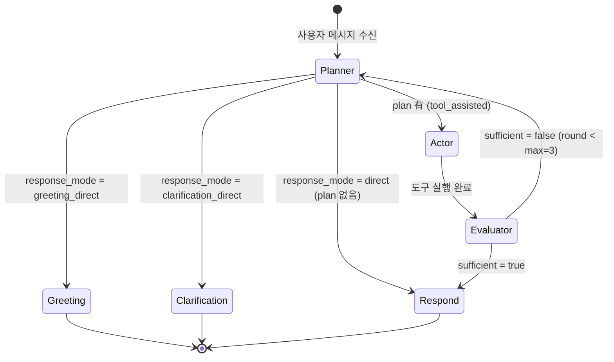

# 학습 자료: AI 에이전트 — Planner·Actor·Evaluator·Respond 분석팀

> 대상: server/server/agent/ (state · graph · nodes 4종 · entity_matching)
> 목적: LangGraph 기반 PAE 그래프가 어떻게 사용자 질문을 공공데이터 분석 보고서로 바꾸는지 이해한다.
> 선행 문서: [03 백엔드 접수창구](03-백엔드-접수창구.md) · 다음: [05 도구 9종: 전문 계측기](05-도구9종-전문계측기.md)

---

## §0 큰 그림 — "4인 분석팀" 비유

사용자가 "강남역 카페 창업 어때?" 라고 보내는 순간, 서버는 4명짜리 분석팀을 즉석으로 소집한다.

- **기획자 (Planner)**: 질문을 읽고 "업종 추천 요청이구나. 어떤 DB를 조사해야 하지?" 라고 계획을 세운다.
- **실무자 (Actor)**: 계획에 따라 DB 창구를 열고 데이터를 가져온다. 독립적인 조회는 동시에 처리한다.
- **검토자 (Evaluator)**: "모든 자료가 갖춰졌나? 빠진 게 있으면 기획자에게 반려한다."
- **작성자 (Respond)**: 모든 자료를 종합해 한국어 보고서를 LLM 스트리밍으로 작성한다.

검토자가 자료가 부족하다고 판단하면 기획자에게 반려(최대 3회). 충분하다고 판단해야 작성자로 넘어간다.



> 그래프 노드별 Tool 목록·LLM 프로바이더 역할은 [agent.md](../architecture/agent.md) 참조.

---

## §1 공유 업무 양식 — `AgentState` (`agent/state.py`)

팀원 4명이 협업하려면 공통 서류함이 필요하다. LangGraph에서 그 역할을 `AgentState`(TypedDict — 키와 타입이 미리 정해진 사전)가 담당한다. 요청 하나가 들어올 때마다 신규 인스턴스가 생성되고, 요청이 끝나면 사라진다(per-request 상태 격리).

```python
# server/server/agent/state.py (발췌)

class ToolPlanStep(TypedDict):
    tool_name: str        # e.g. "get_district_summary"
    args: dict            # e.g. {"district_code": "D3001"}
    reason: str           # e.g. "상권 종합 요약 조회"
    depends_on: list[int] # 선행 단계 인덱스 (DAG 의존성 표현)

class AgentState(TypedDict):
    # --- 메시지 ---
    messages: Annotated[list[BaseMessage], add_messages]

    # --- 컨텍스트 ---
    district_code: str
    district_name: str
    session_id: str
    conversation_history: list[dict]

    # --- Planner 기록 ---
    user_intent: str          # 분류된 의도 (summary / comparison / recommendation …)
    intent_confidence: float  # 분류 신뢰도 0.0~1.0
    referenced_districts: list[str]   # 언급된 상권 코드 목록
    referenced_category: str | None   # 언급된 업종 코드
    ambiguous_districts: list[dict]   # 상권명 매칭 모호 항목

    # --- Actor 기록 ---
    plan: list[ToolPlanStep]  # 실행 계획
    tool_results: dict[str, dict]  # 성공한 도구 결과
    tool_errors: dict[str, str]    # 실패한 도구 오류 메시지
    execution_round: int            # 재진입 횟수 (최대 3)

    # --- Evaluator 기록 ---
    evaluation: EvaluationResult | None

    # --- 응답 제어 ---
    response_mode: str   # "direct" | "tool_assisted" | "clarification_direct" | "greeting_direct"
    clarification_text: str   # P0-4: 빈 계획 시 즉시 돌려줄 고정 안내 문구
    card_emissions: list[dict]  # Actor가 발행한 카드 목록

    # --- 품질 ---
    quality_flags: list[dict]
    quality_match_rate: float
```

**왜 TypedDict인가?** LangGraph는 노드 함수가 `dict`를 반환하면 변경된 키만 상태에 병합(merge)한다. TypedDict를 쓰면 타입 힌트가 어떤 키를 어느 노드가 소유하는지 명확히 보여준다. `Annotated[list[BaseMessage], add_messages]`는 특별 처리 — `messages` 키는 덮어쓰지 않고 추가(append)한다.

**주의:** `card_emissions`는 Actor가 누적 방식으로 쓴다. 재진입 시 이전 라운드 카드도 유지되므로, `graph.py`에서 새 카드만 골라 SSE로 방출하는 인덱스 추적 로직이 별도로 있다.

---

## §2 그래프 조립 — `agent/graph.py`

### 라우팅 분기

```python
# server/server/agent/graph.py (발췌: route_after_planner)

def route_after_planner(state) -> str:
    if state.get("response_mode") == "greeting_direct":
        return "greeting"
    if state.get("response_mode") == "clarification_direct":
        return "clarification"
    if state.get("response_mode") == "direct" or not state.get("plan"):
        return "respond"
    return "actor"
```

이 코드는 Planner가 `response_mode`를 어떤 값으로 설정했느냐에 따라 다음 노드를 결정한다.

- `greeting_direct`: 인사 메시지 → LLM 없이 즉시 텍스트 발행 후 종료.
- `clarification_direct`: 빈 계획(참조 상권 부재 등) → 고정 안내 문구 발행 후 종료.
- `direct` 또는 plan 없음: 일반 질문(도구 없이 LLM만으로 충분) → Respond 직행.
- 나머지: Tool plan이 있음 → Actor 진입.

```python
# server/server/agent/graph.py (발췌: route_after_evaluator)

def route_after_evaluator(state) -> str:
    evaluation = state.get("evaluation")
    if not evaluation or evaluation["sufficient"]:
        return "respond"
    if (state.get("execution_round") or 0) >= settings.agent_max_rounds:
        return "respond"
    return "planner"
```

Evaluator 이후 분기: 충분하거나 최대 라운드(기본 3회)에 도달하면 Respond로. 부족하면 Planner로 반려(재진입). 이 루프가 PAE 아키텍처의 핵심이다.

### SSE 이벤트 큐

```python
# server/server/agent/graph.py (발췌: run_agent)

event_queue: asyncio.Queue[dict | None] = asyncio.Queue(maxsize=settings.sse_queue_maxsize)
```

`asyncio.Queue`(비동기 큐, FIFO 메시지 박스)를 그래프 바깥에 만들고, 내부 노드에 클로저로 전달한다. 노드들은 이 큐에 SSE 이벤트를 `put`하고, 바깥의 `run_agent` 제너레이터가 `get`해서 HTTP 스트림으로 내보낸다. `maxsize` 상한이 있어 소비자가 느리면 생산자도 블록된다(백프레셔).

---

## §3 기획자 — `agent/nodes/planner.py`

### 3-1. 규칙 우선 intent 분류

```python
# server/server/agent/nodes/planner.py (발췌: _classify_by_rules)

def _classify_by_rules(message: str) -> tuple[str | None, float]:
    config = load_intent_config()

    # 서비스 범위 외(서울 외 지역) 토큰이 있으면 다른 어떤 intent 보다 우선.
    out_of_scope_pattern = config.patterns.get("out_of_scope")
    if out_of_scope_pattern is not None and out_of_scope_pattern.search(message):
        return "out_of_scope", 0.95

    # ...단일 패턴 매칭, 다중 매칭 우선순위 등 ...
    if len(matched) == 1:
        return matched[0], 0.9
    if len(matched) > 1:
        for preferred in ("comparison", "simulation", "risk", "recommendation", "category_analysis"):
            if preferred in matched:
                return preferred, 0.85
        return None, 0.4

    return None, 0.0  # no match → LLM
```

**이 코드는:** `intents.yaml`에 정의된 정규식 패턴으로 빠르게 intent(사용자가 원하는 작업 종류)를 분류한다. 규칙으로 못 잡으면 신뢰도 0.7 미만 또는 `None`으로 반환해 LLM 경로로 넘긴다.

**왜 규칙 우선인가?** 인사말, 서울 외 지역 거부, 비교 요청 같은 자주 오는 패턴은 정규식으로 1ms 안에 처리한다. LLM 호출(15s 타임아웃)은 정말 모호한 경우에만 쓴다. 비용과 응답 속도 모두 절감된다.

### 3-2. out_of_scope 가드 (서울 외 지역 거부)

```python
# server/server/agent/nodes/planner.py (발췌: planner_node)

# 1.5. Out-of-scope short-circuit — 서울 외 지역(부산/제주/경기 등) 거부.
# LLM/Tool 호출 0건. greeting 처럼 그래프를 건너뛰고 즉시 종료.
if intent == "out_of_scope":
    tmpl = _CLARIFICATION_TEMPLATES["out_of_scope"]
    return {
        "user_intent": "clarification",
        "response_mode": "clarification_direct",
        "clarification_text": tmpl["text"],    # "현재 마켓스코프는 서울시 1,650개 상권만 지원합니다."
        "clarification_suggestions": list(tmpl["suggestions"]),
    }
```

**이 코드는:** "부산 해운대 분석해줘" 같은 질문이 오면 Tool 호출도, LLM 호출도 없이 즉시 고정 문구를 반환한다. `clarification_direct` 모드로 전환해 그래프가 `clarification` 노드로 건너뛴다.

**왜 3중 가드인가?** (1) `intents.yaml` 패턴으로 1차 거부, (2) `planner_node` 에서 short-circuit 2차 거부, (3) `respond.py` 시스템 프롬프트 rule 13에 "서울 외 지역 수치 생성 금지" 3차 방어. LLM이 "부산도 대충 알겠지" 하고 환각(hallucination)하는 것을 세 겹으로 막는다.

### 3-3. 한국어 조사 strip과 상권명 추출

> **메모리 교훈 `feedback_korean_particles`**: DB에 저장된 상권명은 조사가 없는 순수 이름("강남역"). 사용자가 "강남역을 분석해줘", "홍대입구와 성수를 비교해줘" 라고 입력하면 조사("을", "와")가 붙어 직접 매칭이 실패한다. `detect_districts_in_message()`와 `entity_matching.py`가 이 문제를 해결한다.

```python
# server/server/agent/utils/entity_matching.py (발췌: _string_similarity)

def _string_similarity(query: str, name: str) -> float:
    if query == name:
        return 1.0
    if name.startswith(query):
        coverage = len(query) / max(len(name), 1)
        return 0.55 + 0.25 * coverage
    if query in name:
        coverage = len(query) / max(len(name), 1)
        return 0.55 + 0.15 * coverage
    # ...
    return SequenceMatcher(None, query, name).ratio() * 0.5
```

Repository 레이어의 `detect_districts_in_message()`는 메시지를 어절 단위로 분리하고 각 어절에서 조사(은/는/이/가/을/를/과/와/에서/의 등)를 strip한 뒤 이 함수로 1,650개 상권명과 비교한다. 완전 일치가 최고점(1.0)이고, 접두 매칭·부분 문자열 매칭·퍼지 매칭 순으로 점수가 낮아진다.

**abstention(기권) 임계값:**

```python
# server/server/agent/utils/entity_matching.py (발췌)

TOP1_MIN = 0.55          # 이 미만이면 "모른다" (매칭 실패)
STRONG_TOP1_MIN = 0.70   # 앵커(지도 선택 상권)가 없을 때 더 엄격한 기준
CLOSE_DELTA = 0.08       # Top1과 Top2 점수 차이가 이보다 작으면 모호(ambiguous) 처리
```

`STRONG_TOP1_MIN=0.70`은 out-of-scope 2026-04-29 fix에서 추가됐다. 지도에서 상권을 선택하지 않고 텍스트만 입력한 경우, 0.55~0.70 구간 약한 매칭을 거부해 "서울 외 비슷한 이름"이 엉뚱하게 매칭되는 것을 막는다.

**상권 유형 가산점:**

```python
# server/server/agent/utils/entity_matching.py (발췌)

TYPE_PRIORITY: dict[str, int] = {
    "발달상권": 4,
    "골목상권": 2,
    "관광특구": 2,
    "전통시장": 1,
}
_TYPE_BOOST_PER_RANK = 0.05
_PAREN_EXACT_BONUS = 0.15   # "홍대" → "홍대입구역(홍대)" 괄호 별칭 정확 매칭 보너스
```

사용자가 "홍대"라고 하면 DB에는 "홍대입구역(홍대)", "홍대부중" 등 여러 후보가 있다. 괄호 안 별칭 정확 매칭(+0.15)과 발달상권 유형 가산점(+0.20)이 "홍대입구역(홍대)"를 확실하게 1위로 끌어올린다.

---

## §4 실무자 — `agent/nodes/actor.py`

Actor는 LLM을 전혀 호출하지 않는다. 오직 DB 조회 도구(Tool)만 실행한다.

### 4-1. 의존성 레이어 그룹핑

```python
# server/server/agent/nodes/actor.py (발췌: group_by_dependencies)

def group_by_dependencies(plan: list[ToolPlanStep]) -> list[list[ToolPlanStep]]:
    """Split plan steps into layers that can execute in parallel."""
    layers: list[list[ToolPlanStep]] = []
    resolved: set[int] = set()

    while len(resolved) < len(plan):
        current_layer: list[ToolPlanStep] = []
        for i, step in enumerate(plan):
            if i in resolved:
                continue
            if all(dep in resolved for dep in step["depends_on"]):
                current_layer.append(step)
        # ...
        layers.append(current_layer)

    return layers
```

**이 코드는:** `ToolPlanStep.depends_on`(선행 단계 인덱스 목록)을 보고 위상 정렬(DAG — 방향 비순환 그래프)을 수행한다. 서로 의존 관계가 없는 단계는 같은 레이어에 묶이고, 같은 레이어는 한 번에 병렬 실행된다.

### 4-2. 병렬 실행 (`asyncio.gather`)

```python
# server/server/agent/nodes/actor.py (발췌: actor_node)

for layer in layers:
    # 레이어 내 모든 도구를 동시에 시작
    results = await asyncio.gather(
        *[execute_tool(step) for step in layer],
        return_exceptions=True,
    )
```

`asyncio.gather`(여러 비동기 작업을 동시에 돌리고 모두 기다리는 함수)를 쓰면 레이어 안의 도구들이 병렬로 실행된다. 예를 들어 summary 의도는 유동인구·매출·점포·인구 4개 도구를 동시에 조회하므로 순차 대비 약 4배 빠르다. `return_exceptions=True`는 하나가 실패해도 나머지를 계속 실행하게 한다.

**도구 실행 안전망:**

```python
# server/server/agent/nodes/actor.py (발췌: execute_tool)

@retry(
    stop=stop_after_attempt(2),
    wait=wait_fixed(0.5),
    retry=retry_if_exception_type(_db_errors),  # DB OperationalError / InterfaceError 만
    reraise=True,
)
async def _run():
    args = {k: v for k, v in step["args"].items() if v is not None}
    return await meta.fn(**args)

async with asyncio.timeout(settings.tool_execution_timeout):  # 기본 15초
    result = await _run()
```

DB 연결 일시 오류는 0.5초 후 1회 재시도. 그 외 예외는 즉시 실패 처리. 15초 이내에 응답 없으면 타임아웃. 결과가 크면 `_truncate_result()`로 토큰 예산 절감(리스트 필드 10개로 제한).

### 4-3. 카드 발행

```python
# server/server/agent/nodes/actor.py (발췌)

card_type = meta.card_type if meta else None
if card_type and step["tool_name"] in tool_results:
    card_data = tool_results[step["tool_name"]]
    if "error" not in card_data:
        card_copy = dict(card_data)
        sources = get_sources_for_tool(step["tool_name"])
        if sources:
            card_copy["dataSources"] = sources
        card_emissions.append({"card_type": card_type, "data": card_copy})
```

도구가 성공하면 해당 도구의 `card_type`(예: `"summary"`, `"recommend"`)을 보고 카드를 `card_emissions`에 추가한다. 카드에는 데이터 출처(`dataSources` — 서울 열린데이터 URL 등)가 자동으로 붙는다. `graph.py`가 이 목록을 주기적으로 읽어 SSE `card` 이벤트로 방출한다.

---

## §5 검토자 — `agent/nodes/evaluator.py`

### 5-1. Fast path (규칙 기반, LLM 없음)

```python
# server/server/agent/nodes/evaluator.py (발췌: _fast_evaluate)

def _fast_evaluate(state: AgentState) -> EvaluationResult | None:
    """Rule-based sufficiency check for simple, first-round intents."""
    if not settings.evaluator_skip_simple:
        return None
    if state.get("user_intent") not in SIMPLE_INTENTS:  # {"summary", "comparison", "recommendation", "risk"}
        return None
    if (state.get("execution_round") or 0) > 1:
        return None

    if planned_tools and planned_tools.issubset(succeeded_tools) and not failed_tools:
        return EvaluationResult(sufficient=True, ...)

    if planned_tools and planned_tools.issubset(failed_tools):
        return EvaluationResult(sufficient=False, ...)

    return None  # mixed → slow path
```

**이 코드는:** 단순한 의도(summary/comparison 등)이고 첫 라운드이며 성공·실패 패턴이 명확하면 LLM 없이 바로 판정한다. "모든 도구 성공 → sufficient=True", "모든 도구 실패 → sufficient=False". 혼합이면 `None`을 반환해 Slow path로 넘긴다.

**왜 이 설계인가?** 대부분 요청은 1라운드에 성공한다. 이때마다 Gemini Flash를 호출하면 비용과 시간이 낭비된다. 규칙이 확실히 답할 수 있는 케이스는 미리 처리한다.

### 5-2. Slow path (LLM 판정)

```python
# server/server/agent/nodes/evaluator.py (발췌: evaluator_node)

fast_result = _fast_evaluate(state)
if fast_result is not None:
    return {"evaluation": fast_result}

# Slow path
try:
    llm_result = await _llm_evaluate(state)
    ...
    return {"evaluation": llm_result}
except CircuitOpenError:
    # LLM 서킷 브레이커가 열려 있으면 규칙 기반으로 폴백
    return {"evaluation": _rule_based_evaluate(state)}
```

Fast path가 `None`을 반환하면(혼합 결과, 복잡한 의도) Gemini Flash에 도구 결과 요약을 주고 충분성 판정을 맡긴다. LLM이 실패하거나 서킷 브레이커(회로 차단기 — 연속 실패 시 빠르게 거부하는 보호 장치)가 열려 있으면 `_rule_based_evaluate()`로 폴백한다.

### 5-3. 추천 질문 생성

```python
# server/server/agent/nodes/evaluator.py (발췌: generate_proactive_suggestions)

def generate_proactive_suggestions(state: AgentState) -> list[str]:
    intent = state.get("user_intent", "")
    name = _short_name(state.get("district_name", "여기"))
    results = state.get("tool_results") or {}

    if intent == "summary":
        suggestions = [f"{name}에서 뭐하면 좋을까?", f"{name} 리스크 분석해줘", ...]
        summary = results.get("get_district_summary", {})
        close_rate = summary.get("closeRate", {}).get("current", 0)
        if close_rate and close_rate > 8.0:
            suggestions[1] = f"{name} 폐업률이 높아요 — 리스크 분석해볼까요?"
```

**이 코드는:** 단순 고정 문구가 아니라 실제 Tool 결과를 보고 추천 질문을 조정한다. 폐업률이 8%를 넘으면 리스크 관련 질문을 더 강조하는 식이다. `_short_name()`은 "홍대입구역(홍대)"에서 괄호 부분을 제거해 "홍대입구역"으로 깔끔하게 표시한다.

---

## §6 작성자 — `agent/nodes/respond.py`

### 6-1. 시스템 프롬프트 역할

`RESPOND_SYSTEM_PROMPT`는 280줄 분량의 한국어 컨설턴트 페르소나 + 출력 규칙이다. 핵심만 꼽으면:

- **Rule 1**: `[수집된 데이터]` 섹션 외 수치를 추측 금지.
- **Rule 11**: 할루시네이션 금지 — 도구 데이터 부족 시 "해당 데이터가 부족합니다" 자연어 안내.
- **Rule 13**: 서울 외 지역 수치 생성 금지 (Planner 가드 통과 시 최후 방어선).
- **Rule 14**: XML 태그, Tool 호출 JSON, 함수명 괄호 표기 출력 금지.
- **3단 해석법**: What(수치) → So What(의미) → Context(맥락).
- **매출 표현 규칙**: 월 매출 절대값 + 같은 유형 상권 분위 컨텍스트 + 점포당 월 매출 세트 제공 의무.

### 6-2. 스트리밍 + 이중 정화 체인

```python
# server/server/agent/nodes/respond.py (발췌: respond_node)

xml_sanitizer = _XMLTagSanitizer()
tool_sanitizer = _ToolTagSanitizer()

async def _emit(raw: str) -> None:
    """SSE emit chain: XML sanitiser → Tool-tag sanitiser → user."""
    safe_xml = xml_sanitizer.feed(raw)
    if not safe_xml:
        return
    safe = tool_sanitizer.feed(safe_xml)
    if not safe:
        return
    if event_queue:
        await event_queue.put({"type": "text", "content": safe})

async with asyncio.timeout(settings.llm_timeout_slow):  # 기본 60초
    async for chunk in llm.astream(messages):
        content = chunk.content
        if isinstance(content, str) and content:
            await _emit(content)
```

**이 코드는:** LLM이 토큰을 스트리밍으로 내보낼 때마다 두 정화기를 통과시킨다.

- `_XMLTagSanitizer`: `<tool_use>`, `<get_district_summary>` 등 Claude가 내부 도구 호출 형식으로 출력하는 XML 태그를 스트림 중에 제거한다. 미완성 태그는 버퍼에 보관했다가 닫히는 `>` 확인 후 판단한다.
- `_ToolTagSanitizer`: `(get_district_summary)`, `(recommend_business)` 처럼 함수명이 괄호로 노출되는 패턴을 제거한다.

**왜 이중 정화가 필요한가?** Claude Sonnet 4는 추가 데이터가 필요하다고 판단할 때 XML 형식의 도구 호출 토큰을 응답 본문에 섞어 보내는 경향이 있다. 프론트엔드가 이를 파싱하지 않으면 원시 XML이 그대로 화면에 노출된다. 스트림 중에 실시간으로 걸러야 하므로 상태 기계(state machine — 현재 상황을 기억하며 처리하는 장치) 방식을 썼다.

### 6-3. 프롬프트 조립

```python
# server/server/agent/nodes/respond.py (발췌: build_respond_prompt)

sections = [RESPOND_SYSTEM_PROMPT, ATTRIBUTION_PROMPT_RULE]

# Tool 결과 충분성에 따라 abstention 문구 추가
status = classify_tool_results(tool_results, tool_errors)
if status == "empty":
    sections.append(ABSTENTION_PROMPT_ADDENDUM_EMPTY)
elif status == "partial":
    sections.append(ABSTENTION_PROMPT_ADDENDUM_PARTIAL)

# 대화 이력, 수집된 데이터, 실패 도구, 후속 제안, 현재 컨텍스트 순서로 조립
if tool_results:
    sections.append(f"## 수집된 데이터\n{_format_tool_results(tool_results)}")

return "\n\n".join(sections)
```

**이 코드는:** 시스템 프롬프트에 상황에 따라 섹션을 붙여 나간다. Tool 결과가 하나도 없으면 `ABSTENTION_PROMPT_ADDENDUM_EMPTY`("데이터 없이 수치를 만들지 말 것")를 추가해 환각을 한 번 더 억제한다. 실패한 도구는 "이 항목은 언급하지 말고 확보된 데이터만으로 답변하세요"라는 지시와 함께 별도 섹션으로 전달된다.

---

## §마지막 — 이 문서가 가르치는 핵심 원칙

1. **규칙 우선, LLM 폴백**: 인사·서울 외 거부·단순 의도 분류 모두 정규식으로 먼저 처리. LLM은 정말 모호한 케이스에만. 비용·응답 속도 두 마리 토끼.

2. **PAE 최대 3 라운드 루프**: Actor 도구 결과가 불충분하면 Evaluator가 반려하고 Planner가 재계획. 최대 3회(설정값 `agent_max_rounds`)로 무한 루프 방지.

3. **병렬 Tool 실행 (asyncio.gather)**: 한 레이어 안 도구는 동시 실행. 순차 대비 최대 N배(도구 수만큼) 빠름. `depends_on` DAG로 순서 의존성 정확히 표현.

4. **서울 외 지역 3중 가드**: `intents.yaml` 패턴(L1) → `planner_node` short-circuit(L2) → `RESPOND_SYSTEM_PROMPT` rule 13(L3). 환각으로 엉뚱한 수치를 만드는 경로를 세 겹으로 차단.

5. **한국어 조사 strip 필수**: DB 상권명에는 조사 없음. 상권 추출 시 `detect_districts_in_message()` 경유 필수. 직접 문자열 매칭 금지.

6. **per-request 상태 격리**: `AgentState`는 요청마다 새로 생성·소멸. 세션 간 상태 오염 없음. 메모리 상한 512KB.

7. **스트리밍 이중 정화**: XML 태그 sanitizer + Tool 태그 sanitizer를 직렬로 연결. LLM이 내부 도구 호출 형식을 응답 본문에 흘려보내도 사용자 화면에는 도달하지 않음.

8. **Evaluator Fast path**: 단순 의도 1라운드에서 모든 도구가 성공/실패 일치하면 LLM 없이 즉시 판정. 대부분 요청에서 Evaluator LLM 호출 비용 절감.

9. **Circuit Breaker 폴백 체인**: LLM이 연속 5회 실패하면 OPEN 상태로 전환. 이후 호출은 즉시 거부. Evaluator와 Planner LLM이 모두 규칙 기반으로 폴백해 서비스 중단 없이 degraded 동작.

---

> 도구 9종 상세(입력·출력·카드 타입)는 [05 도구 9종: 전문 계측기](05-도구9종-전문계측기.md) 에서 계속.
> 전체 그래프 다이어그램·LLM 프로바이더 역할표는 [agent.md](../architecture/agent.md) 참조.
