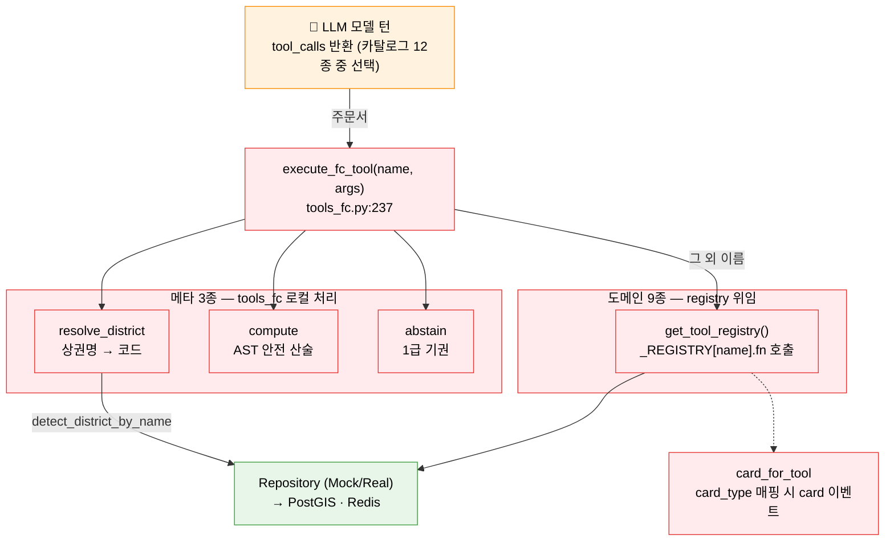

# 학습 자료: 도구 12종 — 컨설턴트의 전문 계측기

> 대상: server/server/agent/loop/tools_fc.py · agent/tools/ (registry · 대표 도구 district_summary)
> 목적: v2 루프가 LLM에 바인딩하는 도구 12종의 이층 구조(도메인 9종 + 메타 3종), `@register_tool` 자기등록 패턴, 카드 매핑을 이해한다.
> 선행 문서: [04 AI 에이전트: v2 루프](04-AI에이전트-v2루프.md) · 다음: [06 데이터 레이어: 자료실](06-데이터레이어-자료실.md)

---

## §0 큰 그림 — 연장통의 이층 구조

현장 조사를 나가는 컨설턴트의 연장통에는 계측기가 두 층으로 담겨 있다.

- **아래층 — 도메인 계측기 9종**: 유동인구 측정기, 매출 스캐너, 점포 이력 조회기 … 각각이 한 가지 데이터 질문에 집중하는 전문 장비다. 이 장비들은 v2 이전부터 있었고, `@register_tool` 데코레이터로 **스스로 명부(_REGISTRY)에 등록**된다.
- **위층 — 메타 계측기 3종** (`resolve_district` · `compute` · `abstain`): 데이터 자체가 아니라 **컨설턴트의 행동 방식**을 위한 장비다. v2 루프(`loop/tools_fc.py`)가 신설했다 — 상권명을 코드로 바꾸는 주소록, 암산을 금지하는 계산기, "모른다"를 공식 선언하는 기권 버튼.

두 층의 관계를 한 문장으로: **registry 는 실체이고, tools_fc 는 모델에게 보여주는 카탈로그다.** 도메인 도구의 함수 본체·카드 타입·진행 라벨은 registry가 소유하고, `tools_fc.py::tool_schemas()`는 그 9종을 LLM이 읽을 수 있는 function-calling 스키마로 포장해 메타 3종과 함께 **총 12개 카탈로그**를 만든다. LLM은 카탈로그를 보고 "이번 턴엔 이 계측기"라고 주문하고, 실행기(`execute_fc_tool`)가 주문을 실체에 연결한다.



> v2 루프는 이 도구들을 **순차 실행**한다 — 한 턴에 여러 tool_calls 가 와도 하나씩 돈다. 병렬화가 필요한 조합은 `get_district_summary` 처럼 **도구 내부**에 캡슐화돼 있다(§4). 루프 쪽 실행 흐름은 [04 §2-4](04-AI에이전트-v2루프.md)를 참조.

---

## §1 자기등록 패턴 — registry.py 줄별 해설

**파일**: `server/server/agent/tools/registry.py`

계측기가 늘어날수록 실행기가 모든 계측기 이름과 사용법을 외워야 한다면 관리가 어렵다. 이 문제를 해결하는 장치가 **자기등록 패턴**이다. 각 계측기는 제조될 때 이름표(`@register_tool`)를 스스로 붙여 명부(_REGISTRY)에 등록한다. 실행기는 명부만 보면 된다.

```python
@dataclass
class ToolMeta:                     # registry.py:16
    """Metadata for a single tool."""

    name: str
    fn: Callable[..., Any]
    card_type: str | None
    progress_label: str
    done_label: str
    description: str
```

**ToolMeta** — 각 도구의 신분증(dataclass). 함수 참조(`fn`), 카드 타입(`card_type`), 사용자에게 보이는 진행 라벨 두 개(`progress_label` · `done_label`)를 한 객체에 묶는다.

```python
_REGISTRY: dict[str, ToolMeta] = {}
```

**_REGISTRY** — 등록된 것들을 모아두는 명부. 모듈 수준의 딕셔너리이므로 프로세스 전체에서 하나만 존재한다(싱글톤 효과).

```python
def register_tool(                  # registry.py:30
    name: str,
    *,
    emoji: str = "",
    card_type: str | None = None,
    progress_label: str = "",
    done_label: str = "",
):
    """Decorator that registers a tool function with its metadata."""

    def decorator(fn: Callable) -> Callable:
        _REGISTRY[name] = ToolMeta(
            name=name,
            fn=fn,
            card_type=card_type,
            progress_label=progress_label or f"{name} 실행 중...",
            done_label=done_label or f"{name} 완료",
            description=fn.__doc__ or "",
        )
        return fn

    return decorator
```

**register_tool** — 데코레이터 팩토리(함수에 표식·기능을 덧붙이는 @문법을 생성하는 함수). 주요 포인트:

- `*` 뒤 파라미터는 **키워드 전용** 인수다 — `@register_tool("name", card_type="summary")` 처럼 명시적으로 적어야 한다.
- `progress_label or f"{name} 실행 중..."` — 라벨을 생략하면 이름 기반 기본값이 자동 적용된다.
- `description=fn.__doc__ or ""` — 함수 docstring을 자동으로 메타데이터로 끌어온다.
- `return fn` — 함수 자체는 변형하지 않는다. 등록만 하고 원본을 그대로 반환한다(투명 데코레이터 패턴).

```python
def get_tool_registry() -> dict[str, ToolMeta]:     # registry.py:54
    """Return the tool registry, discovering tools on first access."""
    if not _REGISTRY:
        _discover_tools()
    return _REGISTRY
```

**지연 디스커버리(lazy discovery)** — `get_tool_registry()`를 처음 호출하는 순간에만 9개 모듈을 import한다. import 자체가 `@register_tool` 데코레이터를 실행시켜 _REGISTRY를 채운다.

> **결합도(coupling) 최소화**: 새 도구를 추가할 때 registry.py의 `_discover_tools`에 모듈명 한 줄만 추가하면 된다. 루프 엔진(`engine.py`)이나 실행기(`tools_fc.py`)는 건드리지 않아도 된다 — 카탈로그(`tool_schemas`)에 스키마 항목 하나만 더 쓰면 LLM이 새 계측기를 쓸 수 있다.

---

## §2 카탈로그 12종 표 — `tools_fc.py::tool_schemas()` (tools_fc.py:37)

스키마는 OpenAI-function 형태의 dict 로 작성된다(Anthropic·Gemini 양쪽 `bind_tools`에서 동작). 아래 표는 `tool_schemas()`의 실제 12개 항목이다.

| # | 도구 | 층 | 주요 인자 | card_type (코드 실젯값) | 진행 라벨 | 기능 |
|---|---|---|---|---|---|---|
| 1 | `resolve_district` | 메타 | name | — | "상권 찾는 중..." | 상권명→코드 |
| 2 | `get_district_summary` | 도메인 | district_code | `"summary"` | "상권 요약 분석 중..." | F03 종합요약 |
| 3 | `get_floating_population` | 도메인 | district_code, quarter? | `None` | (registry 라벨) | 유동인구 상세 |
| 4 | `get_estimated_sales` | 도메인 | district_code, category_code? | `None` | (registry 라벨) | 매출(월환산) |
| 5 | `get_store_info` | 도메인 | district_code, category_code? | `None` | (registry 라벨) | 점포 현황 |
| 6 | `get_store_history` | 도메인 | district_code | `"risk"` | (registry 라벨) | F08 리스크 |
| 7 | `get_population_info` | 도메인 | district_code | `None` | (registry 라벨) | 상주/직장 인구 |
| 8 | `compare_districts` | 도메인 | district_codes[2..3] | `"compare"` | (registry 라벨) | F05 비교 |
| 9 | `recommend_business` | 도메인 | district_code, budget?, preference? | `"recommend"` | (registry 라벨) | F07 추천 |
| 10 | `simulate_revenue` | 도메인 | district_code, category_code?, unit_price? | `"simulation"` | (registry 라벨) | F09 시뮬 |
| 11 | `compute` | 메타 | expression | — | "계산 중..." | 산술 계산 |
| 12 | `abstain` | 메타 | reason | — | "확인 중..." | 1급 기권 |

- **card_type 을 가진 5종**(`summary`/`risk`/`compare`/`recommend`/`simulation`)이 프론트 `cards/registry.ts`의 5개 키와 1:1 일치한다. `None` 인 4종은 카드 없이 데이터 공급/텍스트 컨텍스트 역할만 한다. `population`/`sales`/`store`/`history` 같은 card_type 은 **존재하지 않는다**.
- 라벨 소유권도 이층 구조를 따른다: 메타 3종의 라벨은 `labels_for_tool`(tools_fc.py:289)의 로컬 테이블에, 도메인 9종의 라벨은 registry `ToolMeta`에 있다.
- 스키마의 설명 문구 자체가 모델 행동을 조향한다: `district_code` 인자 설명은 "모르면 먼저 resolve_district 로 찾으세요", `compute` 설명은 "숫자 계산은 암산하지 말고 반드시 이 도구를 쓰세요" — 카탈로그가 곧 사용 설명서다.

> **내부 헬퍼 `get_district_benchmarks` (`benchmarks.py`)**: `@register_tool` 미등록 함수라 명부에 없고, 따라서 카탈로그 12종에도 등장하지 않는다. `district_summary.py`와 `store_history.py`가 직접 import해 내부에서만 호출한다 — 의도된 설계다.

---

## §3 메타 도구 3종 — 설계 의도 줄별 해설

### 3-1. `resolve_district` — 열린 질문의 일반성

```python
# tools_fc.py:250-260 (발췌)
if name == RESOLVE_DISTRICT:
    from server.repositories import get_data_access

    da = get_data_access()
    match = await da.districts.detect_district_by_name(clean.get("name", ""))
    if not match:
        return ({"error": "해당 상권을 찾지 못했습니다."}, "not_found")
    return ({"code": match["code"], "name": match.get("name"), "score": match.get("score")}, None)
```

**왜 필요한가?** 도메인 도구는 전부 `district_code`(예: 3120103)를 요구한다. 그런데 사용자는 "성수동 카페거리 어때?"라고 **이름**으로 말한다. 지도를 클릭했다면 chat.py가 코드를 넣어 주지만, 채팅만으로 진입한 열린 질문은 코드가 없다. resolve_district 는 그 간극을 **모델이 스스로 메우게** 하는 다리다 — 시스템 프롬프트도 "상권명만 말하면 resolve_district 부터"라고 안내한다. 내부는 Repository의 퍼지 매칭(`detect_district_by_name`, 한국어 조사 strip 포함 — [06](06-데이터레이어-자료실.md))을 그대로 재사용한다.

성공 결과의 `name`은 엔진이 따로 기억해 뒀다가(engine.py:208-209) 추천 질문 개인화("○○ 리스크는 어때?")에 쓴다.

### 3-2. `compute` — 암산 금지 계약의 집행

```python
# tools_fc.py:192-209 (발췌 — eval() 미사용 AST 평가기)
def _eval_node(node: ast.AST) -> float:
    if isinstance(node, ast.Constant) and isinstance(node.value, (int, float)):
        return float(node.value)
    if isinstance(node, ast.BinOp) and type(node.op) in _BIN_OPS:
        return _BIN_OPS[type(node.op)](_eval_node(node.left), _eval_node(node.right))
    if isinstance(node, ast.UnaryOp) and type(node.op) in _UNARY_OPS:
        return _UNARY_OPS[type(node.op)](_eval_node(node.operand))
    raise ValueError("허용되지 않은 식")


def safe_compute(expression: str) -> dict:          # tools_fc.py:202
    try:
        tree = ast.parse(expression, mode="eval")
        value = _eval_node(tree.body)
        return {"expression": expression, "result": value}
    except Exception as exc:
        return {"error": f"계산 실패: {exc}"}
```

**왜 필요한가?** LLM 은 산수를 자주 틀린다 — 특히 "4,106,209 ÷ 1,412,369는 몇 배?" 같은 큰 수 나눗셈. 더 나쁜 건, 모델이 암산한 파생 수치는 **도구가 반환한 값이 아니므로** Trust Kernel 바인딩에 실패해 정당한 분석까지 차단된다는 점이다. compute 는 두 문제를 한 번에 푼다: 계산은 파이썬이 정확히 하고, 결과는 `computed` 리스트로 흘러들어 **바인딩 풀에 합류**한다([04 §2-4](04-AI에이전트-v2루프.md)) — 파생 수치가 "근거 있는 숫자"가 되는 유일한 경로.

**왜 AST 인가?** `eval()`은 임의 코드 실행 통로다(LLM 출력을 eval 에 넣는 것은 프롬프트 인젝션을 셸에 넣는 것과 같다). `ast.parse` 후 **화이트리스트 노드**(숫자 상수, +−×÷, 거듭제곱, 나머지, 단항 부호, 괄호)만 재귀 평가한다. 그 밖의 모든 것 — 이름, 함수 호출, 속성 접근 — 은 `ValueError`. 계산기여야 하는 도구가 계산기 이상이 될 수 없게 만든 것이다.

### 3-3. `abstain` — "모른다"의 1급 승격

```python
# tools_fc.py:247-248
if name == ABSTAIN:
    return ({"abstain": True, "reason": clean.get("reason", "")}, None)
```

**왜 필요한가?** 실행부는 두 줄이지만 설계 의미는 12종 중 가장 크다. LLM 의 고질병은 "모른다"를 못 한다는 것 — 데이터가 없으면 그럴듯한 숫자를 지어낸다. abstain 은 기권을 **도구 호출이라는 1급 행동**으로 만들었다: 서울 외 지역이거나 데이터가 없으면 모델이 이 버튼을 누르고, 엔진은 즉시 루프를 끊은 뒤(engine.py:237-238) 고정 템플릿("요청하신 내용은 확인된 데이터로 답하기 어렵습니다. {이유}...")으로 답한다. 추측 생성 경로 자체가 닫힌다.

시스템 프롬프트의 "데이터가 없거나 서울 외 지역이면 abstain — 추측하지 마세요"(약속)와 Trust Kernel(집행)이 이 버튼의 앞뒤를 받친다. 실전 검증: 2026-07-02 QA에서 데이터 없는 업종 질문에 "억지로 숫자를 만들지 않겠다"는 명시 거부가 확인됐다(Q10).

### 3-4. 공통 전처리 — 업종명 관용

```python
# tools_fc.py:237-241 (execute_fc_tool 진입부)
clean = {k: v for k, v in (args or {}).items() if v is not None}
if "category_code" in clean:
    clean["category_code"] = _normalize_category(clean["category_code"])
```

`_normalize_category`(tools_fc.py:219)는 모델이 `category_code`에 "카페" 같은 **업종명**을 넣어도 CategoryResolver 로 코드(CS100010)로 바꿔 준다. 교훈이 담긴 코드다: 시스템 프롬프트는 "업종명을 그대로 넣어도 된다"고 약속했는데 실행부가 이행하지 않아 `simulate_revenue("카페")`가 항상 빈 결과를 반환하던 결함(2026-07-02 QA HIGH)의 수정이다. **프롬프트가 한 약속은 실행부가 지켜야 한다.**

---

## §4 대표 도메인 도구 줄별 — district_summary.py

**파일**: `server/server/agent/tools/district_summary.py` (등록 선언: :40)
역할: 4개 도구를 병렬 호출해 하나의 Summary Card 페이로드로 조립한다.

### 등록 선언

```python
@register_tool(
    "get_district_summary",
    card_type="summary",
    progress_label="상권 요약 분석 중...",
    done_label="상권 요약 완료",
)
async def get_district_summary(district_code: str) -> dict:
    """Aggregate data for a district into SummaryCardData shape."""
```

`card_type="summary"` — 루프는 이 값을 보고(`card_for_tool`, tools_fc.py:276) 결과를 `SummaryCard` 컴포넌트로 렌더링할 `card` SSE 이벤트를 발행한다.

### 캐시 체크

```python
    cache = get_cache_service()
    cache_key = f"summary:{district_code}"
    cached = await cache.get(cache_key)
    if cached is not None:
        return cached
```

Redis(또는 MemoryCache) 조회를 먼저 한다. 캐시 히트 시 DB 호출 없이 즉시 반환 — TTL 24시간.

### 4종 병렬 호출

```python
    da = get_data_access()

    # 4 parallel calls
    fp_result, sales_result, store_result, meta = await asyncio.gather(
        get_floating_population(district_code),
        get_estimated_sales(district_code),
        get_store_info(district_code),
        da.districts.get_district_meta(district_code),
    )
```

`asyncio.gather` — 4개 코루틴을 동시에 실행한다. 각각이 DB 쿼리를 수행하므로, 순차 실행 대비 응답 시간이 최대 4분의 1로 단축된다. v2 루프의 tool call 은 순차지만, **병렬화가 도구 내부에 캡슐화**돼 있어 성능은 유지된다. `get_floating_population` 등 등록된 다른 도구 함수를 직접 import해 재사용하는 도구 간 조합이기도 하다.

### 에러 격리

```python
    if not meta:
        return {"error": f"상권 코드 '{district_code}'에 해당하는 데이터가 없습니다."}

    fp_ok = "error" not in fp_result
    sales_ok = "error" not in sales_result
    store_ok = "error" not in store_result
```

하위 도구 하나가 실패해도 나머지 결과로 응답을 구성할 수 있도록 `*_ok` 플래그로 개별 방어한다. 전체 실패가 아닌 **부분 성공** 허용 설계다.

### 인사이트 블록 (파생 지표)

```python
    insights: dict = {}

    if fp_ok:
        gender = fp_result.get("gender", {})
        m_ratio = gender.get("male_ratio", 50)
        f_ratio = gender.get("female_ratio", 50)
        diff = abs(m_ratio - f_ratio)
        if diff >= 5:
            dominant = "남성" if m_ratio > f_ratio else "여성"
            insights["genderInsight"] = (
                f"{dominant} 비중 높음 ({dominant} {max(m_ratio, f_ratio):.1f}%, 차이 {diff:.1f}%p)"
            )
    ...
    if sales_ok and total_stores > 0:
        insights["perStoreSales"] = round(monthly_sales / total_stores)
```

원시 데이터(raw)가 아니라 **해석된 텍스트**를 LLM 컨텍스트에 주입한다. 성별 차이 5%p 이상일 때만 genderInsight를 포함하는 식으로 불필요한 토큰을 줄인다.

### 벤치마크 블록 (내부 헬퍼 호출)

```python
    per_store = insights.get("perStoreSales", 0)
    benchmarks = await get_district_benchmarks(
        meta["type"],
        floating_pop=quarter_total,
        monthly_sales=monthly_sales,
        close_rate=close_rate["current"],
        store_count=total_stores,
        per_store_sales=per_store,
    )
```

> `quarter_total` 은 repo 가 반환하는 **분기 시간대별 합계 총량**이다 (`fp_result.get("quarter_total", 0)`). 과거 이 값은 `daily_avg` 라는 이름이었는데, 실제로는 일평균이 아닌 분기 총계라서 LLM이 "일평균"으로 오독·날조하는 원인이 됐고 2026-07-04에 `quarter_total`/`quarterTotal` 로 근본 rename 됐다. — 필드 이름이 데이터의 **단위·의미**를 정확히 말하게 하라는 교훈. v2 시스템 프롬프트도 "'일평균' 표기 금지"를 명시한다.

`get_district_benchmarks`는 `benchmarks.py`의 내부 헬퍼다(카탈로그 미등장 — §2 참조). 같은 상권 유형(type) 내 백분위 순위를 계산해 "이 상권이 유사 상권 대비 어느 위치인지"를 알려준다.

### 카드 페이로드 조립 및 캐시 저장

```python
    result = {
        "districtName": meta["name"],
        "districtType": meta["type"],
        "summary": summary_text,
        "monthlySales": monthly_sales,
        "floatingPopulation": {
            "quarterTotal": quarter_total,
            "peakHour": fp_result.get("peak_hour", 0) if fp_ok else 0,
            "byHour": by_hour,
        },
        "topCategories": top_categories,
        "status": status,
        "closeRate": close_rate,
        "insights": insights,
        "dataQuarter": data_quarter,
        "dataSources": get_sources_for_tool("get_district_summary"),
    }

    if benchmarks:
        result["benchmarks"] = benchmarks

    await cache.set(cache_key, result, ttl=86400)
    return result
```

`dataSources` — 데이터 출처(기관명·라이선스)를 페이로드에 포함해 프론트엔드의 `SourcesCitation` 컴포넌트가 자동으로 표시한다. 마지막으로 결과를 캐시에 저장(TTL=86400초=24시간)한 뒤 반환한다.

---

## §마지막 — 이 문서가 가르치는 핵심 원칙

1. **이층 구조 — registry 는 실체, tools_fc 는 카탈로그.** 도메인 9종의 함수·카드·라벨은 registry가 소유하고, tools_fc 는 그것을 LLM용 스키마로 포장해 메타 3종과 함께 12개 카탈로그를 만든다. 실행기(`execute_fc_tool`)는 메타 3종만 로컬 처리하고 나머지는 명부에 위임한다.

2. **메타 도구 3종이 v2 의 성격을 결정한다.** `resolve_district`는 코드 없는 열린 질문을 가능하게 하고(일반성), `compute`는 암산 금지 계약을 집행하며 파생 수치를 바인딩 풀에 합류시키고(신뢰), `abstain`은 "모른다"를 1급 행동으로 만들어 추측 경로를 닫는다(신뢰).

3. **자기등록으로 결합도를 낮춘다** — `@register_tool` 덕에 루프 엔진은 개별 도구를 모른다. 새 도구는 파일 작성 + `_discover_tools` 한 줄 + 카탈로그 스키마 한 항목으로 편입된다.

4. **card_type 매핑이 UI와 에이전트를 연결한다** — registry의 `card_type` 값이 SSE `card` 이벤트 타입을 결정하고, 프론트 `cards/registry.ts`가 해당 컴포넌트로 렌더링한다. 어떤 카드를 보낼지는 코드가 아닌 메타데이터로 선언된다.

5. **병렬화는 도구 내부에 캡슐화한다** — 루프의 tool call 은 순차지만, `get_district_summary` 내부의 `asyncio.gather` 4종 병렬은 그대로다. 성능 최적화가 호출자가 아닌 도구의 책임이 되면, 호출 방식이 바뀌어도(구 아키텍처 → v2) 성능이 따라온다.
