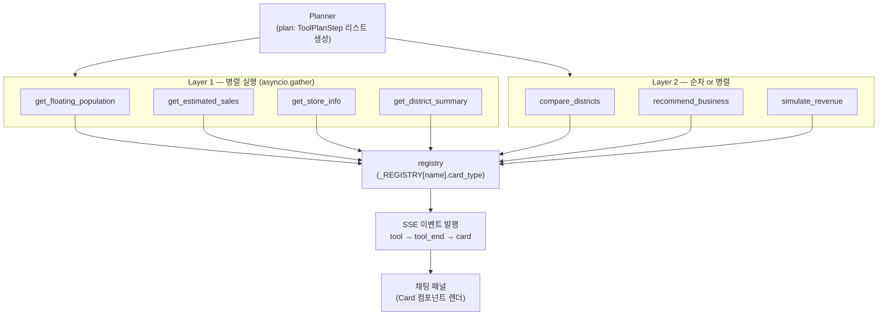

# 학습 자료: 도구 9종 — 분석팀의 전문 계측기

> 대상: server/server/agent/tools/ (registry · 대표 도구 district_summary · 9종 표)
> 목적: `@register_tool` 자기등록 패턴과 Agent가 사용하는 Tool 9종의 구조·역할·카드 매핑을 이해한다.
> 선행 문서: [04 AI 에이전트: 분석팀](04-AI에이전트-분석팀.md) · 다음: [06 데이터 레이어: 자료실](06-데이터레이어-자료실.md)

---

## §0 큰 그림

현장 조사팀이 출동할 때는 각기 다른 계측기를 꺼낸다. 유동인구 측정기, 매출 스캐너, 점포 이력 조회기 … 각각이 한 가지 일만 잘하는 **전문 계측기**다. MarketScope AI의 Tool 9종도 마찬가지다. 각 도구는 하나의 데이터 질문에 집중하고, 응답을 **카드(card)** 형태로 포장해 채팅 패널로 전달한다.

그런데 계측기가 늘어날수록 팀장(Actor)이 모든 계측기 이름과 사용법을 외워야 한다면 관리가 어렵다. 이 문제를 해결하는 장치가 **자기등록 패턴**이다. 각 계측기는 제조될 때 이름표(`@register_tool`)를 스스로 붙여 팀 명부(_REGISTRY)에 등록한다. 팀장은 명부만 보면 된다 — 계측기가 몇 개든, 어디서 만들어졌든 상관없이.

> ⚠ **2026-07-04 현행 기준 주의**: 아래 Planner/Actor 흐름도는 **레거시 PAE 경로**(Mock 모드 또는 `AGENT_LOOP_VERSION=pae`)의 서술이다. 현행 기본 런타임인 **v2 agentic loop**(`agent/loop/engine.py`)에서는 LLM이 같은 도메인 도구 9종 + 메타툴 3종(`resolve_district`/`compute`/`abstain`, `loop/tools_fc.py`) 스키마를 직접 골라 호출하고, 도구는 **순차 실행**된다(Planner의 사전 계획·layer 병렬 없음). 다만 `@register_tool` 자기등록 패턴·도구 9종·card_type 매핑 자체는 **두 경로 공용**이므로 이 문서의 학습 내용은 그대로 유효하다. 디스패치 구조는 [ARCHITECTURE-MAP.md §3](ARCHITECTURE-MAP.md)을 참조.

아래 흐름도는 (PAE 경로 기준으로) Planner가 계획을 세운 뒤 Actor가 Tool을 꺼내 쓰고, 결과가 카드 이벤트로 변환되는 전체 흐름을 보여 준다.



> Actor는 plan의 `depends_on` 필드로 DAG(방향성 비순환 그래프)를 위상 정렬해 의존성이 없는 Tool들을 한 layer 안에서 `asyncio.gather`로 **병렬 실행**한다. 자세한 Actor 로직은 [agent.md](../architecture/agent.md)를 참조.

---

## §1 자기등록 패턴 — registry.py 줄별 해설

**파일**: `server/server/agent/tools/registry.py`

```python
"""Tool registry — centralizes tool metadata (emoji, card type, labels).

Each tool file uses @register_tool to self-register its metadata.
actor.py and graph.py consume the registry instead of maintaining
duplicate mappings.
"""
```

모듈 docstring이 설계 의도를 한 줄로 요약한다: "중복 매핑을 없애기 위해 registry에 모은다."

---

```python
@dataclass
class ToolMeta:
    """Metadata for a single tool."""

    name: str
    fn: Callable[..., Any]
    card_type: str | None
    progress_label: str
    done_label: str
    description: str
```

**ToolMeta** — 각 도구의 신분증(dataclass). 함수 참조(`fn`), 카드 타입(`card_type`), 사용자에게 보이는 진행 라벨 두 개(`progress_label` · `done_label`)를 한 객체에 묶는다.

---

```python
_REGISTRY: dict[str, ToolMeta] = {}
```

**_REGISTRY** — 레지스트리(등록된 것들을 모아두는 명부). 모듈 수준의 딕셔너리이므로 프로세스 전체에서 하나만 존재한다(싱글톤 효과).

---

```python
def register_tool(
    name: str,
    *,
    emoji: str = "",
    card_type: str | None = None,
    progress_label: str = "",
    done_label: str = "",
):
    """Decorator that registers a tool function with its metadata."""

    def decorator(fn: Callable) -> Callable:
        _REGISTRY[name] = ToolMeta(
            name=name,
            fn=fn,
            card_type=card_type,
            progress_label=progress_label or f"{name} 실행 중...",
            done_label=done_label or f"{name} 완료",
            description=fn.__doc__ or "",
        )
        return fn

    return decorator
```

**register_tool** — 데코레이터 팩토리(함수에 표식·기능을 덧붙이는 @문법을 생성하는 함수). 주요 포인트:

- `*` 뒤 파라미터는 **키워드 전용** 인수다 — `@register_tool("name", card_type="summary")` 처럼 명시적으로 적어야 한다.
- `progress_label or f"{name} 실행 중..."` — 라벨을 생략하면 이름 기반 기본값이 자동 적용된다.
- `description=fn.__doc__ or ""` — 함수 docstring을 자동으로 메타데이터로 끌어온다.
- `return fn` — 함수 자체는 변형하지 않는다. 등록만 하고 원본을 그대로 반환한다(투명 데코레이터 패턴).

---

```python
def get_tool_registry() -> dict[str, ToolMeta]:
    """Return the tool registry, discovering tools on first access."""
    if not _REGISTRY:
        _discover_tools()
    return _REGISTRY


def _discover_tools() -> None:
    """Import all tool modules to trigger @register_tool decorators."""
    from server.agent.tools import (  # noqa: F401
        compare_districts,
        district_summary,
        estimated_sales,
        floating_population,
        population_info,
        recommend_business,
        simulate_revenue,
        store_history,
        store_info,
    )
```

**지연 디스커버리(lazy discovery)** — `get_tool_registry()`를 처음 호출하는 순간에만 9개 모듈을 import한다. import 자체가 `@register_tool` 데코레이터를 실행시켜 _REGISTRY를 채운다. `# noqa: F401`은 "import만 하고 쓰지 않는다"는 경고를 린터에게 알리는 주석이다.

> **결합도(coupling) 최소화**: 새 도구를 추가할 때 registry.py의 `_discover_tools`에 모듈명 한 줄만 추가하면 된다. actor.py나 graph.py는 건드리지 않아도 된다.

---

## §2 Tool 9종 표

아래 표는 각 도구 파일의 `@register_tool(...)` 인수를 직접 확인해 작성했다. 일부 문서·과거 표기는 `get_floating_population` · `get_estimated_sales` · `get_store_info` · `get_population_info` 의 card 타입을 `population` / `sales` / `store` 등으로 기재해 왔지만, **실제 코드에서 이 4종은 `card_type=None`으로 등록**되어 있다(카드 직접 발행 없이 다른 도구에 데이터를 공급하는 역할). 코드 실젯값을 우선한다.

| Tool 이름 | 입력 | 출력 요약 | card_type (코드 실젯값) | 사용 기능 |
|---|---|---|---|---|
| `get_district_summary` | district_code | 유동인구·매출·점포 4종 병렬 집계 → SummaryCard 형태 | `"summary"` | F03 |
| `get_floating_population` | district_code, quarter? | 시간대별·성별·연령대 유동인구 | `None` | F03, F05, F06 |
| `get_estimated_sales` | district_code, category_code? | 분기매출 → 월 환산, 추이 | `None` | F03, F04, F09 |
| `get_store_info` | district_code, category_code? | 점포수·개폐업·프랜차이즈 비율 | `None` | F03, F04, F07 |
| `get_store_history` | district_code | 안정성 스코어·생존기간 분포 | `"risk"` | F08 |
| `get_population_info` | district_code | 상주인구·직장인구 | `None` | F03, F07 |
| `compare_districts` | district_codes\[2..3\], category? | 복수 상권 지표 비교 + AI 의견 | `"compare"` | F05 |
| `recommend_business` | district_code, budget? | Top 5 업종 + 점수 + 면책 | `"recommend"` | F07 |
| `simulate_revenue` | district_code, category, unit_price? | p25/avg/p75 시뮬레이션 + 서울 평균 비교 | `"simulation"` | F09 |

> **내부 헬퍼 `get_district_benchmarks` (`benchmarks.py`)**: `@register_tool`로 등록되지 않는다. `district_summary.py`와 `store_history.py`가 직접 `import`해서 호출하는 내부 함수다. Planner의 plan에 단독으로 등장하지 않으며, SSE `tool` 이벤트도 발행하지 않는다.

> 카드 타입이 `None`인 4종은 Actor가 카드를 직접 발행하지 않고, 데이터를 다른 도구(`get_district_summary` 등)에 전달하거나 Respond 노드가 텍스트 응답을 구성하는 데 활용한다. 상세 카드 타입 활용은 [agent.md §4](../architecture/agent.md)를 참조.

---

## §3 대표 도구 줄별 — district_summary.py

**파일**: `server/server/agent/tools/district_summary.py`  
역할: 4개 도구를 병렬 호출해 하나의 Summary Card 페이로드로 조립한다.

### 등록 선언

```python
@register_tool(
    "get_district_summary",
    card_type="summary",
    progress_label="상권 요약 분석 중...",
    done_label="상권 요약 완료",
)
async def get_district_summary(district_code: str) -> dict:
    """Aggregate data for a district into SummaryCardData shape."""
```

`card_type="summary"` — Actor는 이 값을 보고 결과를 `SummaryCard` 컴포넌트로 렌더링할 `card` SSE 이벤트를 발행한다.

### 캐시 체크

```python
    cache = get_cache_service()
    cache_key = f"summary:{district_code}"
    cached = await cache.get(cache_key)
    if cached is not None:
        return cached
```

Redis(또는 MemoryCache) 조회를 먼저 한다. 캐시 히트 시 DB 호출 없이 즉시 반환 — TTL 24시간.

### 4종 병렬 호출

```python
    da = get_data_access()

    # 4 parallel calls
    fp_result, sales_result, store_result, meta = await asyncio.gather(
        get_floating_population(district_code),
        get_estimated_sales(district_code),
        get_store_info(district_code),
        da.districts.get_district_meta(district_code),
    )
```

`asyncio.gather` — 4개 코루틴을 동시에 실행한다. 각각이 DB 쿼리를 수행하므로, 순차 실행 대비 응답 시간이 최대 4분의 1로 단축된다. `get_floating_population` / `get_estimated_sales` / `get_store_info`는 등록된 다른 Tool을 직접 import해 재사용한다(도구 간 조합).

### 에러 격리

```python
    if not meta:
        return {"error": f"상권 코드 '{district_code}'에 해당하는 데이터가 없습니다."}

    fp_ok = "error" not in fp_result
    sales_ok = "error" not in sales_result
    store_ok = "error" not in store_result
```

하위 도구 하나가 실패해도 나머지 결과로 응답을 구성할 수 있도록 `*_ok` 플래그로 개별 방어한다. 전체 실패가 아닌 **부분 성공** 허용 설계다.

### 인사이트 블록 (파생 지표)

```python
    # --- Insights block (derived metrics for LLM) ---
    insights: dict = {}

    if fp_ok:
        gender = fp_result.get("gender", {})
        m_ratio = gender.get("male_ratio", 50)
        f_ratio = gender.get("female_ratio", 50)
        diff = abs(m_ratio - f_ratio)
        if diff >= 5:
            dominant = "남성" if m_ratio > f_ratio else "여성"
            insights["genderInsight"] = (
                f"{dominant} 비중 높음 ({dominant} {max(m_ratio, f_ratio):.1f}%, 차이 {diff:.1f}%p)"
            )
    ...
    if sales_ok and total_stores > 0:
        insights["perStoreSales"] = round(monthly_sales / total_stores)
```

원시 데이터(raw)가 아니라 **해석된 텍스트**를 LLM 컨텍스트에 주입한다. 성별 차이 5%p 이상일 때만 genderInsight를 포함하는 식으로 불필요한 토큰을 줄인다.

### 벤치마크 블록 (내부 헬퍼 호출)

```python
    # --- Benchmarks block (percentile rankings within district type) ---
    per_store = insights.get("perStoreSales", 0)
    benchmarks = await get_district_benchmarks(
        meta["type"],
        floating_pop=quarter_total,
        monthly_sales=monthly_sales,
        close_rate=close_rate["current"],
        store_count=total_stores,
        per_store_sales=per_store,
    )
```

> `quarter_total` 은 repo 가 반환하는 **분기 시간대별 합계 총량**이다 (`fp_result.get("quarter_total", 0)`). 과거 이 값은 `daily_avg` 라는 이름이었는데, 실제로는 일평균이 아닌 분기 총계라서 LLM이 "일평균"으로 오독·날조하는 원인이 됐고 2026-07-04에 `quarter_total`/`quarterTotal` 로 근본 rename 됐다. — 필드 이름이 데이터의 **단위·의미**를 정확히 말하게 하라는 교훈.

`get_district_benchmarks`는 `benchmarks.py`의 내부 헬퍼다. `@register_tool` 미등록 함수이므로 이 도구만 직접 import해서 사용한다. 같은 상권 유형(type) 내 백분위 순위를 계산해 "이 상권이 유사 상권 대비 어느 위치인지"를 알려준다.

### 카드 페이로드 조립 및 캐시 저장

```python
    result = {
        "districtName": meta["name"],
        "districtType": meta["type"],
        "summary": summary_text,
        "monthlySales": monthly_sales,
        "floatingPopulation": {
            "quarterTotal": quarter_total,
            "peakHour": fp_result.get("peak_hour", 0) if fp_ok else 0,
            "byHour": by_hour,
        },
        "topCategories": top_categories,
        "status": status,
        "closeRate": close_rate,
        "insights": insights,
        "dataQuarter": data_quarter,
        "dataSources": get_sources_for_tool("get_district_summary"),
    }

    if benchmarks:
        result["benchmarks"] = benchmarks

    await cache.set(cache_key, result, ttl=86400)
    return result
```

`dataSources` — 데이터 출처(기관명·라이선스)를 페이로드에 포함해 프론트엔드의 `SourcesCitation` 컴포넌트가 자동으로 표시한다. 마지막으로 결과를 캐시에 저장(TTL=86400초=24시간)한 뒤 반환한다.

---

## §마지막 — 이 문서가 가르치는 핵심 원칙

1. **자기등록으로 결합도를 낮춘다** — `@register_tool` 데코레이터가 있어서 actor.py·graph.py는 개별 Tool을 알 필요가 없다. 새 도구는 파일 작성 + `_discover_tools`에 모듈명 한 줄 추가로 시스템에 편입된다.

2. **card_type 매핑이 UI와 Agent를 연결한다** — registry에 저장된 `card_type` 값이 SSE `card` 이벤트의 타입을 결정하고, 프론트엔드 `cards/registry.ts`가 해당 컴포넌트로 렌더링한다. Agent가 어떤 Card를 보낼지는 코드가 아닌 메타데이터로 선언된다.

3. **의존성 Layer 병렬 실행으로 응답을 빠르게 한다 (PAE 경로)** — Planner의 `ToolPlanStep.depends_on` 필드로 DAG를 구성하고, 같은 Layer의 도구들은 `asyncio.gather`로 동시에 실행된다. 현행 v2 루프는 LLM의 tool call을 **순차 실행**하지만, `get_district_summary` **내부**의 4종 병렬 호출(`asyncio.gather`)은 두 경로 모두에서 그대로 동작한다 — 병렬화가 도구 내부로 캡슐화돼 있기 때문.

4. **내부 헬퍼(`get_district_benchmarks`)는 에이전트에 단독 노출되지 않는다** — `@register_tool` 미등록 함수는 레지스트리에 없으므로 PAE Planner의 plan에도, v2 루프의 도구 스키마 12종(`loop/tools_fc.py`)에도 등장하지 않는다. 이는 의도된 설계다 — 헬퍼는 다른 도구 내부에서만 호출된다.
