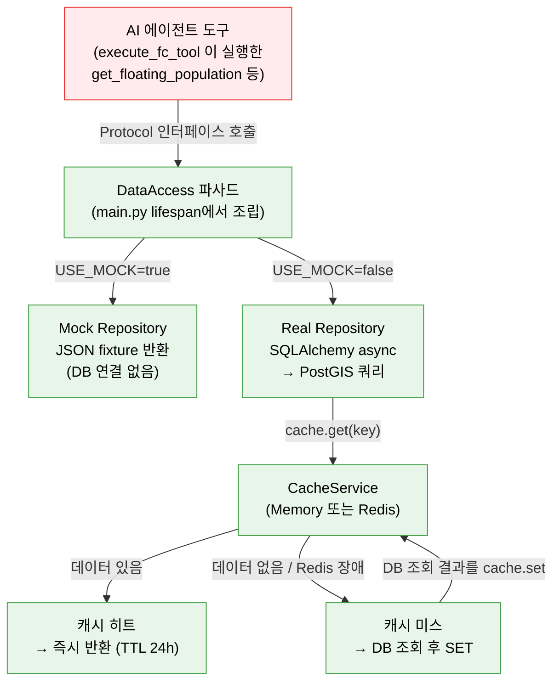

# 학습 자료: 데이터 레이어 — 자료실 설계

> 대상: server/server/repositories/ (protocols · real/recommendation · _units) · services/cache.py
> 목적: Repository 패턴(protocols + mock/real)·`USE_MOCK` 토글·PostGIS 공간쿼리·Redis 캐시 graceful degradation·매출 월환산 단위 주의를 "자료실" 비유로 이해한다.
> 선행 문서: [05 도구 12종: 전문 계측기](05-도구12종-전문계측기.md) · 다음: [07 관측 — 품질기록실](07-관측-품질기록실.md)

---

## §0 큰 그림 — 자료실 비유

시청 자료실을 떠올려 보자. 민원인이 "강남역 상권 유동인구 알려줘"라고 요청하면, 창구 담당자(AI Agent Tool)는 자료실 안내데스크에 청구서를 낸다. 안내데스크는 **청구서식(Protocol)**만 보고 서류를 꺼내 준다 — 그 캐비닛이 **연습용 견본 파일(Mock fixture)**인지 **실제 PostGIS 데이터베이스(Real DB)**인지는 담당자가 알 필요 없다.

자주 쓰는 자료는 사서(캐시)가 미리 책상 위에 꺼내 둔다. 사서가 자리를 비웠거나 파업 중이어도(Redis 장애) 서비스는 멈추지 않는다 — 조금 느려질 뿐 캐비닛에서 직접 꺼내면 된다. 이것이 **graceful degradation(장애 시 죽지 않고 기능을 낮춰 계속 동작)**의 핵심이다.

`USE_MOCK` 환경 변수는 "오늘은 연습 캐비닛을 쓸까, 진짜 캐비닛을 쓸까"를 결정하는 스위치다. 전환해도 청구서식(Protocol)은 동일하기 때문에 AI Agent 코드는 한 줄도 바꾸지 않아도 된다.



> 색상 범례는 [00 시작하기 §공통 색상 범례](00-시작하기.md#공통-색상-범례) 참조. 도구가 어떻게 실행되는지(v2 루프의 `execute_fc_tool`)는 [05 §0](05-도구12종-전문계측기.md) 참조.

---

## §1 Repository Protocol — 청구서식

**파일**: `server/server/repositories/protocols.py`

### 1-1 실제 코드 (전문)

```python
# server/server/repositories/protocols.py

from __future__ import annotations
from typing import Protocol


class DistrictRepository(Protocol):
    async def get_district_meta(self, district_code: str) -> dict | None: ...
    async def resolve_district(self, district_code: str) -> dict | None: ...
    async def detect_district_by_name(self, message: str) -> dict | None: ...
    async def detect_districts_in_message(self, message: str) -> list[dict]: ...
    async def list_districts(
        self, search: str | None, district_type: str | None, limit: int, offset: int
    ) -> tuple[int, list[dict]]: ...
    async def get_district_detail(self, code: str) -> dict | None: ...
    async def get_polygons_geojson(self, bounds: str | None) -> dict: ...


class RecommendationRepository(Protocol):
    async def recommend_business(
        self, district_code: str, budget: int | None = None, preference: str | None = None
    ) -> dict: ...
```

*(위 두 클래스는 파일 전체 10개 Protocol 중 대표 발췌)*

### 1-2 해설

**이 코드는** `Protocol`(파이썬에서 "이런 메서드를 가져야 한다"고 약속하는 인터페이스)을 정의한다. 각 메서드 본문은 `...`(Ellipsis) 하나뿐이다 — 여기서는 "무엇을 받고 무엇을 돌려주는가"만 선언하고, **어떻게 구현할지는 전혀 적지 않는다**.

**왜?** Mock 구현(`repositories/mock/`)은 DB 없이 JSON fixture를 읽어 같은 메서드 시그니처를 만족시키고, Real 구현(`repositories/real/`)은 SQLAlchemy로 PostGIS에 쿼리를 날린다. AI Agent Tool은 `DataAccess` 파사드를 통해 같은 메서드를 호출하기 때문에 둘 중 무엇이 뒤에 있는지 몰라도 된다.

> **메모리 교훈 `feedback_mock_real_pattern`**: Mock Repository는 DB 연결을 절대 열지 않는다. JSON fixture 값만 반환해야 한다. `USE_MOCK=true`로 시작했는데 `DATABASE_URL` 오류가 나면 Mock 구현이 실수로 SQLAlchemy를 import하거나 세션을 여는 것이다. Protocol 인터페이스가 분리돼 있는 이유가 바로 이 규칙을 강제하기 위함이다.

**주의**: Protocol은 파이썬 런타임에서 명시적 등록 없이 구조적으로 검사된다(duck typing). Mock/Real 클래스가 `DistrictRepository`를 `class MockDistrict(DistrictRepository):`처럼 상속하지 않아도 된다 — 메서드 이름과 시그니처가 맞으면 Protocol을 충족한 것으로 간주한다.

---

## §2 ISSUE-003 fix — 점포 수 플로어로 데이터 정확성 지키기

**파일**: `server/server/repositories/real/recommendation.py`

### 2-1 버그 배경

`recommend_business`의 핵심 점수 계산식은 다음과 같다 (L183):

```python
raw_score = (per_store_sales * age_match * (1 - close_rate)) / max(competition, 0.01)
```

| 변수 | 의미 |
|---|---|
| `per_store_sales` | 카테고리 월매출 ÷ 해당 카테고리 점포 수 |
| `age_match` | 주요 소비 연령대 ↔ 유동인구 연령대 일치도 (0~1) |
| `close_rate` | 해당 카테고리 폐업률 |
| `competition` | 해당 카테고리 점포 수 ÷ 상권 전체 점포 수 (하한 0.01 적용) |

**이 코드는** 각 카테고리의 "매력도"를 숫자 하나로 환산한다.

**문제**: 성수동카페거리 편의점처럼 **점포가 단 1개**인 카테고리를 만나면 어떻게 될까?

- `per_store_sales` = 카테고리 월매출 전체 ÷ 1 = 수억 원대 그대로
- `competition` = 1 / 전체 수백 점포 = 0.002 → `max(..., 0.01)` 하한에 걸려 0.01
- 결과: `raw_score`가 실제 경쟁력 있는 카테고리보다 **50~100배** 부풀어 오름
- 정규화 후 score = 100, 1순위 고정

이 현상이 ISSUE-003이다. "성수 편의점을 창업하세요"라는 엉뚱한 추천이 나오던 원인이었다.

### 2-2 fix: `_apply_store_floor` (전문)

```python
# server/server/repositories/real/recommendation.py, L14-42 (발췌)

MIN_RELIABLE_STORES = 3  # n<3 카테고리는 per-store 지표가 통계적으로 무의미


def _apply_store_floor(scored: list[dict]) -> tuple[list[dict], bool]:
    """표본 부족(store_count < floor) 카테고리를 랭킹에서 제외.

    플로어 통과 카테고리가 0이면(작은 골목상권) 전체로 fallback 하고 low_confidence=True.
    """
    reliable = [s for s in scored if s.get("store_count", 0) >= MIN_RELIABLE_STORES]
    if reliable:
        return reliable, False
    return scored, True
```

그리고 호출부 (L211):

```python
filtered, low_confidence = _apply_store_floor(raw_scores)
```

결과 반환 직전 메시지 처리 (L252):

```python
if low_confidence:
    message = "점포 표본이 적어(<3개) 참고용 추천입니다"
```

**후속 보강 — 점수 유계 밴드 (2026-07)**: 플로어와 별개로, 정규화 점수가 0~100 극단에 붙는 것도 신뢰 문제였다(1위가 항상 "100점"으로 보이면 과신을 유도한다). 현재는 `_band_scores`(L23)가 raw_score 순위를 보존한 채 **55~95 범위**(`SCORE_BAND_MIN/MAX`, L18-19)로 정규화한다 — "만점 추천"이 구조적으로 불가능하다.

### 2-3 해설

**이 코드는** 스코어링 루프(`for cat_row in cat_rows:`)가 끝나고 `raw_scores` 리스트가 완성된 뒤, **파티션 필터**를 한 번 통과시킨다.

- `reliable = [s for s in scored if s.get("store_count", 0) >= MIN_RELIABLE_STORES]`: store_count가 3 이상인 카테고리만 남긴다.
- `if reliable: return reliable, False`: 통과자가 1개라도 있으면 그 목록만 쓰고, 신뢰도 낮음 플래그 `False`.
- `return scored, True`: 아무도 통과 못 하면(작은 골목상권 전체가 영세) 원본 전체를 fallback으로 쓰되 `low_confidence=True`를 올린다. UI에 안내 메시지가 노출된다.

**왜 스코어링 루프 내부를 수정하지 않았나?** 루프 내부는 "점포당 매출"을 계산하는 수학적 로직이다. 편의점 1개짜리 카테고리라도 그 카테고리 내부에서는 수식이 맞는다. 잘못된 것은 **다른 카테고리와 비교**할 때 표본이 적은 숫자가 통계적으로 과장된다는 점이다. 따라서 루프 이후에 **파티션 단계**만 추가하는 외과적 수술(surgical fix)로 충분했다.

**주의**: `MIN_RELIABLE_STORES = 3`은 모듈 상수다. 이 값을 변경하면 `test_recommendation_scoring.py`의 회귀 테스트도 함께 업데이트해야 한다. 이 함수는 신규 추가였으므로 import 자체가 회귀 가드 역할을 한다 — fix가 없으면 import 실패로 전체 테스트가 깨진다.

---

## §3 매출 월환산 단위 주의 — `_units.py`

**파일**: `server/server/repositories/real/_units.py`

### 3-1 실제 코드 (전문)

```python
# server/server/repositories/real/_units.py

"""Unit conversion helpers for raw Seoul OpenData sales values.

The DB column ``estimated_sales.monthly_sales`` stores the raw
``THSMON_SELNG_AMT`` value from Seoul OpenData OA-15572
(상권분석서비스 추정매출). Despite the column name and the ``THSMON`` (당월)
prefix in the upstream field, the Seoul OpenData FAQ documents the value as
a **quarterly** aggregate in won:

    "분기당 매출 금액은 개인 매출액과 법인 매출액의 합산값..."

Downstream tools, agent outputs, and UI cards label this figure as
``월매출`` (monthly sales). Divide the raw DB value by
:data:`MONTHS_PER_QUARTER` at the repository read boundary to convert a
quarterly aggregate into the average monthly value those consumers expect.

This is applied only for real-mode repositories. Mock fixtures are authored
directly in monthly units and do not need conversion.
"""

from __future__ import annotations

MONTHS_PER_QUARTER = 3
```

### 3-2 해설

**이 코드는** 상수 하나(`MONTHS_PER_QUARTER = 3`)만 선언하지만, 그 위의 docstring이 진짜 핵심이다.

서울 열린데이터가 제공하는 `THSMON_SELNG_AMT` 컬럼 이름은 "당월 매출액"처럼 읽히지만, 실제로는 **분기 누적 합산값**이다. DB에는 이 값을 그대로 저장하고(`monthly_sales` 컬럼 이름이 오해를 부를 수 있다), **Repository 경계**에서만 나누기 3을 적용한다.

실제 사용 예시는 `recommendation.py` L156에서 볼 수 있다:

```python
monthly_sales = int(sales_data.monthly_sales or 0) // MONTHS_PER_QUARTER
```

**대비해서 기억할 것 — 매출은 월환산, 유동인구는 분기 합계다.** 매출은 분기 누적을 3으로 나눠 "월 매출"로 **환산해서** 내보내지만, 유동인구 집계값(`quarter_total`)은 환산 없이 **분기 시간대별 합계 그대로** 내보내고 이름과 라벨("분기 유동인구")이 그 사실을 말하게 한다. 과거 이 필드가 `daily_avg` 라는 오명(誤名)이었을 때 LLM이 '일평균'으로 오독·분할 날조하는 사고가 났고, 2026-07-04에 rename 됐다 — v2 시스템 프롬프트도 "'일평균' 표기 금지"를 명시한다. 같은 "숫자 신뢰" 문제를 매출은 **값 변환**으로, 유동인구는 **이름 교정**으로 푼 셈이다.

**왜 이 파일이 따로 존재하는가?** `MONTHS_PER_QUARTER = 3`은 단순히 `// 3`으로 써도 되는 값이다. 하지만 별도 상수 + 긴 docstring으로 분리한 이유는:

1. 나누기가 필요한 모든 Real 레포가 이 상수를 import함으로써 **일관성**을 보장한다.
2. 미래에 서울 열린데이터 정책이 바뀌어 "월 실적"을 진짜로 제공하게 되면, 이 파일 한 곳만 수정하면 된다.
3. 코드 리뷰어가 `// MONTHS_PER_QUARTER`를 보는 순간 "아, 분기→월 변환이구나"를 즉시 이해한다.

**주의**: Mock fixture는 처음부터 **월 단위**로 작성한다. Mock을 수정할 때 "3으로 나눠야 하나?"라고 혼동하지 말 것. 나누기는 Real 레포에서만 일어난다.

> DB 스키마·컬럼 코멘트·ETL 적재 세부사항은 [data.md](../architecture/data.md) 참조. (재서술 생략)

---

## §4 캐시 graceful degradation — 사서가 없어도 자료실은 열린다

**파일**: `server/server/services/cache.py`

### 4-1 두 구현체

| 구현체 | 사용 조건 | 특징 |
|---|---|---|
| `MemoryCacheService` | `USE_MOCK=true` 또는 Redis 없음 | in-process dict, 재시작 시 초기화 |
| `RedisCacheService` | `USE_MOCK=false` + Redis 가동 중 | TTL 기반, 서버 재시작 후에도 유지 |

둘 다 같은 `CacheService Protocol`(`.get / .set / .delete / .flush_by_prefix / .close`)을 구현하므로, 호출 측 코드는 어느 구현체를 쓰는지 모른다.

### 4-2 Redis 연결 실패 시 흐름

```python
# RedisCacheService._get_redis() 핵심 흐름 (요약)

# 1. 이미 연결돼 있으면 그냥 반환
if self._redis is not None:
    return self._redis

# 2. 마지막 실패 이후 backoff 시간이 안 지났으면 None 반환 (재시도 스킵)
if self._last_fail_time > 0 and (now - self._last_fail_time) < self._backoff_seconds:
    return None

# 3. 연결 시도 → 성공이면 backoff 초기화
# 4. 실패이면 self._redis = None, backoff 2배 (최대 60초)
```

그리고 `get()` / `set()` 모두 이렇게 구성된다:

```python
async def get(self, key: str) -> dict | None:
    try:
        redis = await self._get_redis()
        if redis is None:
            return None          # Redis 없으면 None 반환, 예외 없음
        data = await redis.get(key)
        return json.loads(data) if data else None
    except Exception:
        self._on_error("GET", key)
        return None              # 네트워크 에러도 None 반환, 절대 예외를 올리지 않음
```

**이 코드는** Redis가 다운됐을 때 **예외를 호출자에게 전파하지 않는다**. `get()`은 그냥 `None`을 반환하고, 호출자는 캐시 미스처럼 처리해 DB에서 직접 읽는다. 서비스가 느려질 수는 있어도 **터지지는 않는다** — 이것이 graceful degradation이다.

**지수 백오프(exponential backoff)**: 첫 실패 후 1초 대기 → 다음 실패 2초 → 4초 → … → 최대 60초. Redis가 완전히 죽어 있을 때 매 요청마다 TCP 연결을 시도하는 낭비를 막는다. 복구되는 순간 `ping()` 성공 시 backoff가 1초로 초기화된다.

**키 규약**: `report:{district_code}:{quarter}`, `heatmap:{quarter}:{slot}`. 세부 키 규약은 [data.md](../architecture/data.md) 참조.

**주의**: `MemoryCacheService`는 TTL을 무시한다 — `set(key, value, ttl=86400)` 시그니처를 받지만 내부에서 `ttl`을 사용하지 않는다. 개발/Mock 용도로만 쓰이기 때문에 서버 재시작이 자연스러운 초기화 수단이다.

---

## §마지막 — 이 문서가 가르치는 핵심 원칙

1. **`USE_MOCK` 토글**: 환경 변수 하나로 JSON fixture와 실제 PostGIS 중 하나를 선택한다. AI Agent Tool 코드는 바뀌지 않는다.

2. **Repository 패턴 — 인터페이스 분리**: `protocols.py`가 "무엇을 해야 하는가"를 선언하고, `mock/`과 `real/` 두 폴더가 각자 "어떻게 하는가"를 구현한다. Mock은 DB 연결을 열어서는 안 된다 — JSON fixture만.

3. **데이터 정확성**:
   - **store floor** (`MIN_RELIABLE_STORES=3`): 점포 수가 적은 카테고리는 점포당 매출 지표가 통계적으로 부풀려지므로 랭킹에서 제외한다. 전부 영세하면 fallback + 안내 메시지. 점수는 55~95 유계 밴드로 정규화해 "만점 추천"을 구조적으로 차단한다.
   - **단위 환산** (`MONTHS_PER_QUARTER=3`): DB의 `estimated_sales.monthly_sales`는 분기 누적값이다. Repository 경계에서 반드시 3으로 나눈 후 응답한다. Mock fixture는 처음부터 월 단위로 작성한다.
   - **유동인구는 분기 합계** (`quarter_total`): 환산하지 않고 이름·라벨이 단위를 말하게 한다. '일평균' 파생 표기는 금지.

4. **캐시 graceful degradation**: Redis가 죽어도 서비스는 멈추지 않는다. `get()` / `set()`은 장애 시 `None`을 반환하거나 아무것도 하지 않는다. 지수 백오프로 불필요한 재연결 시도를 억제한다.
