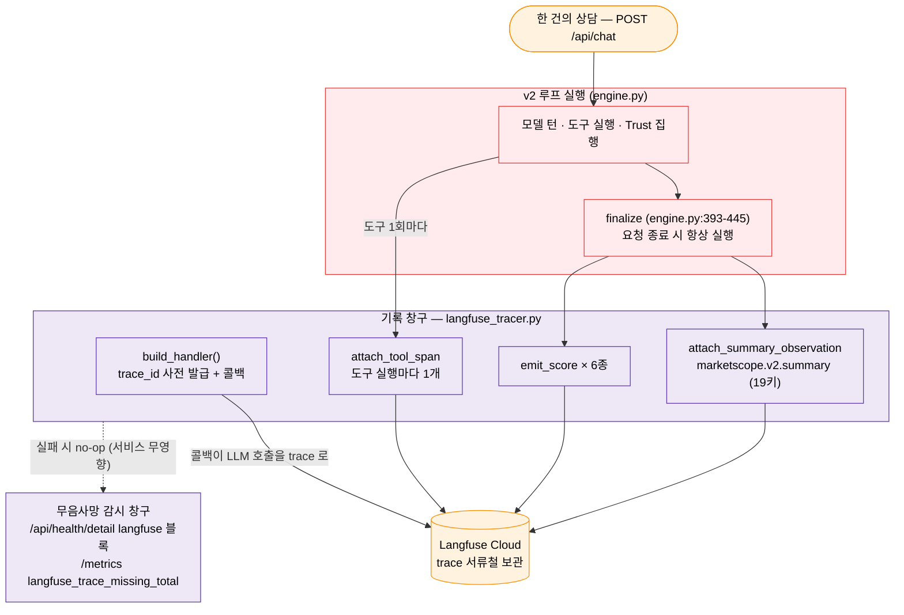

# 학습 자료: 관측 — 품질기록실 (Langfuse)

> 대상: server/server/agent/loop/engine.py (finalize) · services/langfuse_tracer.py · api/routes/feedback.py
> 목적: 모든 상담(요청)이 어떻게 품질기록실(Langfuse)에 기록되고 성적표(score)가 매겨지는지, 그리고 기록 시스템 자체가 죽었을 때 어떻게 알아차리는지 이해한다.
> 선행 문서: [06 데이터 레이어: 자료실](06-데이터레이어-자료실.md) (여정의 다리는 [04 §6-4](04-AI에이전트-v2루프.md)) · 다음: [00 시작하기로 돌아가기](00-시작하기.md)

---

## §0 큰 그림 — 품질기록실 비유, 그리고 무음사망 사건

컨설팅 회사가 오래 살아남으려면 상담을 "하는" 것만으로는 부족하다 — 상담이 **얼마나 좋았는지**를 계속 재야 한다. 그래서 이 회사에는 **품질기록실**이 있다. 상담 하나가 끝날 때마다 기록실에 서류철 하나가 만들어진다: 컨설턴트가 몇 번 고민했고(모델 턴), 어떤 계측기를 몇 ms 에 돌렸고(도구 스팬), 팩트체크 데스크가 몇 번 개입했는지(trust 플래그), 그리고 성적표(score 6종)까지.

왜 이렇게까지 하나? **실제 사고가 있었기 때문이다.** 한때 컨테이너에 구버전 SDK 가 남아 있어 기록계 초기화가 조용히 실패한 적이 있다. 서비스는 멀쩡히 답변을 내보냈고, LLM 프로바이더에는 과금이 쌓였는데, 품질기록실에는 **0건**이 기록됐다 — 아무도 눈치채지 못한 채. 유일한 흔적은 로그의 `agent_done trace_id=-` 한 줄이었다. 이것이 **무음사망(silent death)**: 관측 시스템은 죽어도 소리를 내지 않는다. 그래서 이 프로젝트의 관측 설계는 두 원칙 위에 서 있다.

1. **관측은 서비스를 절대 방해하지 않는다** (graceful degrade — 기록실이 불타도 상담은 계속된다).
2. **대신 기록실이 죽은 것 자체를 감시하는 별도 창구를 둔다** (무음사망 가시화 — §4).

> 색상 범례는 [00 시작하기 §공통 색상 범례](00-시작하기.md#공통-색상-범례) 참조. 🔴 = 루프 본체, 🟣 = 백엔드 기록 창구, 🟠 = 외부(Langfuse Cloud).

---

## §1 세 개의 기록 단위 — trace · observation · score

품질기록실의 서류철은 세 층으로 구성된다.

| 개념 | 비유 | 이 프로젝트에서 |
|---|---|---|
| **trace** | 상담 1건의 서류철 표지 | 요청(`/api/chat`) 1건 = trace 1개. 표지에 메타데이터(세션 해시 · request_id · `agent_mode`)와 태그(`marketscope.v2`)가 붙는다 |
| **observation** | 서류철 안의 개별 기록지 | LLM 호출(콜백이 자동 기록) · 도구 스팬(`attach_tool_span`) · 종합 요약지(`marketscope.v2.summary`) |
| **score** | 성적표 스티커 | trace 에 붙는 수치 평가 — 자동 6종(§2) + 사용자 피드백 proxy(§5) |

세 가지 모두 **trace_id 하나로 묶인다.** 흥미로운 설계가 하나 있다: trace_id 는 기록이 끝난 뒤 발급받는 게 아니라 **요청 시작 시점에 미리 발급**(pre-assign)해 둔다. 그래야 스트림 마지막의 `done` 이벤트에 `trace_id` 를 동봉해 프론트가 피드백을 제출할 수 있고(§5), 도중에 죽어도 어느 서류철이 미완인지 추적할 수 있다.

> 태그의 `v2` 는 설정값이 아니라 `effective_loop_version()`(runtime.py)이 보고하는 **실제 서빙 루프**다 — mock 폴백으로 레거시가 돌고 있는데 v2 로 오기록되는 일을 막는다([04 §1](04-AI에이전트-v2루프.md)).

---

## §2 v2 가 남기는 기록 — 도구 스팬 · 요약지 19키 · 성적표 6종

모든 기록은 `engine.py` 의 `finally` 블록(finalize, engine.py:393-445)에서 완결된다 — **정상 종료든 예외든 반드시 실행**되는 위치라는 점이 핵심이다. `lf_trace_id` 가 None 이면(관측 비활성/실패) 전부 no-op.

### 2-1. 도구 스팬 — 계측기 사용 기록지

도구를 실행할 때마다 `attach_tool_span`(engine.py:265-271 호출부)이 기록지 한 장을 남긴다: 도구 이름, 인자, `duration_ms`, 에러 여부. **결과 본문은 싣지 않는다** — 기록실에 개인정보·대용량 페이로드를 쌓지 않으면서 "무엇을 얼마나 걸려 했는가"만 남기는 절제다.

### 2-2. 요약지 — `marketscope.v2.summary` 19키

종료 시 `attach_summary_observation`(engine.py:401-428)이 상담 전체를 한 장으로 요약한다:

| 분류 | 키 |
|---|---|
| 무엇을 분석했나 | `district_code` · `district_type` · `district_name` · `resolved_name` · `data_quarter` |
| 루프가 어떻게 돌았나 | `iterations_used` · `tool_calls_made` · `tool_error_count` · `card_count` · `called_tools` · `wall_clock_s` · `budget_exhausted` |
| 신뢰 장치가 일했나 | `abstention_triggered` · `trust_unbound_final` · `trust_scale_error_count` · `trust_corrective_applied` · `trust_fallback_triggered` · `trust_masked_count` · `numeric_match_rate` |

[04](04-AI에이전트-v2루프.md)에서 배운 모든 개념 — budget governor, abstain, 교정/마스킹/결정론 대체 — 이 각각 관측 가능한 키로 대응된다. **설계 원칙이 측정 항목이 된 것이다.**

### 2-3. 성적표 — score 6종 (engine.py:429-437)

| score | 값 | 발행 조건 |
|---|---|---|
| `numeric_match` | 바인딩 매치율 (0~1) | 채점 대상 수치가 1개 이상일 때만 |
| `tool_error_rate` | 도구 실패율 (0~1) | 도구를 1회 이상 썼을 때만 |
| `abstention_triggered` | 0/1 | 항상 |
| `trust_corrective_applied` | 0/1 | 항상 |
| `trust_fallback_triggered` | 0/1 | 항상 |
| `trust_masked_count` | 마스킹 개수 | 항상 |

앞의 두 개가 조건부인 이유: 분모가 0인 성적(수치 없는 인사 응답의 `numeric_match`)은 의미가 없어서 아예 매기지 않는다 — "측정할 수 없으면 기록하지 않는다"도 정직함의 일부다. 이 성적표가 쌓이면 Langfuse 대시보드에서 "이번 주 fallback 발동률이 왜 올랐지?" 같은 질문에 데이터로 답할 수 있다.

---

## §3 기록실이 서비스를 방해하지 않는 법 — 단일 게이트와 graceful degrade

### 3-1. 샘플링 단일 게이트

기록 비율(`LANGFUSE_SAMPLING_RATE`)은 `should_sample()`(langfuse_tracer.py:49) **한 곳**에서만 판정한다. SDK 자체의 `sample_rate` 옵션은 의도적으로 쓰지 않는다 — 두 게이트가 겹치면 "우리는 기록하기로 하고 `done` 에 trace_id 까지 동봉했는데 SDK 가 trace 를 버리는" **고아 trace_id** 가 생기기 때문이다(langfuse_tracer.py:88 주석). 판정 주체가 하나면 약속(trace_id 동봉)과 실행(실제 기록)이 어긋날 수 없다.

### 3-2. graceful degrade — `_tracer_valid` 플래그

초기화나 기록이 실패하면 `_tracer_valid = False` 가 세워지고, 이후 모든 기록 함수(`attach_tool_span`/`attach_summary_observation`/`emit_score`)는 입구에서 즉시 반환한다(no-op). 요청마다 죽은 SDK 에 재시도하는 낭비도, 관측 오류가 상담을 중단시키는 일도 없다. flush 조차 `asyncio.to_thread` 로 밀어내(engine.py:442-445) 이벤트 루프를 막지 않는다.

**비유**: 기록실에 불이 나도 상담실 문은 닫히지 않는다. 기록 담당자가 "오늘 기록은 포기"라고 팻말을 걸고 물러날 뿐이다.

---

## §4 무음사망 가시화 — 기록실이 죽은 걸 어떻게 아나

§0 사건의 교훈: graceful degrade 는 서비스를 지키지만, 바로 그래서 **관측의 죽음이 조용해진다.** 그 침묵을 깨는 창구가 두 개 있다.

| 창구 | 내용 |
|---|---|
| `/api/health/detail` 의 `langfuse` 블록 | `enabled` / `tracer_valid` / `client_initialized` / `sampling_rate` — 배포 직후 curl 한 번으로 기록계 상태 확인 |
| `/metrics` 의 `langfuse_trace_missing_total` | 관측이 켜져 있는데 trace_id 가 비어 나간 요청 수 — 0 이 아니면 무음사망 진행 중 |

로그 신호도 있다: `agent_done trace_id=-`. 대시보드 없이 로그만 봐도 "기록 없이 상담이 끝났다"를 알 수 있다. 진단 절차는 [ops/runbook.md](../ops/runbook.md) 참조.

---

## §5 사용자의 성적표 — F12 FeedbackRow → score proxy

자동 성적표(§2-3)만으로는 "사용자가 만족했는가"를 모른다. 그래서 `done` 이벤트에 동봉된 `trace_id` 를 프론트가 `lastTraceId` 로 저장해 뒀다가([02 §2](02-프론트엔드-화면.md)), 답변 아래 👍👎(FeedbackRow)를 누르면 `POST /api/feedback/score`(feedback.py:45)로 보낸다. 백엔드가 이를 Langfuse score 로 proxy 하면 — **같은 서류철에 기계 성적표와 사람 성적표가 나란히 붙는다.** "Trust 지표는 만점인데 사용자 평가가 나쁜 상담"을 골라내는 것이 다음 개선의 출발점이 된다.

---

## §마지막 — 이 문서가 가르치는 핵심 원칙

1. **관측은 부산물이 아니라 설계다.** budget governor·Trust Kernel 의 모든 동작이 요약지 19키·성적표 6종으로 대응된다. "잘 하고 있는가"를 묻기 전에 "무엇을 재는가"를 먼저 코드에 박았다.
2. **관측은 서비스를 인질로 잡지 않는다.** `_tracer_valid` no-op, flush offload, finalize 의 예외 삼킴 — 기록 실패는 언제나 상담보다 후순위다.
3. **조용한 실패에는 전용 감시 창구를 만든다.** graceful degrade 의 대가는 침묵이다. health `langfuse` 블록과 `langfuse_trace_missing_total` 카운터가 그 침묵을 다시 소리로 바꾼다.
4. **판정 주체는 하나만.** 샘플링을 `should_sample()` 단일 게이트로 통일해 "trace_id 는 줬는데 기록은 없는" 어긋남을 구조적으로 없앤다.

---

> 정확한 wiring 표·PAE 경로 관측·Langfuse 환경 변수는 [agent.md §9](../architecture/agent.md) · [deployment.md §3](../architecture/deployment.md) 참조. 장애 진단 절차는 [runbook.md](../ops/runbook.md).
> 전체 지도가 필요하면 [ARCHITECTURE-MAP](ARCHITECTURE-MAP.md), 처음으로 돌아가려면 [00 시작하기](00-시작하기.md).
