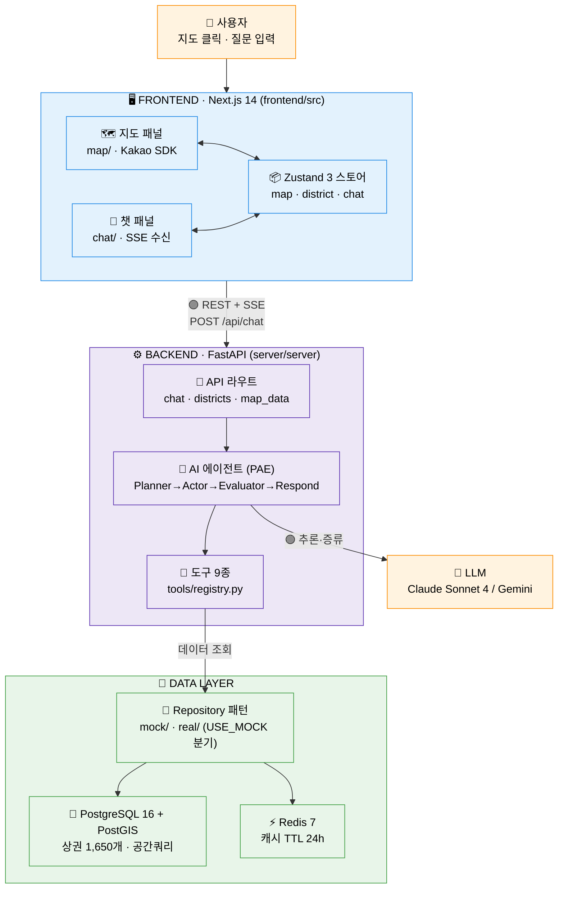
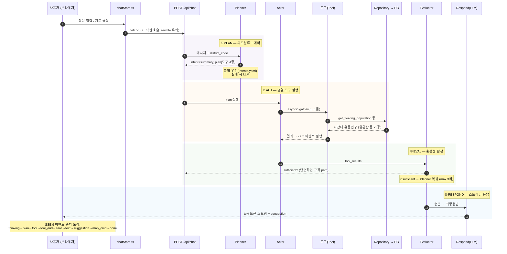
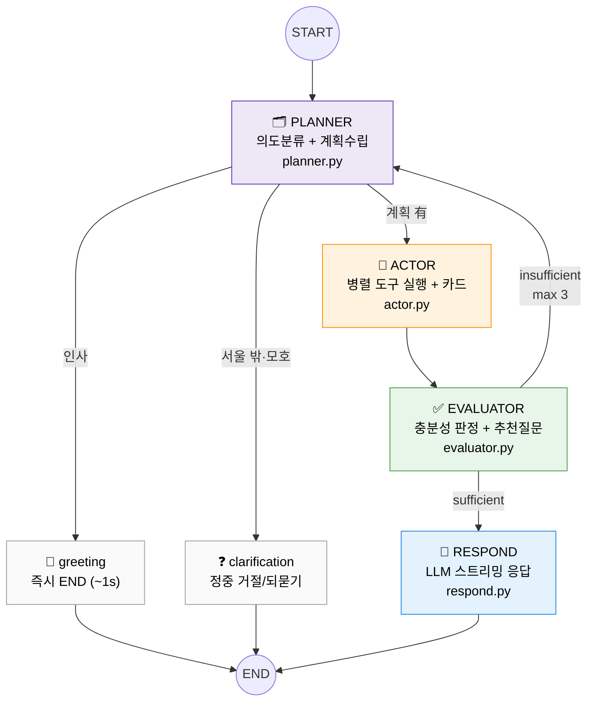

# 아키텍처 맵 — MarketScope AI (상권분석)

> 실제 구현 코드 기준의 구조·설계도·코드 매핑 문서. **학습용**.
> 서술형 학습 코스는 [`00-시작하기.md`](./00-시작하기.md) ~ [`06-데이터레이어-자료실.md`](./06-데이터레이어-자료실.md) 참고.
> 레이어별 상세는 [`../architecture/`](../architecture/) (backend/frontend/agent/data) 참고.

이 프로젝트는 **지도에서 상권을 고르면 AI가 공공데이터를 해석해 답해주는** Freemium SaaS다.
한 문장으로: **"지도 클릭 → 질문 → AI 에이전트가 도구로 데이터 긁어와 → 카드+글로 스트리밍 응답"**.

핵심 구조는 **3덩어리**로 나뉜다.

```
프론트엔드(Next.js)  ──REST+SSE──▶  백엔드(FastAPI)  ──도구 호출──▶  데이터(PostGIS/Redis)
   지도 + 챗 화면                    AI 에이전트(PAE)              상권 1,650개
```

**4대 학습 포인트** → SSE 스트리밍 · PAE 에이전트 그래프 · Repository 패턴(Mock/Real) · 지도↔챗 양방향 동기화

---

## 1. 시스템 토폴로지 (전체 아키텍처)



| 경계 | 색 | 의미 |
|---|---|---|
| 🟣 **REST + SSE** | 파랑 | 브라우저 ↔ 백엔드. 질문은 POST, 답변은 SSE 스트림(9 이벤트) |
| 🟢 **LLM** | 보라 | 에이전트 ↔ Claude/Gemini. 의도분류·평가·최종응답 |
| 🟢 **Repository** | 초록 | 도구 ↔ DB. `USE_MOCK` 한 줄로 가짜/진짜 데이터 전환 |

> **핵심 불변식:** 프론트는 **DB를 직접 모른다.** 항상 백엔드 API만 호출한다. 백엔드 에이전트도 **DB를 직접 모른다.** 항상 Repository(`protocols.py`)를 통해서만 데이터를 만진다. → 갈아끼우기 쉬움.

---

## 2. 단일 요청 흐름 — "강남역 상권 알려줘"



---

## 3. AI 에이전트 내부 그래프 (PAE)

LangGraph 커스텀 그래프. `create_react_agent` 블랙박스를 **Planner-Actor-Evaluator**로 풀어 헤친 것. 최대 3라운드 반복.



| 노드 | 역할 | LLM 사용 | 비고 |
|---|---|---|---|
| **Planner** | 의도분류(summary/compare/...) + 엔티티추출 + 계획 | 규칙 우선, LLM fallback | `intents.yaml` 50+ 패턴 |
| **Actor** | 의존성 DAG → 위상정렬 → `asyncio.gather` 병렬 | ✗ (도구만) | 15s 타임아웃 + 2회 재시도 |
| **Evaluator** | 결과 충분한지 판정 + 추천질문 생성 | 단순=규칙 / 복잡=LLM | `evaluator_skip_simple` |
| **Respond** | 한국어 컨설턴트 톤 최종응답 스트리밍 | ✓ (필수) | XML/Tool태그 sanitize 가드 |

> **단락(short-circuit):** "안녕" 같은 인사나 "부산 알려줘"(서울 밖) 같은 건 Actor/도구를 거치지 않고 즉시 끝난다. LLM·DB 비용 0.

---

## 4. 폴더별 책임

### 4-1. 백엔드 (`server/server/`)

| 폴더 / 파일 | 책임 | 핵심 개념 |
|---|---|---|
| `main.py` | FastAPI 앱 + **lifespan**(캐시/DB/에이전트 초기화) | 부팅 |
| `config.py` | pydantic-settings, 모든 환경변수 (`use_mock` 등) | 설정 |
| `api/routes/` | 4개 라우트: `chat`(SSE) · `districts` · `map_data` · `feedback` | HTTP 경계 |
| `api/middleware.py` · `rate_limiter.py` · `errors.py` | RequestId/보안헤더 · 레이트리밋 · 에러규약 | 횡단관심사 |
| `agent/graph.py` | PAE 그래프 빌드 + `run_agent` 엔트리 | 에이전트 골격 |
| `agent/nodes/` | planner · actor · evaluator · respond 4노드 | PAE |
| `agent/tools/` | **도구 9종** + `registry.py`(자체등록) | Tool 경계 |
| `agent/config/intents.yaml` | 의도 50+ 규칙 패턴 | 규칙 우선 분류 |
| `agent/utils/` | entity_matching · abstention · numeric_sanity · formatting | 정확도 가드 |
| `agent/history.py` | 세션별 대화 히스토리 (최근 10턴, 인메모리) | 컨텍스트 |
| `repositories/protocols.py` | **10개 인터페이스 정의** (로직 없음) | 계약 우선 |
| `repositories/mock/` · `real/` | 같은 인터페이스 두 구현체 (`USE_MOCK` 분기) | Repository 패턴 |
| `repositories/data_access.py` | 10개 repo 묶는 Facade | 의존성 주입 |
| `services/` | cache · circuit_breaker · category_resolver · singleflight · langfuse | 인프라 서비스 |
| `models/` | SQLAlchemy ORM (district/sales/store/population/...) | DB 스키마 |
| `data/etl/` | 공공데이터 수집 스크립트 | ETL |

### 4-2. 프론트엔드 (`frontend/src/`)

| 폴더 / 파일 | 책임 | 핵심 개념 |
|---|---|---|
| `app/page.tsx` | `/` 공개 랜딩 (F11) | 라우트 |
| `app/app/page.tsx` | `/app` 분석 앱 (지도+챗) | 메인 화면 |
| `components/map/` | MapContainer · DistrictLayer(폴리곤) · HeatmapLayer · TimeSlider | 지도 UI |
| `components/chat/` | ChatPanel · MessageList · PreviewCard · `cards/`(5종) | 챗 UI |
| `components/chat/cards/registry.ts` | `card_type → 컴포넌트` 매핑 | 카드 레지스트리 |
| `stores/chatStore.ts` | `sendMessage` + SSE 소비 + 세션 | 챗 상태 |
| `stores/districtStore.ts` · `mapStore.ts` | 선택상권/비교 · 지도중심/줌/히트맵 | 지도 상태 |
| `hooks/useMapSync.ts` | 지도클릭→프리뷰, 챗언급→지도이동 | **양방향 동기화** |
| `lib/sseParser.ts` | SSE 스트림 → async generator | SSE 파싱 |
| `lib/eventHandlers.ts` | SSE 이벤트 → 스토어 dispatch | 이벤트 라우팅 |
| `lib/api.ts` · `types.ts` | fetch 래퍼 · 공유 타입 | API 계층 |

---

## 5. 설계 노드 ↔ 코드 매핑

### 5-1. 4대 학습 포인트

| 개념 | 어디서 실현 | 코드 (file:line) |
|---|---|---|
| **SSE 스트리밍** | 백엔드 9이벤트 발행 → 프론트 파싱 | 발행: `agent/graph.py:run_agent` · 라우트: `api/routes/chat.py:184` · 파싱: `lib/sseParser.ts:10` · 라우팅: `lib/eventHandlers.ts:55` |
| **PAE 에이전트** | Planner→Actor→Evaluator→Respond | 그래프: `agent/graph.py:148` (`_build_pae_graph`) · 라우팅: `graph.py:203, 212` |
| **Repository 패턴** | 같은 인터페이스 Mock/Real 2구현 | 계약: `repositories/protocols.py` · 분기: `main.py:21`(lifespan) · Facade: `repositories/data_access.py` |
| **지도↔챗 동기화** | Zustand 3스토어 + useMapSync | `hooks/useMapSync.ts:29` · `stores/chatStore.ts:102` |

### 5-2. 흐름 노드 ↔ 코드 (백엔드)

| 설계도 노드 | 구현 함수 | file:line |
|---|---|---|
| 앱 부팅 / 의존성 초기화 | `lifespan` | `main.py:21` |
| 챗 SSE 진입점 | `chat` | `api/routes/chat.py:184` |
| 세션 슬롯/락 관리 | `_claim_session_slot` / `_get_session` | `chat.py:46, 83` |
| 에이전트 실행 엔트리 | `run_agent` | `agent/graph.py:248` |
| **PLAN**: 규칙 의도분류 | `_classify_by_rules` | `agent/nodes/planner.py:95` |
| **PLAN**: LLM 분류 fallback | `_classify_with_llm` | `planner.py:185` |
| **PLAN**: 계획 생성 | `_build_plan` / `planner_node` | `planner.py:232, 272` |
| **ACT**: 의존성 그룹핑 | `group_by_dependencies` | `agent/nodes/actor.py:63` |
| **ACT**: 도구 1개 실행 | `execute_tool` | `actor.py:99` |
| **ACT**: 노드 본체(병렬+카드) | `actor_node` | `actor.py:156` |
| **EVAL**: 규칙 평가(fast) | `_fast_evaluate` | `agent/nodes/evaluator.py:76` |
| **EVAL**: LLM 평가(slow) | `_llm_evaluate` | `evaluator.py:132` |
| **EVAL**: 추천질문 생성 | `generate_proactive_suggestions` | `evaluator.py:195` |
| **RESPOND**: 프롬프트 빌드 | `build_respond_prompt` | `agent/nodes/respond.py:349` |
| **RESPOND**: 응답 스트리밍 | `respond_node` | `respond.py:427` |
| RESPOND: 태그 누수 가드 | `_XMLTagSanitizer` / `_ToolTagSanitizer` | `respond.py:52, 160` |

### 5-3. 도구(Tool) 레지스트리

| 노드 | 코드 | file:line |
|---|---|---|
| 등록 데코레이터 | `register_tool` | `agent/tools/registry.py:30` |
| 레지스트리 조회 | `get_tool_registry` | `registry.py:54` |
| 도구 메타데이터 | `ToolMeta` | `registry.py:16` |
| 도구 사용 예시 | `@register_tool` | `agent/tools/district_summary.py:40` |

도구 9종 (모두 `@register_tool`로 자체 등록):

| 도구 | 입력 | Card | 기능 |
|---|---|---|---|
| `get_district_summary` | district_code | summary | F03 종합요약 |
| `get_floating_population` | district_code | population | F03/F06 유동인구 |
| `get_estimated_sales` | district_code, category? | sales | F03/F09 매출(월환산) |
| `get_store_info` | district_code, category? | store | F03/F07 점포 |
| `get_store_history` | district_code | history | F08 리스크 |
| `get_population_info` | district_code | population | F07 상주/직장 |
| `compare_districts` | codes[2..3] | comparison | F05 비교 |
| `recommend_business` | district_code, budget? | recommend | F07 추천 |
| `simulate_revenue` | district_code, category | simulation | F09 시뮬 |

### 5-4. 프론트엔드 SSE 흐름

| 노드 | 구현 | file:line |
|---|---|---|
| 메시지 전송 + SSE 소비 | `sendMessage` | `stores/chatStore.ts:240` |
| 지도클릭 프리뷰 (LLM無) | `setPreview` | `chatStore.ts:144` |
| SSE 스트림 파서 | `parseSSEStream` | `lib/sseParser.ts:10` |
| 이벤트→스토어 dispatch | `handleSSEEvent` | `lib/eventHandlers.ts:55` |
| 도구 진행 라벨 매핑 | `TOOL_LABELS` | `eventHandlers.ts:5` |
| 카드 컴포넌트 매핑 | `registry.ts` | `components/chat/cards/registry.ts` |

### 5-5. 데이터 레이어 (Repository ↔ DB)

| 계층 | 인터페이스 | Mock | Real |
|---|---|---|---|
| 상권 | `protocols.py` | `mock/districts.py` | `real/districts.py` |
| 유동인구 | `protocols.py` | `mock/floating_population.py` | `real/floating_population.py` |
| 추정매출 | `protocols.py` | `mock/estimated_sales.py` | `real/estimated_sales.py` (월환산 `_units.py`) |
| 점포 | `protocols.py` | `mock/stores.py` | `real/stores.py` |
| 추천 | `protocols.py` | `mock/recommendation.py` | `real/recommendation.py` (점포≥3 floor) |
| 비교/히트맵/시뮬/벤치마크/인구 | `protocols.py` | `mock/*.py` | `real/*.py` |

---

## 6. 주요 설계 결정 ↔ 코드

| 결정 | 내용 | 코드 |
|---|---|---|
| Mock/Real 분기 | `USE_MOCK` 한 플래그로 DB 없이 단독 기동 | `config.py` · `main.py:21` |
| SSE 직접 호출 | Next rewrite 우회(버퍼링 방지) | `chatStore.ts` (`NEXT_PUBLIC_API_URL` 직접) |
| 매출 월환산 | DB는 분기누적(`THSMON_SELNG_AMT`) → repo에서 ÷ 환산 | `real/_units.py` |
| 서울 밖 거절 3중 가드 | intents → planner → entity_matching → respond | `intents.yaml` + `planner.py` + `agent/utils/entity_matching.py` |
| 저점포수 추천 floor | 점포<3 카테고리 랭킹 제외 (`MIN_RELIABLE_STORES`) | `real/recommendation.py` |
| Circuit Breaker | LLM 연속실패 시 OPEN→degraded | `services/circuit_breaker.py` |
| 캐시 graceful degrade | Redis 죽어도 None 반환(예외X) | `services/cache.py` |
| 세션 동시성 가드 | 세션별 락 + monotonic requestId | `chat.py:46` + `chatStore.ts:55` |

---

## 7. 기능 ↔ 코드 빠른 인덱스 (F01~F13)

| 기능 | 프론트 | 백엔드 도구/노드 |
|---|---|---|
| F01 지도 상권선택 | `map/DistrictLayer.tsx` + `useMapSync` | `api/routes/map_data.py` |
| F02 AI 챗봇 | `chat/ChatPanel.tsx` + `chatStore` | `agent/graph.py` (PAE) |
| F03 기본리포트 | `cards/SummaryCard.tsx` | `get_district_summary` 외 4종 |
| F05 상권비교 | `cards/CompareCard.tsx` | `compare_districts` |
| F06 히트맵 | `map/HeatmapLayer.tsx` + `TimeSlider` | `map_data.py:/heatmap` |
| F07 업종추천 | `cards/RecommendCard.tsx` | `recommend_business` |
| F08 리스크 | `cards/RiskCard.tsx` | `get_store_history` |
| F09 매출시뮬 | `cards/SimulationCard.tsx` | `simulate_revenue` |
| F10 PDF | `hooks/useReportExport.ts` + `report/` | (프론트 전용) |
| F11 랜딩 | `components/landing/*` | — |
| F12 피드백 | `components/feedback/*` | `api/routes/feedback.py` |
| F13 프리뷰(Zero-LLM) | `chat/PreviewCard.tsx` | `districts.py:/preview` (LLM無) |

---

## 부록: 빠른 실행 레퍼런스

```bash
# Mock 모드 — DB/Redis 없이 단독 기동 (학습용 최적)
#   백엔드
cd server && pip install -e ".[dev]"
USE_MOCK=true uvicorn server.main:app --reload --port 8000
#   프론트
cd frontend && npm install && npm run dev      # :3000

# Real 모드 — 1,650개 실데이터 (Docker)
docker compose up -d                            # DB+Redis+Backend+Frontend+Nginx

# 헬스체크
cd frontend && npx tsc --noEmit                 # 타입체크
cd server && ruff check . && pytest             # 린트 + 테스트
```

핵심 env: `USE_MOCK`(true/false), `LLM_PROVIDER`(anthropic/gemini/mock), `DATABASE_URL`, `REDIS_URL`, `NEXT_PUBLIC_API_URL`(SSE 직접호출용, `:8000` 권장), `NEXT_PUBLIC_KAKAO_MAP_KEY`, `ANTHROPIC_API_KEY`.

---

> 📖 더 깊게: 개념을 비유로 풀어쓴 [`00-시작하기.md`](./00-시작하기.md) 코스 / 정밀 스펙은 [`../architecture/`](../architecture/) (overview·backend·frontend·agent·data·deployment).
