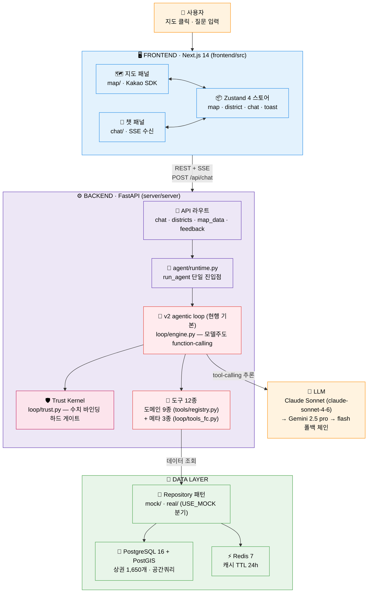
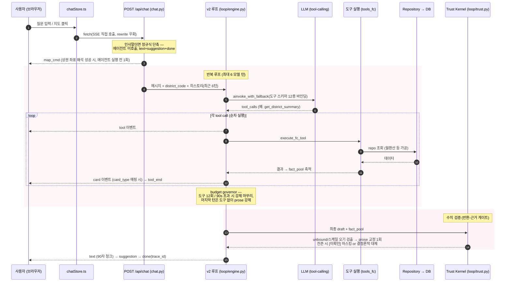
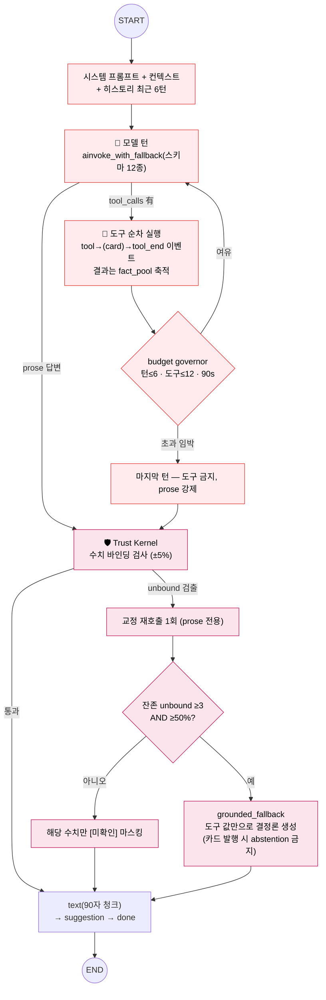

# 아키텍처 맵 — MarketScope AI (상권분석)

> 실제 구현 코드 기준의 구조·설계도·코드 매핑 문서. **학습용**. (2026-07-05 v2 아키텍처 기준 개정 — 공통 색상 팔레트 적용)
> 서술형 학습 코스는 [`00-시작하기.md`](./00-시작하기.md) ~ [`06-데이터레이어-자료실.md`](./06-데이터레이어-자료실.md) 참고.
> 레이어별 상세는 [`../architecture/`](../architecture/) (backend/frontend/agent/data) 참고.
> Mermaid 색상 범례 정본은 [`00-시작하기.md`](./00-시작하기.md#공통-색상-범례) 참고 (🔵프론트 / 🟣백엔드 / 🔴에이전트 / 🟢데이터 / 🟠외부·LLM / 🩷Trust 게이트).

이 프로젝트는 **지도에서 상권을 고르면 AI가 공공데이터를 해석해 답해주는** Freemium SaaS다.
한 문장으로: **"지도 클릭 → 질문 → AI 에이전트가 도구로 데이터 긁어와 → 카드+글로 스트리밍 응답"**.

핵심 구조는 **3덩어리**로 나뉜다.

```
프론트엔드(Next.js)  ──REST+SSE──▶  백엔드(FastAPI)  ──도구 호출──▶  데이터(PostGIS/Redis)
   지도 + 챗 화면              AI 에이전트(v2 루프 + Trust Kernel)      상권 1,650개
```

**4대 학습 포인트** → SSE 스트리밍 · v2 agentic loop + Trust Kernel · Repository 패턴(Mock/Real) · 지도↔챗 양방향 동기화

---

## 1. 시스템 토폴로지 (전체 아키텍처)



| 경계 | 색 | 의미 |
|---|---|---|
| **REST + SSE** | 🔵↔🟣 | 브라우저 ↔ 백엔드. 질문은 POST, 답변은 SSE 스트림 (v2 루프 방출 7종 + chat.py 계층의 `map_cmd`) |
| **LLM** | 🔴↔🟠 | 에이전트 ↔ Claude/Gemini. 단일 tool-calling 모델에 per-invoke 폴백 체인 |
| **Repository** | 🔴↔🟢 | 도구 ↔ DB. `USE_MOCK` 한 줄로 가짜/진짜 데이터 전환 |
| **Trust 게이트** | 🩷 | 답변 방출 직전 수치 검증 — v2 를 v2 답게 만드는 관문 |

> (레거시 각주) mock 모드(`LLM_PROVIDER=mock`) 또는 `AGENT_LOOP_VERSION=pae` 롤백 시에는 레거시 경로(`agent/graph.py`)를 탄다 — 학습 범위 외.

> **핵심 불변식 1:** 프론트는 **DB를 직접 모른다.** 항상 백엔드 API만 호출한다. 백엔드 에이전트도 **DB를 직접 모른다.** 항상 Repository(`protocols.py`)를 통해서만 데이터를 만진다. → 갈아끼우기 쉬움.
>
> **핵심 불변식 2 (v2, Trust Kernel):** 최종 답변의 **모든 수치 주장은 도구 반환값(또는 `compute` 파생값)에 ±5% 이내로 바인딩**되어야 한다. 바인딩 안 되는 수치는 교정 → 마스킹(`[미확인]`) → 결정론적 대체 순으로 집행된다 (`agent/loop/trust.py`).

---

## 2. 단일 요청 흐름 — "강남역 상권 알려줘" (v2 루프 기준)



> **SSE 이벤트 계약:**
> - **v2 루프 방출 7종**: `thinking → tool → tool_end → card → text → suggestion → done` (`loop/engine.py`)
> - **`map_cmd` 는 `api/routes/chat.py` 가 에이전트 밖에서 방출** (유일 방출처, chat.py:325). 인사말 단축(text/suggestion/done)도 chat.py 계층.
> - 프론트 `SSEEvent` 유니온은 10종 정의 (`lib/types.ts:163-173`) — `plan` 은 v2 에서 발생하지 않는 방어 코드, `error` 는 프론트 측 정의. (레거시 각주: mock 모드의 레거시 경로에서는 `plan` 이 실제 발생한다.)

---

## 3. AI 에이전트 내부 — v2 agentic loop + Trust Kernel

런타임은 **v2 모델주도 루프**다. `agent/runtime.py::_use_v2` 가
`agent_loop_version == "v2"`(config.py:81 기본값) **이고** `llm_provider != "mock"` 일 때
`agent/loop/engine.py` 로 디스패치한다. (레거시 각주: mock 모드는 FakeListChatModel 이
tool-call 을 못 하므로 레거시 경로(`graph.py`)를 탄다 — Mock E2E 도 그 경로다.)



| 구성요소 | 값/역할 | 코드 |
|---|---|---|
| 디스패치 | `agent_loop_version="v2"` (기본) + `llm_provider!="mock"` | `agent/runtime.py::_use_v2` · `config.py:81` |
| 모델 턴 상한 | `agent_loop_max_iterations` = **6** (마지막 턴 prose 강제) | `config.py:83` |
| 도구 실행 총량 | `agent_loop_max_tool_calls` = **12** | `config.py:84` |
| wall clock | `agent_loop_wall_clock` = **90s** | `config.py:85` |
| 도구 스키마 | **12종** = 도메인 9종 + 메타 3종 | `loop/tools_fc.py::tool_schemas` |
| 메타툴 | `resolve_district`(상권명→코드) · `compute`(AST 안전 산술, eval 미사용) · `abstain`(데이터 없음/서울 외 1급 거부) | `tools_fc.py` |
| LLM 체인 | per-invoke 폴백: anthropic `claude-sonnet-4-6` → `gemini-2.5-pro` → `gemini-2.5-flash` | `loop/models.py::ainvoke_with_fallback` |
| 수치 허용오차 | `trust_numeric_tolerance` = **0.05** (±5%) | `config.py:87` |
| Trust 집행 | 교정 1회 → `should_fallback`(unbound ≥3 AND ≥50%) 시 `grounded_fallback`, 미만이면 `mask_unbound` | `loop/trust.py` |

> **설계 포인트 3가지:** ① 계획을 미리 세우지 않는다 — **모델이 매 턴 도구를 직접 고른다** (그래서 `plan` 이벤트가 없다). ② 도구는 **순차 실행**된다 (병렬화가 필요한 조합은 `get_district_summary` 처럼 도구 **내부**에 캡슐화). ③ 응답 후 **Trust Kernel 이 수치를 검증**한 뒤에야 방출한다 (검증-후-방출 — 토큰 단위 스트리밍이 아닌 90자 청크인 이유).

> **단락(short-circuit):** "안녕" 같은 인사는 `chat.py` 의 정규식 단축(`_GREETING_PATTERN`, chat.py:126)이 에이전트 호출 전에 처리한다(LLM·DB 비용 0). "부산 알려줘"(서울 밖)·데이터 없는 질문은 루프 안에서 모델이 `abstain` 도구를 호출해 1급 거부로 끝난다.

---

## 4. 폴더별 책임

### 4-1. 백엔드 (`server/server/`)

| 폴더 / 파일 | 책임 | 핵심 개념 |
|---|---|---|
| `main.py` | FastAPI 앱 + **lifespan**(캐시/DB/CategoryResolver 초기화) | 부팅 |
| `config.py` | pydantic-settings, 모든 환경변수 (`use_mock` · `agent_loop_version` 등) | 설정 |
| `api/routes/` | 4개 라우트: `chat`(SSE) · `districts` · `map_data` · `feedback` | HTTP 경계 |
| `api/middleware.py` · `rate_limiter.py` · `errors.py` | RequestId/보안헤더 · 레이트리밋 · 에러규약 | 횡단관심사 |
| `agent/runtime.py` | **단일 `run_agent` 진입점** — v2 루프로 디스패치 (mock 시 레거시 폴백) | 런타임 스위치 |
| `agent/loop/` | **v2 agentic loop**: `engine.py`(루프 본체) · `trust.py`(Trust Kernel) · `tools_fc.py`(스키마 12종+메타툴) · `models.py`(LLM 폴백 체인) · `prompts.py`(시스템 프롬프트+교정 지시) | 현행 에이전트 |
| `agent/graph.py` · `agent/nodes/` · `agent/config/intents.yaml` | 레거시 경로 일체 (mock 모드 폴백·롤백 스위치용 — 학습 범위 외) | 레거시 |
| `agent/tools/` | **도메인 도구 9종** + `registry.py`(자체등록) | Tool 경계 |
| `agent/utils/` | entity_matching · abstention · numeric_sanity · formatting · rewriter | 정확도 가드 (`numeric_sanity` 의 한국어 수치 추출·±5% 매칭을 Trust Kernel 이 재사용) |
| `agent/history.py` | 세션별 대화 히스토리 (최근 10턴, 인메모리 — v2 루프는 최근 6턴만 소비) | 컨텍스트 |
| `repositories/protocols.py` | **10개 인터페이스 정의** (로직 없음) | 계약 우선 |
| `repositories/mock/` · `real/` | 같은 인터페이스 두 구현체 (`USE_MOCK` 분기) | Repository 패턴 |
| `repositories/data_access.py` | 10개 repo 묶는 Facade | 의존성 주입 |
| `services/` | cache · circuit_breaker · category_resolver · singleflight · langfuse | 인프라 서비스 |
| `models/` | SQLAlchemy ORM (district/sales/store/population/...) | DB 스키마 |
| `data/etl/` | 공공데이터 수집 스크립트 | ETL |

### 4-2. 프론트엔드 (`frontend/src/`)

| 폴더 / 파일 | 책임 | 핵심 개념 |
|---|---|---|
| `app/page.tsx` | `/` 공개 랜딩 (F11) | 라우트 |
| `app/app/page.tsx` | `/app` 분석 앱 (지도+챗) | 메인 화면 |
| `components/map/` | MapContainer · DistrictLayer(폴리곤) · HeatmapLayer · TimeSlider | 지도 UI |
| `components/chat/` | ChatPanel · MessageList · PreviewCard · `cards/`(5종) | 챗 UI |
| `components/chat/cards/registry.ts` | `card_type → 컴포넌트` 매핑 | 카드 레지스트리 |
| `stores/chatStore.ts` | `sendMessage` + SSE 소비 + 세션 | 챗 상태 |
| `stores/districtStore.ts` · `mapStore.ts` · `toastStore.ts` | 선택상권/비교 · 지도중심/줌/히트맵 · 토스트 큐 | 지도/알림 상태 |
| `hooks/useMapSync.ts` | 지도클릭→프리뷰, 챗언급→지도이동 | **양방향 동기화** |
| `lib/sseParser.ts` | SSE 스트림 → async generator | SSE 파싱 |
| `lib/eventHandlers.ts` | SSE 이벤트 → 스토어 dispatch | 이벤트 라우팅 |
| `lib/api.ts` · `types.ts` | fetch 래퍼 · 공유 타입 | API 계층 |

---

## 5. 설계 노드 ↔ 코드 매핑

### 5-1. 4대 학습 포인트

| 개념 | 어디서 실현 | 코드 (file:line) |
|---|---|---|
| **SSE 스트리밍** | 백엔드 이벤트 발행 → 프론트 파싱 | 발행: `agent/loop/engine.py:124` (`run_agent`) · 라우트: `api/routes/chat.py:184` · 파싱: `lib/sseParser.ts:10` · 라우팅: `lib/eventHandlers.ts:55` |
| **v2 agentic loop + Trust Kernel** | 모델주도 tool-calling 루프 + 수치 반환-근거 게이트 | 디스패치: `agent/runtime.py:16` (`_use_v2`) · 루프: `agent/loop/engine.py:124` (`run_agent`) · 검증: `agent/loop/trust.py` |
| **Repository 패턴** | 같은 인터페이스 Mock/Real 2구현 | 계약: `repositories/protocols.py` · 분기: `main.py:21`(lifespan) · Facade: `repositories/data_access.py` |
| **지도↔챗 동기화** | Zustand 4스토어 + useMapSync | `hooks/useMapSync.ts:29` · `stores/chatStore.ts:102` |

### 5-2. 흐름 노드 ↔ 코드 (백엔드)

**공통 계층 (라우트 ↔ 에이전트 경계)**

| 설계도 노드 | 구현 함수 | file:line |
|---|---|---|
| 앱 부팅 / 의존성 초기화 | `lifespan` | `main.py:21` |
| 챗 SSE 진입점 | `chat` | `api/routes/chat.py:184` |
| 세션 슬롯/락 관리 | `_claim_session_slot` / `_get_session` | `chat.py:46, 83` |
| greeting 정규식 단축 | `_GREETING_PATTERN` | `chat.py:126` |
| `map_cmd` 방출 (유일 방출처) | event_generator 내 | `chat.py:325` |
| 런타임 디스패치 | `_use_v2` / `run_agent` | `agent/runtime.py:16, 20` |

**v2 agentic loop**

| 설계도 노드 | 구현 함수 | file:line |
|---|---|---|
| 루프 본체 (모델 턴 + budget governor + Trust 집행) | `run_agent` | `agent/loop/engine.py:124` (루프: 166 · Trust 집행: 240) |
| 교정 턴 메타 발화 필터 | `_is_answer_shaped` | `engine.py:113` |
| 도구 스키마 12종 (도메인 9 + 메타 3) | `tool_schemas` | `agent/loop/tools_fc.py:37` |
| 도구 실행 (메타 3종 로컬 / 도메인 9종 registry 위임) | `execute_fc_tool` / `safe_compute` | `tools_fc.py:237, 202` |
| 업종명 → category_code 정규화 | `_normalize_category` | `tools_fc.py:219` |
| LLM 폴백 체인 | `_candidate_chain` / `ainvoke_with_fallback` | `agent/loop/models.py:38, 76` |
| 수치 바인딩 검사 | `find_unbound_numbers` / `binding_stats` | `agent/loop/trust.py:41, 68` |
| ×10/×100 자릿수 오기 검출 | `find_scale_errors` | `trust.py:87` |
| 마스킹 / 전체 대체 판정 | `mask_unbound` / `should_fallback` | `trust.py:106, 122` |
| 결정론적 폴백 텍스트 | `grounded_fallback` | `trust.py:268` |
| 시스템 프롬프트 / 교정 지시 | `LOOP_SYSTEM_PROMPT` / `corrective_instruction` | `agent/loop/prompts.py:6, 40` |

> 라인 번호는 2026-07-05 확인값 — 드리프트가 의심되면 함수명으로 grep 하라.

### 5-3. 도구(Tool) 레지스트리

| 노드 | 코드 | file:line |
|---|---|---|
| 등록 데코레이터 | `register_tool` | `agent/tools/registry.py:30` |
| 레지스트리 조회 | `get_tool_registry` | `registry.py:54` |
| 도구 메타데이터 | `ToolMeta` | `registry.py:16` |
| 도구 사용 예시 | `@register_tool` | `agent/tools/district_summary.py:40` |

도메인 도구 9종 (모두 `@register_tool`로 자체 등록):

| 도구 | 입력 | card_type (코드 실젯값) | 기능 |
|---|---|---|---|
| `get_district_summary` | district_code | `"summary"` | F03 종합요약 |
| `get_floating_population` | district_code, quarter? | `None` (카드 미발행) | F03/F06 유동인구 |
| `get_estimated_sales` | district_code, category? | `None` (카드 미발행) | F03/F09 매출(월환산) |
| `get_store_info` | district_code, category? | `None` (카드 미발행) | F03/F07 점포 |
| `get_store_history` | district_code | `"risk"` | F08 리스크 |
| `get_population_info` | district_code | `None` (카드 미발행) | F07 상주/직장 |
| `compare_districts` | codes[2..3] | `"compare"` | F05 비교 |
| `recommend_business` | district_code, budget? | `"recommend"` | F07 추천 |
| `simulate_revenue` | district_code, category | `"simulation"` | F09 시뮬 |

> card_type 을 가진 5종(`summary`/`risk`/`compare`/`recommend`/`simulation`)이 프론트 `cards/registry.ts` 의 5개 키와 1:1 일치한다. `None` 인 4종은 카드를 발행하지 않고 데이터 공급/텍스트 컨텍스트 역할만 한다. `population`/`sales`/`store`/`history` 같은 card_type 은 **존재하지 않는다**.
>
> v2 루프는 여기에 **메타툴 3종**(`resolve_district` · `compute` · `abstain`, `loop/tools_fc.py`)을 더해 총 12개 스키마를 LLM 에 바인딩한다. 메타툴은 레지스트리 밖에서 로컬 처리되며 카드를 발행하지 않는다.

### 5-4. 프론트엔드 SSE 흐름

| 노드 | 구현 | file:line |
|---|---|---|
| 메시지 전송 + SSE 소비 | `sendMessage` | `stores/chatStore.ts:240` |
| 지도클릭 프리뷰 (LLM無) | `setPreview` | `chatStore.ts:144` |
| SSE 스트림 파서 | `parseSSEStream` | `lib/sseParser.ts:10` |
| 이벤트→스토어 dispatch | `handleSSEEvent` | `lib/eventHandlers.ts:55` |
| 도구 진행 라벨 매핑 | `TOOL_LABELS` | `eventHandlers.ts:5` |
| 카드 컴포넌트 매핑 | `registry.ts` | `components/chat/cards/registry.ts` |

### 5-5. 데이터 레이어 (Repository ↔ DB)

| 계층 | 인터페이스 | Mock | Real |
|---|---|---|---|
| 상권 | `protocols.py` | `mock/districts.py` | `real/districts.py` |
| 유동인구 | `protocols.py` | `mock/floating_population.py` | `real/floating_population.py` |
| 추정매출 | `protocols.py` | `mock/estimated_sales.py` | `real/estimated_sales.py` (월환산 `_units.py`) |
| 점포 | `protocols.py` | `mock/stores.py` | `real/stores.py` |
| 추천 | `protocols.py` | `mock/recommendation.py` | `real/recommendation.py` (점포≥3 floor) |
| 비교/히트맵/시뮬/벤치마크/인구 | `protocols.py` | `mock/*.py` | `real/*.py` |

---

## 6. 주요 설계 결정 ↔ 코드

| 결정 | 내용 | 코드 |
|---|---|---|
| v2 ↔ PAE 디스패치 | `AGENT_LOOP_VERSION` 하나로 신형/레거시 전환. mock 프로바이더는 항상 PAE | `agent/runtime.py` · `config.py:81` |
| Trust Kernel (검증-후-방출) | 답변의 모든 수치를 도구 반환값에 ±5% 바인딩. 교정→마스킹→결정론적 대체 단계 집행 | `agent/loop/trust.py` + `engine.py` 집행부 |
| Budget governor | 모델 턴 6 / 도구 12회 / 90s — 마지막 턴은 도구 없이 prose 강제 종결 | `config.py:83-85` · `loop/engine.py` |
| Mock/Real 분기 | `USE_MOCK` 한 플래그로 DB 없이 단독 기동 | `config.py` · `main.py:21` |
| SSE 직접 호출 | Next rewrite 우회(버퍼링 방지) | `chatStore.ts` (`NEXT_PUBLIC_API_URL` 직접) |
| 매출 월환산 | DB는 분기누적(`THSMON_SELNG_AMT`) → repo에서 ÷ 환산 | `real/_units.py` (`MONTHS_PER_QUARTER`) |
| 서울 밖 거절 | PAE: intents → planner → entity_matching → respond 3중 가드 / v2: `abstain` 메타툴 1급 거부 | `intents.yaml` + `planner.py` + `agent/utils/entity_matching.py` / `loop/tools_fc.py` |
| 저점포수 추천 floor | 점포<3 카테고리 랭킹 제외 (`MIN_RELIABLE_STORES`) | `real/recommendation.py` |
| Circuit Breaker | LLM 연속실패 시 OPEN→degraded | `services/circuit_breaker.py` |
| 캐시 graceful degrade | Redis 죽어도 None 반환(예외X) | `services/cache.py` |
| 세션 동시성 가드 | 세션별 락 + monotonic requestId | `chat.py:46` + `chatStore.ts:60` |

---

## 7. 기능 ↔ 코드 빠른 인덱스 (F01~F13)

| 기능 | 프론트 | 백엔드 도구/노드 |
|---|---|---|
| F01 지도 상권선택 | `map/DistrictLayer.tsx` + `useMapSync` | `api/routes/map_data.py` |
| F02 AI 챗봇 | `chat/ChatPanel.tsx` + `chatStore` | `agent/runtime.py` → `loop/engine.py` (v2) / `graph.py` (PAE 폴백) |
| F03 기본리포트 | `cards/SummaryCard.tsx` | `get_district_summary` (내부 4종 병렬 집계) |
| F05 상권비교 | `cards/CompareCard.tsx` | `compare_districts` |
| F06 히트맵 | `map/HeatmapLayer.tsx` + `TimeSlider` | `map_data.py:/heatmap` |
| F07 업종추천 | `cards/RecommendCard.tsx` | `recommend_business` |
| F08 리스크 | `cards/RiskCard.tsx` | `get_store_history` |
| F09 매출시뮬 | `cards/SimulationCard.tsx` | `simulate_revenue` |
| F10 PDF | `hooks/useReportExport.ts` + `report/` | (프론트 전용) |
| F11 랜딩 | `components/landing/*` | — |
| F12 피드백 | `components/feedback/*` | `api/routes/feedback.py` |
| F13 프리뷰(Zero-LLM) | `chat/PreviewCard.tsx` | `districts.py:/preview` (LLM無) |

---

## 부록: 빠른 실행 레퍼런스

```bash
# Mock 모드 — DB/Redis 없이 단독 기동 (학습용 최적)
#   ⚠ Mock(LLM_PROVIDER=mock)에서는 에이전트가 PAE 폴백 경로로 돈다 (v2 는 실제 LLM 필요)
#   백엔드
cd server && pip install -e ".[dev]"
USE_MOCK=true uvicorn server.main:app --reload --port 8000
#   프론트
cd frontend && npm install && npm run dev      # :3000

# Real 모드 — 1,650개 실데이터 (Docker)
docker compose up -d                            # DB+Redis+Backend+Frontend+Nginx

# 헬스체크
cd frontend && npx tsc --noEmit                 # 타입체크
cd server && ruff check . && pytest             # 린트 + 테스트
```

핵심 env: `USE_MOCK`(true/false), `AGENT_LOOP_VERSION`(`v2` 기본 / `pae` 롤백 스위치), `LLM_PROVIDER`(anthropic/gemini/mock — mock 이면 PAE 폴백), `DATABASE_URL`, `REDIS_URL`, `NEXT_PUBLIC_API_URL`(SSE 직접호출용, `:8000` 권장), `NEXT_PUBLIC_KAKAO_MAP_KEY`, `ANTHROPIC_API_KEY`.
관련 설정(`config.py`): `agent_loop_max_iterations=6` · `agent_loop_max_tool_calls=12` · `agent_loop_wall_clock=90.0` · `trust_numeric_tolerance=0.05`. (구 `AGENT_MODE` 설정은 제거됨 — 관측 필드 `agent_mode` 는 `runtime.py::effective_loop_version()` 실효값을 보고한다.)

---

> 📖 더 깊게: 개념을 비유로 풀어쓴 [`00-시작하기.md`](./00-시작하기.md) 코스 / 정밀 스펙은 [`../architecture/`](../architecture/) (overview·backend·frontend·agent·data·deployment).
