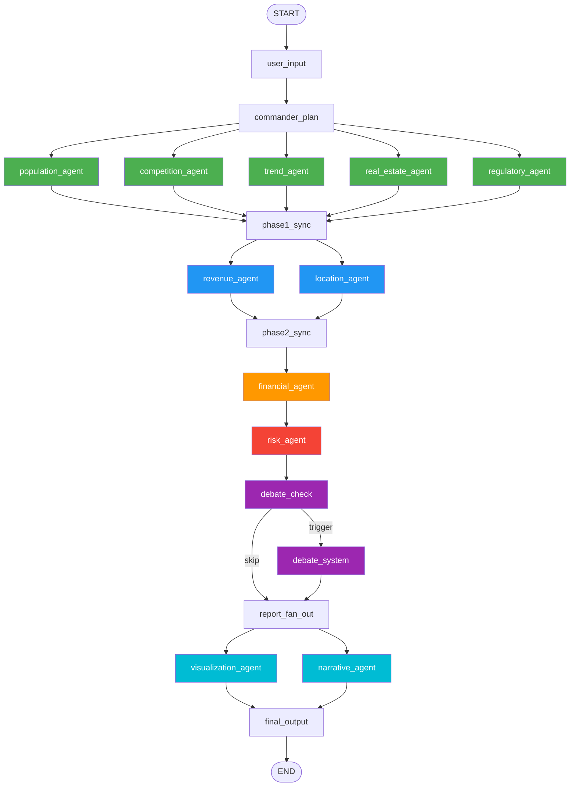

# MarketScope AI - 프로젝트 기반 설계 및 LangGraph 오케스트레이션 통합 명세서

> **문서 버전**: 1.1.0
> **최종 수정일**: 2026-03-19
> **상태**: 확정 (Phase 1 MVP 기준)
> **범위**: 프로젝트 전체 공유 기반 구조 + LangGraph 오케스트레이션 시스템
>
> ⚠️ **Phase 1 MVP 범위 제한**
> - **커버리지**: 서울 주요 상권 10개 우선 지원
> - **활성 에이전트**: 유동인구(population), 매출(revenue), 경쟁(competition), 입지(location) — 4개
> - **비활성(Phase 2)**: 트렌드, 재무, 리스크, 부동산, 규제 에이전트
> - **Debate 시스템**: Phase 2 (비용 최적화 이후 도입)
> - **AnalysisMode**: BASIC / COMPARISON / QUICK (DEEP은 Phase 2)
> - **비용 목표**: 분석 1건당 $2 이하 (모델 다운그레이드 적용)

---

## 목차

### Part I — 프로젝트 기반 설계

1. [프로젝트 설정 (Project Configuration)](#1-프로젝트-설정)
2. [공유 상태 스키마 (Shared State Schema)](#2-공유-상태-스키마)
3. [기본 에이전트 클래스 (Base Agent Class)](#3-기본-에이전트-클래스)
4. [공유 Pydantic 모델 (Shared Pydantic Models)](#4-공유-pydantic-모델)
5. [에러 처리 전략 (Error Handling Strategy)](#5-에러-처리-전략)
6. [로깅 및 모니터링 (Logging & Monitoring)](#6-로깅-및-모니터링)
7. [상수 및 열거형 (Constants & Enums)](#7-상수-및-열거형)

### Part II — LangGraph 오케스트레이션

8. [시스템 개요](#8-시스템-개요)
9. [LangGraph State 정의](#9-langgraph-state-정의)
10. [그래프 토폴로지 (DAG)](#10-그래프-토폴로지-dag)
11. [조건부 엣지 (Conditional Edges)](#11-조건부-엣지-conditional-edges)
12. [노드 구현 패턴](#12-노드-구현-패턴)
13. [체크포인팅 전략](#13-체크포인팅-전략)
14. [병렬 실행](#14-병렬-실행)
15. [스트리밍](#15-스트리밍)
16. [타임아웃 및 서킷 브레이커](#16-타임아웃-및-서킷-브레이커)
17. [코드 구조](#17-코드-구조)
18. [사용자 시나리오](#18-사용자-시나리오)
19. [부록](#19-부록)

---

# Part I — 프로젝트 기반 설계

---

## 1. 프로젝트 설정

### 1.1 디렉토리 구조

```
marketscope/
├── pyproject.toml
├── .env
├── .env.example
├── alembic/
│   └── versions/
├── app/
│   ├── __init__.py
│   ├── main.py                    # FastAPI 앱 엔트리포인트
│   ├── config.py                  # Pydantic Settings 정의
│   ├── constants.py               # 상수 및 Enum 정의
│   ├── exceptions.py              # 커스텀 예외 클래스
│   ├── logging_config.py          # 구조화된 로깅 설정
│   ├── models/
│   │   ├── __init__.py
│   │   ├── state.py               # LangGraph 공유 상태 TypedDict
│   │   ├── agent_outputs.py       # 에이전트 출력 Pydantic 모델
│   │   ├── debate.py              # 토론 관련 모델
│   │   ├── report.py              # 최종 리포트 모델
│   │   └── common.py              # 공통 재사용 모델
│   ├── agents/
│   │   ├── __init__.py
│   │   ├── base.py                # BaseAgent 추상 클래스
│   │   ├── population.py          # [Phase 1] 유동인구 분석 에이전트
│   │   ├── revenue.py             # [Phase 1] 매출 분석 에이전트
│   │   ├── competition.py         # [Phase 1] 경쟁 분석 에이전트
│   │   ├── location.py            # [Phase 1] 입지 분석 에이전트
│   │   ├── trend.py               # [Phase 2] 트렌드 분석 에이전트
│   │   ├── financial.py           # [Phase 2] 재무 분석 에이전트
│   │   ├── risk.py                # [Phase 2] 리스크 분석 에이전트
│   │   ├── real_estate.py         # [Phase 2] 부동산 분석 에이전트
│   │   └── regulatory.py          # [Phase 2] 규제 분석 에이전트
│   ├── debate/                    # [Phase 2] Debate 시스템 (전체 미구현)
│   │   ├── __init__.py
│   │   ├── commander.py           # [Phase 2] 사령관 에이전트
│   │   ├── advocate.py            # [Phase 2] 옹호자 에이전트
│   │   ├── critic.py              # [Phase 2] 비평가 에이전트
│   │   └── judge.py               # [Phase 2] 최종 판단 에이전트
│   ├── graph/
│   │   ├── __init__.py
│   │   ├── workflow.py            # LangGraph 워크플로우 정의
│   │   ├── nodes.py               # 그래프 노드 함수
│   │   └── edges.py               # 조건부 엣지 로직
│   ├── tools/
│   │   ├── __init__.py
│   │   ├── mcp_client.py          # MCP 도구 호출 클라이언트
│   │   └── registry.py            # 도구 레지스트리
│   ├── memory/
│   │   ├── __init__.py
│   │   ├── reme_client.py         # ReMe 메모리 인터페이스
│   │   └── lightrag_client.py     # LightRAG 검색 인터페이스
│   ├── db/
│   │   ├── __init__.py
│   │   ├── session.py             # SQLAlchemy 세션 관리
│   │   ├── models.py              # ORM 모델
│   │   └── repositories.py        # 데이터 접근 레이어
│   ├── api/
│   │   ├── __init__.py
│   │   ├── routes/
│   │   │   ├── analysis.py        # 분석 요청 API
│   │   │   ├── reports.py         # 리포트 조회 API
│   │   │   └── health.py          # 헬스체크 API
│   │   └── deps.py                # FastAPI 의존성 주입
│   └── services/
│       ├── __init__.py
│       ├── analysis_service.py    # 분석 오케스트레이션
│       └── report_service.py      # 리포트 생성 서비스
├── tests/
│   ├── conftest.py
│   ├── unit/
│   └── integration/
└── frontend/                      # Next.js 프론트엔드
    └── ...
```

### 1.2 환경 변수 (.env 구조)

```dotenv
# ============================================================
# MarketScope AI - 환경 설정
# ============================================================

# ---- 앱 기본 설정 ----
APP_NAME=MarketScope AI
APP_ENV=development                          # development | staging | production
APP_DEBUG=true
APP_VERSION=1.0.0
APP_HOST=0.0.0.0
APP_PORT=8000
APP_WORKERS=4
APP_LOG_LEVEL=DEBUG                          # DEBUG | INFO | WARNING | ERROR | CRITICAL
APP_SECRET_KEY=your-secret-key-here          # JWT 등에 사용할 시크릿 키
APP_CORS_ORIGINS=["http://localhost:3000"]   # JSON 배열 형식

# ---- LLM API 키 ----
ANTHROPIC_API_KEY=sk-ant-xxxxxxxxxxxxxxxx
GOOGLE_API_KEY=AIzaxxxxxxxxxxxxxxxxxxxxxxxx
OPENAI_API_KEY=sk-xxxxxxxxxxxxxxxx           # 폴백용 (선택)

# ---- LiteLLM 설정 ----
LITELLM_MASTER_KEY=sk-litellm-xxxxxxxx
LITELLM_BASE_URL=http://localhost:4000       # LiteLLM 프록시 URL (셀프호스팅 시)
LITELLM_USE_PROXY=false                      # true면 프록시 경유, false면 직접 호출
LITELLM_MAX_RETRIES=3
LITELLM_TIMEOUT=120                          # 초 단위
LITELLM_FALLBACK_ENABLED=true

# ---- LLM 모델 매핑 (Phase 1 비용 최적화 - 분석 1건 $2 이하 목표) ----
# [Phase 1] Commander: Opus → Sonnet 다운그레이드 (비용 약 80% 절감)
LLM_MODEL_COMMANDER=claude-sonnet-4-6-20250514
# [Phase 2] Debate 시스템 모델 (미구현)
# LLM_MODEL_JUDGE=claude-opus-4-6-20250319
# LLM_MODEL_CRITIC=claude-sonnet-4-6-20250514
# LLM_MODEL_ADVOCATE=gemini/gemini-2.5-flash

# [Phase 1] 활성 에이전트 모델
LLM_MODEL_POPULATION=gemini/gemini-2.5-flash
LLM_MODEL_REVENUE=gemini/gemini-2.5-flash
LLM_MODEL_COMPETITION=gemini/gemini-2.5-flash
LLM_MODEL_LOCATION=gemini/gemini-2.5-flash

# [Phase 2] 비활성 에이전트 모델
# LLM_MODEL_TREND=gemini/gemini-2.5-pro
# LLM_MODEL_FINANCIAL=claude-sonnet-4-6-20250514
# LLM_MODEL_RISK=claude-sonnet-4-6-20250514
# LLM_MODEL_REAL_ESTATE=gemini/gemini-2.5-flash
# LLM_MODEL_REGULATORY=claude-sonnet-4-6-20250514

LLM_MODEL_NARRATIVE=gemini/gemini-2.5-flash
LLM_MODEL_VISUALIZATION=gemini/gemini-2.5-flash

# ---- LLM 온도 설정 ----
LLM_TEMPERATURE_ANALYSIS=0.1                 # 데이터 분석 에이전트
LLM_TEMPERATURE_DEBATE=0.4                   # 토론 에이전트
LLM_TEMPERATURE_NARRATIVE=0.7                # 내러티브 생성
LLM_TEMPERATURE_DEFAULT=0.2

# ---- PostgreSQL / PostGIS ----
POSTGRES_HOST=localhost
POSTGRES_PORT=5432
POSTGRES_DB=marketscope
POSTGRES_USER=marketscope_user
POSTGRES_PASSWORD=your-postgres-password
POSTGRES_POOL_SIZE=20
POSTGRES_MAX_OVERFLOW=10
POSTGRES_ECHO_SQL=false                      # SQL 로깅 여부
DATABASE_URL=postgresql+asyncpg://${POSTGRES_USER}:${POSTGRES_PASSWORD}@${POSTGRES_HOST}:${POSTGRES_PORT}/${POSTGRES_DB}

# ---- Redis ----
REDIS_HOST=localhost
REDIS_PORT=6379
REDIS_DB=0
REDIS_PASSWORD=your-redis-password
REDIS_URL=redis://:${REDIS_PASSWORD}@${REDIS_HOST}:${REDIS_PORT}/${REDIS_DB}
REDIS_CACHE_TTL=3600                         # 기본 캐시 TTL (초)
REDIS_RATE_LIMIT_ENABLED=true

# ---- ChromaDB ----
CHROMA_HOST=localhost
CHROMA_PORT=8001
CHROMA_COLLECTION_PREFIX=marketscope
CHROMA_PERSIST_DIRECTORY=/data/chromadb
CHROMA_EMBEDDING_MODEL=text-embedding-3-small
CHROMA_EMBEDDING_DIMENSION=1536

# ---- LightRAG ----
LIGHTRAG_WORKING_DIR=/data/lightrag
LIGHTRAG_EMBEDDING_MODEL=text-embedding-3-small
LIGHTRAG_CHUNK_SIZE=1200
LIGHTRAG_CHUNK_OVERLAP=200
LIGHTRAG_TOP_K=10

# ---- ReMe (메모리 시스템) ----
REME_STORAGE_BACKEND=redis                   # redis | postgresql
REME_MAX_SHORT_TERM=50                       # 단기 기억 최대 항목 수
REME_MAX_LONG_TERM=500                       # 장기 기억 최대 항목 수
REME_SIMILARITY_THRESHOLD=0.75               # 유사 기억 검색 임계값
REME_DECAY_RATE=0.05                         # 기억 감쇠 계수

# ---- MCP (Model Context Protocol) ----
MCP_SERVER_URL=http://localhost:5100
MCP_TRANSPORT=stdio                          # stdio | sse
MCP_TIMEOUT=30
MCP_MAX_CONCURRENT_TOOLS=5

# ---- Langfuse (모니터링) ----
LANGFUSE_ENABLED=true
LANGFUSE_PUBLIC_KEY=pk-lf-xxxxxxxx
LANGFUSE_SECRET_KEY=sk-lf-xxxxxxxx
LANGFUSE_HOST=https://cloud.langfuse.com    # 셀프호스팅 시 URL 변경
LANGFUSE_FLUSH_AT=15
LANGFUSE_FLUSH_INTERVAL=10

# ---- 외부 데이터 API ----
DATA_API_SEOUL_OPEN_DATA_KEY=xxxxxxxx        # 서울 열린데이터 API 키
DATA_API_SMALL_BIZ_KEY=xxxxxxxx              # 소상공인시장진흥공단 API 키
DATA_API_PUBLIC_DATA_KEY=xxxxxxxx            # 공공데이터포털 API 키
DATA_API_NAVER_CLIENT_ID=xxxxxxxx            # 네이버 검색 트렌드 API
DATA_API_NAVER_CLIENT_SECRET=xxxxxxxx
DATA_API_KAKAO_REST_KEY=xxxxxxxx             # 카카오 로컬 API

# ---- 분석 실행 설정 (Phase 1) ----
ANALYSIS_MAX_PARALLEL_AGENTS=4               # Phase 1: 4개 에이전트만 실행
ANALYSIS_AGENT_TIMEOUT=60                    # Phase 1: 에이전트당 60초 (비용 통제)
ANALYSIS_TOTAL_TIMEOUT=300                   # Phase 1: 전체 5분 이내 목표
# ANALYSIS_MAX_DEBATE_ROUNDS=3               # [Phase 2] Debate 미구현
ANALYSIS_CONFIDENCE_THRESHOLD=0.5            # Phase 1: 데이터 부족 감안하여 완화
ANALYSIS_CACHE_ENABLED=true
ANALYSIS_CACHE_TTL=43200                     # Phase 1: 캐시 12시간 (공공 API 갱신 주기 감안)

# ---- Phase 1 지역 제한 ----
PHASE1_SEOUL_ONLY=true                       # Phase 1: 서울 상권만 지원
PHASE1_ALLOWED_DISTRICTS=강남,홍대,이태원,건대,신촌,종로,명동,여의도,성수,잠실

# ---- Next.js 프론트엔드 ----
NEXT_PUBLIC_API_URL=http://localhost:8000
NEXT_PUBLIC_WS_URL=ws://localhost:8000/ws
```

### 1.3 Pydantic Settings 설정 클래스

```python
# app/config.py

from __future__ import annotations

from enum import Enum
from functools import lru_cache
from pathlib import Path
from typing import Optional

from pydantic import Field, field_validator, model_validator
from pydantic_settings import BaseSettings, SettingsConfigDict


class AppEnvironment(str, Enum):
    """애플리케이션 실행 환경."""
    DEVELOPMENT = "development"
    STAGING = "staging"
    PRODUCTION = "production"


class LogLevel(str, Enum):
    """로그 레벨."""
    DEBUG = "DEBUG"
    INFO = "INFO"
    WARNING = "WARNING"
    ERROR = "ERROR"
    CRITICAL = "CRITICAL"


class MCPTransport(str, Enum):
    """MCP 전송 방식."""
    STDIO = "stdio"
    SSE = "sse"


class ReMeStorageBackend(str, Enum):
    """ReMe 저장소 백엔드."""
    REDIS = "redis"
    POSTGRESQL = "postgresql"


class LLMSettings(BaseSettings):
    """LLM 관련 설정. Phase 1: 비용 최적화 기준 모델 선택."""
    model_config = SettingsConfigDict(env_prefix="LLM_")

    # ── Phase 1 활성 모델 매핑 ──
    # Commander: Opus → Sonnet 다운그레이드 (비용 ~80% 절감, 분석 1건 $2 이하 목표)
    model_commander: str = "claude-sonnet-4-6-20250514"
    # 4개 전문 에이전트: 모두 Gemini Flash (가장 저렴한 고품질 모델)
    model_population: str = "gemini/gemini-2.5-flash"
    model_revenue: str = "gemini/gemini-2.5-flash"
    model_competition: str = "gemini/gemini-2.5-flash"
    model_location: str = "gemini/gemini-2.5-flash"
    # 리포트 에이전트: Flash 사용
    model_narrative: str = "gemini/gemini-2.5-flash"
    model_visualization: str = "gemini/gemini-2.5-flash"

    # ── Phase 2 모델 매핑 (참조용 — 미구현) ──
    # model_judge: str = "claude-opus-4-6-20250319"       # [Phase 2] Debate Judge
    # model_critic: str = "claude-sonnet-4-6-20250514"    # [Phase 2] Debate Critic
    # model_advocate: str = "gemini/gemini-2.5-flash"     # [Phase 2] Debate Advocate
    # model_trend: str = "gemini/gemini-2.5-pro"          # [Phase 2] 트렌드 에이전트
    # model_financial: str = "claude-sonnet-4-6-20250514" # [Phase 2] 재무 에이전트
    # model_risk: str = "claude-sonnet-4-6-20250514"      # [Phase 2] 리스크 에이전트
    # model_real_estate: str = "gemini/gemini-2.5-flash"  # [Phase 2] 부동산 에이전트
    # model_regulatory: str = "claude-sonnet-4-6-20250514"# [Phase 2] 규제 에이전트

    # 온도 설정
    temperature_analysis: float = 0.1
    temperature_narrative: float = 0.7
    temperature_default: float = 0.2

    def get_model_for_agent(self, agent_name: str) -> str:
        """에이전트 이름으로 할당된 LLM 모델 식별자를 반환한다."""
        attr = f"model_{agent_name}"
        if hasattr(self, attr):
            return getattr(self, attr)
        raise ValueError(f"알 수 없는 에이전트 이름: {agent_name}")

    def get_temperature_for_role(self, role: str) -> float:
        """역할(analysis/debate/narrative)에 적합한 온도 값을 반환한다."""
        mapping = {
            "analysis": self.temperature_analysis,
            "debate": self.temperature_debate,
            "narrative": self.temperature_narrative,
        }
        return mapping.get(role, self.temperature_default)


class Settings(BaseSettings):
    """
    MarketScope AI 전체 설정.
    .env 파일에서 자동 로드되며, 환경 변수로 오버라이드 가능하다.
    """
    model_config = SettingsConfigDict(
        env_file=".env",
        env_file_encoding="utf-8",
        env_nested_delimiter="__",
        case_sensitive=False,
        extra="ignore",
    )

    # ---- 앱 기본 ----
    app_name: str = "MarketScope AI"
    app_env: AppEnvironment = AppEnvironment.DEVELOPMENT
    app_debug: bool = True
    app_version: str = "1.0.0"
    app_host: str = "0.0.0.0"
    app_port: int = 8000
    app_workers: int = 4
    app_log_level: LogLevel = LogLevel.DEBUG
    app_secret_key: str = Field(..., min_length=16)
    app_cors_origins: list[str] = ["http://localhost:3000"]

    # ---- LLM API 키 ----
    anthropic_api_key: str = Field(..., min_length=1)
    google_api_key: str = Field(..., min_length=1)
    openai_api_key: Optional[str] = None

    # ---- LiteLLM ----
    litellm_master_key: Optional[str] = None
    litellm_base_url: str = "http://localhost:4000"
    litellm_use_proxy: bool = False
    litellm_max_retries: int = Field(default=3, ge=0, le=10)
    litellm_timeout: int = Field(default=120, ge=10, le=600)
    litellm_fallback_enabled: bool = True

    # ---- LLM (중첩 설정) ----
    llm: LLMSettings = LLMSettings()

    # ---- PostgreSQL ----
    postgres_host: str = "localhost"
    postgres_port: int = 5432
    postgres_db: str = "marketscope"
    postgres_user: str = "marketscope_user"
    postgres_password: str = Field(..., min_length=1)
    postgres_pool_size: int = Field(default=20, ge=5, le=100)
    postgres_max_overflow: int = Field(default=10, ge=0, le=50)
    postgres_echo_sql: bool = False
    database_url: Optional[str] = None

    @model_validator(mode="after")
    def assemble_database_url(self) -> "Settings":
        if self.database_url is None:
            self.database_url = (
                f"postgresql+asyncpg://{self.postgres_user}:{self.postgres_password}"
                f"@{self.postgres_host}:{self.postgres_port}/{self.postgres_db}"
            )
        return self

    # ---- Redis ----
    redis_host: str = "localhost"
    redis_port: int = 6379
    redis_db: int = 0
    redis_password: Optional[str] = None
    redis_url: Optional[str] = None
    redis_cache_ttl: int = Field(default=3600, ge=60)
    redis_rate_limit_enabled: bool = True

    @model_validator(mode="after")
    def assemble_redis_url(self) -> "Settings":
        if self.redis_url is None:
            auth = f":{self.redis_password}@" if self.redis_password else ""
            self.redis_url = f"redis://{auth}{self.redis_host}:{self.redis_port}/{self.redis_db}"
        return self

    # ---- ChromaDB ----
    chroma_host: str = "localhost"
    chroma_port: int = 8001
    chroma_collection_prefix: str = "marketscope"
    chroma_persist_directory: str = "/data/chromadb"
    chroma_embedding_model: str = "text-embedding-3-small"
    chroma_embedding_dimension: int = 1536

    # ---- LightRAG ----
    lightrag_working_dir: str = "/data/lightrag"
    lightrag_embedding_model: str = "text-embedding-3-small"
    lightrag_chunk_size: int = Field(default=1200, ge=256, le=4096)
    lightrag_chunk_overlap: int = Field(default=200, ge=0, le=1024)
    lightrag_top_k: int = Field(default=10, ge=1, le=50)

    # ---- ReMe ----
    reme_storage_backend: ReMeStorageBackend = ReMeStorageBackend.REDIS
    reme_max_short_term: int = Field(default=50, ge=10, le=200)
    reme_max_long_term: int = Field(default=500, ge=50, le=5000)
    reme_similarity_threshold: float = Field(default=0.75, ge=0.0, le=1.0)
    reme_decay_rate: float = Field(default=0.05, ge=0.0, le=1.0)

    # ---- MCP ----
    mcp_server_url: str = "http://localhost:5100"
    mcp_transport: MCPTransport = MCPTransport.STDIO
    mcp_timeout: int = Field(default=30, ge=5, le=120)
    mcp_max_concurrent_tools: int = Field(default=5, ge=1, le=20)

    # ---- Langfuse ----
    langfuse_enabled: bool = True
    langfuse_public_key: Optional[str] = None
    langfuse_secret_key: Optional[str] = None
    langfuse_host: str = "https://cloud.langfuse.com"
    langfuse_flush_at: int = 15
    langfuse_flush_interval: int = 10

    @field_validator("langfuse_public_key", "langfuse_secret_key")
    @classmethod
    def validate_langfuse_keys(cls, v, info):
        """Langfuse가 활성화된 경우 키가 반드시 존재해야 한다."""
        # model_validator에서 langfuse_enabled와 함께 검증
        return v

    @model_validator(mode="after")
    def validate_langfuse_config(self) -> "Settings":
        if self.langfuse_enabled:
            if not self.langfuse_public_key or not self.langfuse_secret_key:
                if self.app_env == AppEnvironment.PRODUCTION:
                    raise ValueError(
                        "프로덕션 환경에서 Langfuse가 활성화된 경우 "
                        "LANGFUSE_PUBLIC_KEY와 LANGFUSE_SECRET_KEY가 필수입니다."
                    )
        return self

    # ---- 외부 데이터 API ----
    data_api_seoul_open_data_key: Optional[str] = None
    data_api_small_biz_key: Optional[str] = None
    data_api_public_data_key: Optional[str] = None
    data_api_naver_client_id: Optional[str] = None
    data_api_naver_client_secret: Optional[str] = None
    data_api_kakao_rest_key: Optional[str] = None

    # ---- 분석 실행 (Phase 1) ----
    analysis_max_parallel_agents: int = Field(default=4, ge=1, le=4)  # Phase 1: 4개 에이전트 고정
    analysis_agent_timeout: int = Field(default=60, ge=30, le=120)    # Phase 1: 60초 타임아웃
    analysis_total_timeout: int = Field(default=300, ge=60, le=600)   # Phase 1: 5분 이내
    # analysis_max_debate_rounds: int = ...                            # [Phase 2] Debate 미구현
    analysis_confidence_threshold: float = Field(default=0.5, ge=0.0, le=1.0)  # Phase 1: 완화
    analysis_cache_enabled: bool = True
    analysis_cache_ttl: int = Field(default=43200, ge=3600)           # Phase 1: 12시간 캐시

    # ---- Phase 1 지역 제한 ----
    phase1_seoul_only: bool = True
    phase1_allowed_districts: list[str] = [
        "강남", "홍대", "이태원", "건대", "신촌",
        "종로", "명동", "여의도", "성수", "잠실",
    ]

    @property
    def is_production(self) -> bool:
        return self.app_env == AppEnvironment.PRODUCTION

    @property
    def is_debug(self) -> bool:
        return self.app_debug and not self.is_production


@lru_cache()
def get_settings() -> Settings:
    """
    싱글톤 Settings 인스턴스를 반환한다.
    FastAPI의 Depends()에서 사용하며, 앱 전역에서 동일 인스턴스를 참조한다.
    """
    return Settings()
```

---

## 2. 공유 상태 스키마

### 2.1 설계 원칙

- LangGraph의 `TypedDict`를 사용하며, 모든 에이전트 노드가 동일한 상태 딕셔너리를 읽고 쓴다.
- 각 에이전트의 출력은 `Optional` 필드로 선언하여, 실행 전에는 `None`으로 초기화한다.
- **Reducer 패턴**: 리스트 필드(`messages`, `errors`, `debate_rounds`)는 `Annotated[list, operator.add]`를 사용해 자동 병합한다.
- 상태 변이는 반드시 노드 함수의 반환값을 통해서만 발생한다 (직접 변이 금지).

### 2.2 상태 TypedDict 정의

```python
# app/models/state.py
# ⚠️ canonical 정의: 이 파일이 State의 단일 진실 공급원(SSOT)이다.

from __future__ import annotations

import operator
from typing import Annotated, Any, Optional, TypedDict

from langgraph.graph.message import add_messages

from app.models.agent_outputs import (
    CompetitionAnalysis,
    LocationAnalysis,
    PopulationAnalysis,
    RevenueAnalysis,
    # [Phase 2] 비활성 에이전트 임포트
    # FinancialAnalysis,
    # RealEstateAnalysis,
    # RegulatoryAnalysis,
    # RiskAnalysis,
    # TrendAnalysis,
)
from app.models.report import VisualizationOutput, NarrativeOutput


# ──────────────────────────────────────────────────────────────────
# API 요청 모델 (State에 저장되지 않음 — API 레이어에서 user_input으로 변환)
# ──────────────────────────────────────────────────────────────────

class AnalysisRequest(TypedDict):
    """
    FastAPI 엔드포인트가 수신하는 구조화된 분석 요청.
    State에 직접 저장되지 않으며, API 레이어에서 user_input 텍스트로
    직렬화되어 LangGraph에 전달된다.
    commander_plan 노드가 이 정보를 파싱하여 CommanderPlan을 생성한다.
    """
    session_id: str                       # UUID v4 — 분석 세션 식별자
    user_input: str                       # 원본 사용자 자연어 입력
    user_id: Optional[str]                # 로그인 사용자 ID (비로그인 시 None)
    # 선택적 힌트 (Commander가 파싱하지 못할 때 폴백으로 사용)
    hint_location: Optional[str]          # 위치 힌트 (예: "강남역")
    hint_industry: Optional[str]          # 업종 힌트 (예: "카페")
    hint_budget: Optional[int]            # 예산 힌트 (원)


# ──────────────────────────────────────────────────────────────────
# Commander 계획
# ──────────────────────────────────────────────────────────────────

class CommanderPlan(TypedDict):
    """Commander 에이전트가 수립한 실행 계획."""
    analysis_mode: str                     # "basic" | "quick" | "comparison"
    target_location: str                   # 분석 대상 위치 (파싱된 상권명)
    target_location_secondary: Optional[str]  # 비교 분석 시 두 번째 위치
    target_industry: str                   # 분석 대상 업종
    agents_to_run: list[str]               # 실행할 에이전트 ID 목록
    agents_to_skip: list[str]              # 건너뛸 에이전트 ID 목록
    force_debate: bool                     # [Phase 1] 항상 False
    priority_focus: list[str]             # 우선 분석 분야
    user_constraints: dict[str, Any]       # 사용자 제약 (예산, 면적 등)
    estimated_duration_seconds: int        # 예상 소요 시간 (초)
    clarification_needed: bool            # 명확화 요청 필요 여부
    clarification_message: Optional[str]  # 명확화 요청 메시지


# ──────────────────────────────────────────────────────────────────
# 실행 추적
# ──────────────────────────────────────────────────────────────────

class NodeExecution(TypedDict):
    """
    개별 노드 실행 메타데이터.
    fan-out 병렬 실행 시 여러 노드가 동시에 node_executions에 append 가능.
    """
    node_id: str                          # 노드 식별자 (예: "population_agent")
    status: str                           # "running" | "completed" | "failed" | "skipped"
    started_at: Optional[str]             # ISO 8601
    completed_at: Optional[str]           # ISO 8601
    duration_seconds: Optional[float]     # 실행 소요 시간 (초)
    llm_model_used: Optional[str]         # 실제 사용된 LLM 모델명
    token_usage: Optional[dict[str, int]] # {"prompt_tokens": N, "completion_tokens": N}
    error_message: Optional[str]          # 실패 시 에러 메시지
    retry_count: int                      # 재시도 횟수 (0 = 재시도 없음)


# ──────────────────────────────────────────────────────────────────
# 메인 State
# ──────────────────────────────────────────────────────────────────

class MarketScopeState(TypedDict):
    """
    MarketScope AI LangGraph 메인 State.

    모든 에이전트 노드가 공유하며 각 노드는 자신의 담당 필드만 업데이트한다.
    Annotated reducer 필드는 병렬 fan-out 시 자동 병합된다.
    """

    # ── 세션 메타데이터 (불변) ──
    session_id: str                                        # 고유 세션 식별자 (UUID)
    created_at: str                                        # 세션 생성 시각 (ISO 8601)
    updated_at: str                                        # 마지막 업데이트 시각

    # ── 사용자 입력 ──
    user_input: str                                        # 원본 사용자 자연어 입력
    messages: Annotated[list, add_messages]                # LangGraph 메시지 히스토리

    # ── Commander 계획 ──
    commander_plan: Optional[CommanderPlan]                # commander_plan 노드 실행 후 채워짐

    # ── [Phase 1] 에이전트 결과 ──
    # Step 1: 독립 실행 (병렬)
    population_result: Optional[PopulationAnalysis]        # 유동인구 분석
    competition_result: Optional[CompetitionAnalysis]      # 경쟁 분석

    # Step 2: 의존적 실행 (Step 1 완료 후)
    revenue_result: Optional[RevenueAnalysis]              # 매출 추정 (depends: population)
    location_result: Optional[LocationAnalysis]            # 입지 분석 (depends: population, competition)

    # [Phase 2] 비활성 에이전트 결과
    # trend_result: Optional[TrendAnalysis]
    # real_estate_result: Optional[RealEstateAnalysis]
    # regulatory_result: Optional[RegulatoryAnalysis]
    # financial_result: Optional[FinancialAnalysis]
    # risk_result: Optional[RiskAnalysis]

    # [Phase 2] Debate 시스템
    # debate_decision: Optional[str]
    # debate_trigger_reasons: list[str]
    # debate_result: Optional[DebateResult]

    # ── 리포트 산출물 ──
    visualization_output: Optional[VisualizationOutput]    # 시각화 에이전트 출력
    narrative_output: Optional[NarrativeOutput]            # 내러티브 에이전트 출력
    final_report: Optional[dict[str, Any]]                 # 통합 최종 보고서 (직렬화된 dict)

    # ── 실행 추적 ──
    node_executions: Annotated[list[NodeExecution], operator.add]  # append reducer
    current_phase: int                                     # 현재 실행 Phase (0~6)
    progress_pct: float                                    # 전체 진행률 (0.0~100.0)

    # ── 에러 ──
    errors: Annotated[list[dict[str, Any]], operator.add]  # append reducer
    has_critical_failure: bool                             # 치명적 실패 플래그

    # ── 비교 분석 전용 ──
    secondary_population_result: Optional[PopulationAnalysis]
    secondary_competition_result: Optional[CompetitionAnalysis]
    comparison_summary: Optional[dict[str, Any]]
```

### 2.3 State Reducer 요약

| 필드 | Reducer | 설명 |
|------|---------|------|
| `messages` | `add_messages` | LangGraph 내장 — 중복 메시지 자동 제거 |
| `node_executions` | `operator.add` | 리스트 append — 병렬 노드 동시 기록 안전 |
| `errors` | `operator.add` | 리스트 append — 에러 누적 |
| 나머지 | 덮어쓰기 | 마지막 기록 값이 최종 값 |

### 2.4 상태 초기화 팩토리 함수

```python
# app/models/state.py (계속)

from datetime import datetime, timezone


def create_initial_state(session_id: str, user_input: str) -> MarketScopeState:
    """
    신규 분석 세션의 초기 State를 생성한다.
    API 레이어에서 호출하며, session_id는 UUID v4로 생성해서 전달한다.
    """
    now = datetime.now(timezone.utc).isoformat()

    return MarketScopeState(
        # 세션
        session_id=session_id,
        created_at=now,
        updated_at=now,
        user_input=user_input,
        messages=[],

        # Commander 계획 (commander_plan 노드 실행 후 채워짐)
        commander_plan=None,

        # [Phase 1] 에이전트 결과
        population_result=None,
        competition_result=None,
        revenue_result=None,
        location_result=None,
        # [Phase 2] — 초기화 제외 (활성화 시 추가)

        # 리포트 산출물
        visualization_output=None,
        narrative_output=None,
        final_report=None,

        # 실행 추적
        node_executions=[],
        current_phase=0,
        progress_pct=0.0,

        # 에러
        errors=[],
        has_critical_failure=False,

        # 비교 분석
        secondary_population_result=None,
        secondary_competition_result=None,
        comparison_summary=None,
    )
```

---

## 3. 기본 에이전트 클래스

### 3.1 설계 원칙

- 모든 에이전트는 `BaseAgent`를 상속하며, `execute()` 메서드를 반드시 구현한다.
- LLM 호출은 LiteLLM을 통해 통합되며, 모델 선택은 설정에서 자동 결정된다.
- MCP 도구 호출, 메모리 접근, 구조화된 출력 파싱이 공통 인터페이스로 제공된다.
- 재시도 로직, 에러 핸들링, 신뢰도 점수 산출이 기본 내장된다.

### 3.2 BaseAgent 추상 클래스

```python
# app/agents/base.py

from __future__ import annotations

import asyncio
import time
import traceback
from abc import ABC, abstractmethod
from datetime import datetime, timezone
from typing import Any, Generic, Optional, Type, TypeVar

import litellm
from langfuse.decorators import observe
from pydantic import BaseModel, ValidationError

from app.config import Settings, get_settings
from app.constants import ConfidenceLevel
from app.exceptions import (
    AgentExecutionError,
    AgentTimeoutError,
    FallbackTriggeredError,
    LLMCallError,
    MCPToolCallError,
    OutputParsingError,
)
from app.logging_config import get_agent_logger
from app.memory.reme_client import ReMeClient
from app.models.state import NodeExecution, ErrorRecord, MarketScopeState
from app.tools.mcp_client import MCPClient

# 에이전트 출력 모델의 제네릭 타입 변수
T = TypeVar("T", bound=BaseModel)


class BaseAgent(ABC, Generic[T]):
    """
    모든 MarketScope AI 에이전트가 상속하는 추상 기본 클래스.

    제네릭 파라미터 T는 에이전트의 구조화된 출력 Pydantic 모델 타입이다.
    예: class PopulationAgent(BaseAgent[PopulationAnalysis])

    책임:
        - LLM 호출 인터페이스 (LiteLLM 경유)
        - MCP 도구 호출 인터페이스
        - ReMe 메모리 읽기/쓰기
        - 구조화된 출력 파싱 (JSON -> Pydantic 모델)
        - 재시도 로직 (지수 백오프)
        - 에러 핸들링 및 폴백
        - 신뢰도 점수 산출
        - Langfuse 트레이싱 자동 연동
    """

    # ---- 서브클래스에서 오버라이드해야 하는 클래스 변수 ----
    agent_name: str = ""                     # 고유 에이전트 이름 (예: "population")
    agent_description: str = ""              # 에이전트 역할 설명 (프롬프트에 포함)
    output_model: Type[T]                    # Pydantic 출력 모델 클래스
    llm_role: str = "analysis"               # "analysis" | "debate" | "narrative"
    max_retries: int = 3                     # 최대 재시도 횟수
    retry_base_delay: float = 1.0            # 재시도 기본 대기 시간 (초)
    required_state_fields: list[str] = []    # 실행 전 검증할 상태 필드 목록

    def __init__(
        self,
        settings: Optional[Settings] = None,
        mcp_client: Optional[MCPClient] = None,
        reme_client: Optional[ReMeClient] = None,
    ) -> None:
        self.settings = settings or get_settings()
        self.mcp_client = mcp_client or MCPClient(self.settings)
        self.reme_client = reme_client or ReMeClient(self.settings)
        self.logger = get_agent_logger(self.agent_name)
        self._llm_model = self.settings.llm.get_model_for_agent(self.agent_name)
        self._temperature = self.settings.llm.get_temperature_for_role(self.llm_role)

    # ================================================================
    # 추상 메서드: 서브클래스가 반드시 구현해야 함
    # ================================================================

    @abstractmethod
    async def execute(self, state: MarketScopeState) -> T:
        """
        에이전트의 핵심 실행 로직.

        Args:
            state: 현재 LangGraph 공유 상태.

        Returns:
            구조화된 분석 결과 (Pydantic 모델 T 인스턴스).

        Raises:
            AgentExecutionError: 에이전트 실행 중 복구 불가능한 에러.
        """
        ...

    @abstractmethod
    def build_system_prompt(self, state: MarketScopeState) -> str:
        """
        상태 정보를 반영한 시스템 프롬프트를 구성한다.
        에이전트마다 고유한 역할 및 분석 지침을 포함한다.
        """
        ...

    @abstractmethod
    def build_user_prompt(self, state: MarketScopeState, data: dict[str, Any]) -> str:
        """
        수집된 데이터와 상태를 기반으로 사용자 프롬프트를 구성한다.
        에이전트마다 필요한 데이터 형식이 다르다.
        """
        ...

    # ================================================================
    # LLM 호출 인터페이스
    # ================================================================

    @observe(name="llm_call")
    async def call_llm(
        self,
        system_prompt: str,
        user_prompt: str,
        response_format: Optional[Type[BaseModel]] = None,
        temperature: Optional[float] = None,
        max_tokens: int = 4096,
        additional_messages: Optional[list[dict[str, str]]] = None,
    ) -> dict[str, Any]:
        """
        LiteLLM을 통해 LLM을 호출한다.

        Args:
            system_prompt: 시스템 프롬프트.
            user_prompt: 사용자 프롬프트.
            response_format: Pydantic 모델 클래스 (구조화된 출력 요청 시).
            temperature: 온도 오버라이드 (None이면 에이전트 기본값 사용).
            max_tokens: 최대 토큰 수.
            additional_messages: 추가 메시지 (few-shot 예시 등).

        Returns:
            {
                "content": str,            # LLM 응답 텍스트
                "parsed": Optional[T],     # 파싱된 Pydantic 모델 (response_format 지정 시)
                "usage": {                 # 토큰 사용량
                    "prompt_tokens": int,
                    "completion_tokens": int,
                },
                "model": str,              # 실제 사용된 모델
                "latency_ms": float,       # 호출 지연 시간 (밀리초)
            }

        Raises:
            LLMCallError: LLM 호출 실패 (재시도 후에도).
        """
        messages = [{"role": "system", "content": system_prompt}]
        if additional_messages:
            messages.extend(additional_messages)
        messages.append({"role": "user", "content": user_prompt})

        effective_temperature = temperature if temperature is not None else self._temperature

        last_error: Optional[Exception] = None
        for attempt in range(self.max_retries + 1):
            try:
                start_time = time.monotonic()

                kwargs: dict[str, Any] = {
                    "model": self._llm_model,
                    "messages": messages,
                    "temperature": effective_temperature,
                    "max_tokens": max_tokens,
                    "timeout": self.settings.litellm_timeout,
                }

                # 구조화된 출력 요청 (모델이 지원하는 경우)
                if response_format is not None:
                    kwargs["response_format"] = response_format

                response = await litellm.acompletion(**kwargs)

                latency_ms = (time.monotonic() - start_time) * 1000

                content = response.choices[0].message.content
                usage = {
                    "prompt_tokens": response.usage.prompt_tokens,
                    "completion_tokens": response.usage.completion_tokens,
                }

                # 구조화된 출력 파싱
                parsed = None
                if response_format is not None and content:
                    parsed = self._parse_structured_output(content, response_format)

                self.logger.info(
                    "LLM 호출 성공",
                    extra={
                        "model": self._llm_model,
                        "attempt": attempt + 1,
                        "latency_ms": round(latency_ms, 2),
                        "prompt_tokens": usage["prompt_tokens"],
                        "completion_tokens": usage["completion_tokens"],
                    },
                )

                return {
                    "content": content,
                    "parsed": parsed,
                    "usage": usage,
                    "model": self._llm_model,
                    "latency_ms": latency_ms,
                }

            except Exception as e:
                last_error = e
                self.logger.warning(
                    f"LLM 호출 실패 (시도 {attempt + 1}/{self.max_retries + 1})",
                    extra={"error": str(e), "model": self._llm_model},
                )
                if attempt < self.max_retries:
                    delay = self.retry_base_delay * (2 ** attempt)
                    await asyncio.sleep(delay)

        raise LLMCallError(
            agent_name=self.agent_name,
            model=self._llm_model,
            original_error=last_error,
            attempts=self.max_retries + 1,
        )

    # ================================================================
    # 구조화된 출력 파싱
    # ================================================================

    def _parse_structured_output(
        self,
        raw_content: str,
        model_class: Type[BaseModel],
    ) -> BaseModel:
        """
        LLM 응답을 Pydantic 모델로 파싱한다.
        JSON 블록 추출 -> Pydantic 유효성 검증 순서로 진행한다.

        3단계 파싱 전략:
        1. response_format으로 이미 파싱된 경우 그대로 반환.
        2. 응답에서 JSON 코드 블록(```json ... ```) 추출 후 파싱.
        3. 응답 전체를 JSON으로 파싱 시도.

        Raises:
            OutputParsingError: 모든 파싱 전략 실패 시.
        """
        import json
        import re

        # 전략 1: JSON 코드 블록 추출
        json_match = re.search(r"```json\s*([\s\S]*?)\s*```", raw_content)
        if json_match:
            try:
                data = json.loads(json_match.group(1))
                return model_class.model_validate(data)
            except (json.JSONDecodeError, ValidationError):
                pass

        # 전략 2: 전체 텍스트를 JSON으로 파싱
        try:
            data = json.loads(raw_content)
            return model_class.model_validate(data)
        except (json.JSONDecodeError, ValidationError):
            pass

        # 전략 3: JSON 객체 패턴 추출 (처음 { 부터 마지막 } 까지)
        brace_match = re.search(r"\{[\s\S]*\}", raw_content)
        if brace_match:
            try:
                data = json.loads(brace_match.group(0))
                return model_class.model_validate(data)
            except (json.JSONDecodeError, ValidationError):
                pass

        raise OutputParsingError(
            agent_name=self.agent_name,
            model_class=model_class.__name__,
            raw_content=raw_content[:500],
        )

    # ================================================================
    # MCP 도구 호출 인터페이스
    # ================================================================

    @observe(name="mcp_tool_call")
    async def call_tool(
        self,
        tool_name: str,
        arguments: dict[str, Any],
        timeout: Optional[int] = None,
    ) -> dict[str, Any]:
        """
        MCP 프로토콜을 통해 외부 도구를 호출한다.

        Args:
            tool_name: MCP 도구 이름 (예: "search_floating_population").
            arguments: 도구 인자 딕셔너리.
            timeout: 타임아웃 (초). None이면 설정 기본값.

        Returns:
            도구 실행 결과 딕셔너리.

        Raises:
            MCPToolCallError: 도구 호출 실패.
        """
        effective_timeout = timeout or self.settings.mcp_timeout

        try:
            result = await asyncio.wait_for(
                self.mcp_client.call_tool(tool_name, arguments),
                timeout=effective_timeout,
            )

            self.logger.info(
                f"MCP 도구 호출 성공: {tool_name}",
                extra={"tool": tool_name, "arguments_keys": list(arguments.keys())},
            )
            return result

        except asyncio.TimeoutError:
            raise MCPToolCallError(
                agent_name=self.agent_name,
                tool_name=tool_name,
                message=f"도구 호출 타임아웃 ({effective_timeout}초)",
            )
        except Exception as e:
            raise MCPToolCallError(
                agent_name=self.agent_name,
                tool_name=tool_name,
                message=str(e),
                original_error=e,
            )

    async def call_tools_parallel(
        self,
        tool_calls: list[dict[str, Any]],
    ) -> list[dict[str, Any]]:
        """
        여러 MCP 도구를 병렬로 호출한다.

        Args:
            tool_calls: [{"tool_name": str, "arguments": dict}, ...]

        Returns:
            결과 리스트 (호출 순서 유지). 개별 실패 시 해당 항목은
            {"error": str, "tool_name": str} 형태로 반환된다.
        """
        semaphore = asyncio.Semaphore(self.settings.mcp_max_concurrent_tools)

        async def _call_with_semaphore(tc: dict[str, Any]) -> dict[str, Any]:
            async with semaphore:
                try:
                    return await self.call_tool(tc["tool_name"], tc["arguments"])
                except MCPToolCallError as e:
                    self.logger.error(f"병렬 도구 호출 실패: {tc['tool_name']}", extra={"error": str(e)})
                    return {"error": str(e), "tool_name": tc["tool_name"]}

        tasks = [_call_with_semaphore(tc) for tc in tool_calls]
        return await asyncio.gather(*tasks)

    # ================================================================
    # 메모리 인터페이스 (ReMe)
    # ================================================================

    async def recall_memory(
        self,
        query: str,
        memory_type: str = "long_term",
        top_k: int = 5,
    ) -> list[dict[str, Any]]:
        """
        ReMe 메모리 시스템에서 관련 기억을 검색한다.

        Args:
            query: 검색 쿼리.
            memory_type: "short_term" | "long_term" | "episodic".
            top_k: 반환할 최대 기억 수.

        Returns:
            관련 기억 리스트. 각 항목:
            {"content": str, "relevance": float, "created_at": str, "metadata": dict}
        """
        try:
            memories = await self.reme_client.recall(
                agent_name=self.agent_name,
                query=query,
                memory_type=memory_type,
                top_k=top_k,
            )
            self.logger.debug(f"기억 검색 완료: {len(memories)}건", extra={"query": query[:100]})
            return memories
        except Exception as e:
            self.logger.warning(f"기억 검색 실패 (무시): {e}")
            return []

    async def store_memory(
        self,
        content: str,
        memory_type: str = "short_term",
        metadata: Optional[dict[str, Any]] = None,
    ) -> None:
        """
        ReMe 메모리 시스템에 새 기억을 저장한다.

        Args:
            content: 저장할 기억 내용.
            memory_type: "short_term" | "long_term" | "episodic".
            metadata: 추가 메타데이터 (분석 대상 상권, 업종 등).
        """
        try:
            await self.reme_client.store(
                agent_name=self.agent_name,
                content=content,
                memory_type=memory_type,
                metadata=metadata or {},
            )
            self.logger.debug("기억 저장 완료", extra={"memory_type": memory_type})
        except Exception as e:
            self.logger.warning(f"기억 저장 실패 (무시): {e}")

    # ================================================================
    # 신뢰도 점수 산출
    # ================================================================

    def calculate_confidence(
        self,
        data_completeness: float,
        data_freshness: float,
        source_count: int,
        cross_validation_score: float = 0.0,
    ) -> float:
        """
        에이전트 분석 결과의 신뢰도 점수를 산출한다.

        가중치 기반 종합 점수 (0.0 ~ 1.0):
        - 데이터 완전성 (30%): 필수 데이터 필드 중 실제 확보된 비율
        - 데이터 신선도 (25%): 데이터의 최신성 점수
        - 데이터 소스 수 (20%): 참조한 데이터 소스 개수 기반
        - 교차 검증 점수 (25%): 다른 에이전트 결과와의 정합성

        Args:
            data_completeness: 데이터 완전성 (0.0~1.0).
            data_freshness: 데이터 신선도 (0.0~1.0).
            source_count: 참조 데이터 소스 수.
            cross_validation_score: 교차 검증 점수 (0.0~1.0).

        Returns:
            종합 신뢰도 점수 (0.0~1.0).
        """
        # 소스 수를 0~1 점수로 정규화 (5개 이상이면 만점)
        source_score = min(source_count / 5.0, 1.0)

        confidence = (
            data_completeness * 0.30
            + data_freshness * 0.25
            + source_score * 0.20
            + cross_validation_score * 0.25
        )

        return round(min(max(confidence, 0.0), 1.0), 4)

    def classify_confidence(self, score: float) -> ConfidenceLevel:
        """신뢰도 점수를 등급으로 분류한다."""
        if score >= 0.85:
            return ConfidenceLevel.VERY_HIGH
        elif score >= 0.70:
            return ConfidenceLevel.HIGH
        elif score >= 0.55:
            return ConfidenceLevel.MEDIUM
        elif score >= 0.40:
            return ConfidenceLevel.LOW
        else:
            return ConfidenceLevel.VERY_LOW

    # ================================================================
    # 상태 검증
    # ================================================================

    def validate_required_state(self, state: MarketScopeState) -> list[str]:
        """
        에이전트 실행 전 필요한 상태 필드가 존재하는지 검증한다.

        Returns:
            누락된 필드 이름 리스트 (비어있으면 검증 통과).
        """
        missing = []
        for field in self.required_state_fields:
            value = state.get(field)
            if value is None:
                missing.append(field)
        return missing

    # ================================================================
    # 에러 기록 생성 헬퍼
    # ================================================================

    def create_error_record(
        self,
        error: Exception,
        is_critical: bool = False,
        fallback_applied: bool = False,
    ) -> ErrorRecord:
        """에러를 구조화된 ErrorRecord로 변환한다."""
        return ErrorRecord(
            timestamp=datetime.now(timezone.utc).isoformat(),
            agent_name=self.agent_name,
            error_type=type(error).__name__,
            error_message=str(error),
            is_critical=is_critical,
            fallback_applied=fallback_applied,
        )

    # ================================================================
    # 실행 메타데이터 업데이트 헬퍼
    # ================================================================

    def create_execution_started(self) -> NodeExecution:
        """에이전트 실행 시작 메타데이터를 생성한다."""
        return NodeExecution(
            node_id=self.agent_name,
            status="running",
            started_at=datetime.now(timezone.utc).isoformat(),
            completed_at=None,
            duration_seconds=None,
            llm_model_used=self._llm_model,
            token_usage=None,
            error_message=None,
            retry_count=0,
        )

    def create_execution_completed(
        self,
        started_at: str,
        token_usage: dict[str, int],
        retry_count: int = 0,
    ) -> NodeExecution:
        """에이전트 실행 완료 메타데이터를 생성한다."""
        now = datetime.now(timezone.utc)
        started = datetime.fromisoformat(started_at)
        duration = (now - started).total_seconds()

        return NodeExecution(
            node_id=self.agent_name,
            status="completed",
            started_at=started_at,
            completed_at=now.isoformat(),
            duration_seconds=round(duration, 3),
            llm_model_used=self._llm_model,
            token_usage=token_usage,
            error_message=None,
            retry_count=retry_count,
        )

    def create_execution_failed(
        self,
        started_at: str,
        error_message: str,
        retry_count: int = 0,
    ) -> NodeExecution:
        """에이전트 실행 실패 메타데이터를 생성한다."""
        now = datetime.now(timezone.utc)
        started = datetime.fromisoformat(started_at)
        duration = (now - started).total_seconds()

        return NodeExecution(
            node_id=self.agent_name,
            status="failed",
            started_at=started_at,
            completed_at=now.isoformat(),
            duration_seconds=round(duration, 3),
            llm_model_used=self._llm_model,
            token_usage=None,
            error_message=error_message,
            retry_count=retry_count,
        )

    # ================================================================
    # 그래프 노드 래퍼 (LangGraph 노드에서 호출)
    # ================================================================

    @observe(name="agent_node")
    async def run(self, state: MarketScopeState) -> dict[str, Any]:
        """
        LangGraph 노드 함수로 사용되는 최상위 실행 래퍼.

        1. 상태 필드 검증
        2. 실행 메타 "running" 설정
        3. execute() 호출 (서브클래스 구현)
        4. 결과를 상태 업데이트 딕셔너리로 반환
        5. 에러 발생 시 폴백 처리 + 에러 기록

        Returns:
            LangGraph 상태 업데이트 딕셔너리.
            예: {"population_result": PopulationAnalysis(...),
                 "node_executions": [NodeExecution(...)], "errors": [...]}
        """
        execution_start = datetime.now(timezone.utc).isoformat()
        state_update: dict[str, Any] = {}
        retry_count = 0
        accumulated_errors: list[ErrorRecord] = []

        self.logger.info(f"에이전트 실행 시작: {self.agent_name}")

        # 상태 검증
        missing_fields = self.validate_required_state(state)
        if missing_fields:
            self.logger.warning(f"필수 상태 필드 누락: {missing_fields}")
            # 누락 필드가 있어도 최선을 다해 실행 시도

        # 실행 시도 (재시도 포함)
        try:
            result: T = await asyncio.wait_for(
                self._execute_with_retry(state),
                timeout=self.settings.analysis_agent_timeout,
            )

            # 결과 필드명 결정 (에이전트 이름 + "_result")
            result_field = f"{self.agent_name}_result"
            state_update[result_field] = result

            # 실행 메타 업데이트 (list append — operator.add reducer)
            token_usage = getattr(result, "_token_usage", {"prompt_tokens": 0, "completion_tokens": 0})
            state_update["node_executions"] = [
                self.create_execution_completed(
                    started_at=execution_start,
                    token_usage=token_usage,
                    retry_count=retry_count,
                )
            ]

            # 기억 저장 (핵심 인사이트)
            if hasattr(result, "key_insight") and result.key_insight:
                plan = state.get("commander_plan") or {}
                await self.store_memory(
                    content=result.key_insight,
                    memory_type="long_term",
                    metadata={
                        "location": plan.get("target_location", "unknown"),
                        "industry": plan.get("target_industry", "unknown"),
                        "agent": self.agent_name,
                    },
                )

            self.logger.info(f"에이전트 실행 완료: {self.agent_name}")

        except asyncio.TimeoutError:
            error = AgentTimeoutError(
                agent_name=self.agent_name,
                timeout_seconds=self.settings.analysis_agent_timeout,
            )
            self.logger.error(f"에이전트 타임아웃: {self.agent_name}")
            accumulated_errors.append(self.create_error_record(error, is_critical=False, fallback_applied=True))

            # 폴백: 빈 결과 + 최저 신뢰도
            fallback_result = self._create_fallback_result(state, str(error))
            result_field = f"{self.agent_name}_result"
            state_update[result_field] = fallback_result
            state_update["node_executions"] = [
                self.create_execution_failed(
                    started_at=execution_start,
                    error_message=str(error),
                    retry_count=retry_count,
                )
            ]

        except AgentExecutionError as e:
            self.logger.error(f"에이전트 실행 에러: {self.agent_name}", extra={"error": str(e)})
            accumulated_errors.append(self.create_error_record(e, is_critical=e.is_critical, fallback_applied=True))

            fallback_result = self._create_fallback_result(state, str(e))
            result_field = f"{self.agent_name}_result"
            state_update[result_field] = fallback_result
            state_update["node_executions"] = [
                self.create_execution_failed(
                    started_at=execution_start,
                    error_message=str(e),
                    retry_count=retry_count,
                )
            ]

        except Exception as e:
            self.logger.error(
                f"에이전트 예상치 못한 에러: {self.agent_name}",
                extra={"error": str(e), "traceback": traceback.format_exc()},
            )
            accumulated_errors.append(self.create_error_record(e, is_critical=False, fallback_applied=True))

            fallback_result = self._create_fallback_result(state, str(e))
            result_field = f"{self.agent_name}_result"
            state_update[result_field] = fallback_result
            state_update["node_executions"] = [
                self.create_execution_failed(
                    started_at=execution_start,
                    error_message=str(e),
                    retry_count=retry_count,
                )
            ]

        # 에러 기록 추가 (reducer가 자동 append)
        if accumulated_errors:
            state_update["errors"] = accumulated_errors

        return state_update

    async def _execute_with_retry(self, state: MarketScopeState) -> T:
        """execute()를 재시도 로직과 함께 실행한다."""
        last_error: Optional[Exception] = None

        for attempt in range(self.max_retries + 1):
            try:
                return await self.execute(state)
            except (LLMCallError, OutputParsingError, MCPToolCallError) as e:
                last_error = e
                self.logger.warning(
                    f"실행 재시도 {attempt + 1}/{self.max_retries + 1}",
                    extra={"error": str(e)},
                )
                if attempt < self.max_retries:
                    delay = self.retry_base_delay * (2 ** attempt)
                    await asyncio.sleep(delay)

        raise AgentExecutionError(
            agent_name=self.agent_name,
            message=f"{self.max_retries + 1}회 시도 후 실패",
            original_error=last_error,
        )

    def _create_fallback_result(self, state: MarketScopeState, error_message: str) -> T:
        """
        에러 발생 시 최소한의 폴백 결과를 생성한다.
        서브클래스에서 오버라이드하여 더 정교한 폴백을 구현할 수 있다.

        기본 구현: output_model의 모든 필드를 기본값/None으로 채우고,
        confidence_score를 0.0, key_insight를 에러 메시지로 설정한다.
        """
        # Pydantic 모델의 필드 기본값으로 인스턴스 생성 시도
        defaults: dict[str, Any] = {}
        for field_name, field_info in self.output_model.model_fields.items():
            if field_info.default is not None:
                defaults[field_name] = field_info.default
            elif field_info.default_factory is not None:
                defaults[field_name] = field_info.default_factory()
            else:
                # 타입 기반 기본값 추론
                annotation = field_info.annotation
                if annotation == str or annotation == Optional[str]:
                    defaults[field_name] = ""
                elif annotation == int or annotation == Optional[int]:
                    defaults[field_name] = 0
                elif annotation == float or annotation == Optional[float]:
                    defaults[field_name] = 0.0
                elif annotation == bool:
                    defaults[field_name] = False
                elif annotation == list or str(annotation).startswith("list"):
                    defaults[field_name] = []
                elif annotation == dict or str(annotation).startswith("dict"):
                    defaults[field_name] = {}
                else:
                    defaults[field_name] = None

        # 공통 필드 강제 설정
        if "confidence_score" in defaults:
            defaults["confidence_score"] = 0.0
        if "key_insight" in defaults:
            defaults["key_insight"] = f"[폴백] 분석 실패: {error_message}"

        return self.output_model.model_validate(defaults)
```

---

## 4. 공유 Pydantic 모델

> 에이전트 출력 모델, 토론 모델, 최종 리포트 모델의 전체 정의는 분량이 방대하여 핵심 구조만 기술하며, 각 파일 경로에서 원본 코드를 참조한다.

### 4.1 공통 재사용 모델

```python
# app/models/common.py

from __future__ import annotations

from datetime import datetime
from enum import Enum
from typing import Any, Optional

from pydantic import BaseModel, Field


class TimeSlot(BaseModel):
    """시간대별 데이터 포인트."""
    hour: int = Field(..., ge=0, le=23, description="시간 (0-23)")
    value: float = Field(..., description="해당 시간대의 측정값")
    label: Optional[str] = Field(None, description="시간대 라벨 (예: '출근시간대')")


class DayOfWeek(str, Enum):
    """요일."""
    MONDAY = "월"
    TUESDAY = "화"
    WEDNESDAY = "수"
    THURSDAY = "목"
    FRIDAY = "금"
    SATURDAY = "토"
    SUNDAY = "일"


class DailyValue(BaseModel):
    """요일별 데이터 포인트."""
    day: DayOfWeek = Field(..., description="요일")
    value: float = Field(..., description="해당 요일의 측정값")


class AgeDistribution(BaseModel):
    """연령대별 분포."""
    age_10s: float = Field(0.0, description="10대 비율 (%)", ge=0, le=100)
    age_20s: float = Field(0.0, description="20대 비율 (%)", ge=0, le=100)
    age_30s: float = Field(0.0, description="30대 비율 (%)", ge=0, le=100)
    age_40s: float = Field(0.0, description="40대 비율 (%)", ge=0, le=100)
    age_50s: float = Field(0.0, description="50대 비율 (%)", ge=0, le=100)
    age_60_plus: float = Field(0.0, description="60대 이상 비율 (%)", ge=0, le=100)


class TrendDirection(str, Enum):
    """추세 방향."""
    STRONG_UP = "강한상승"
    UP = "상승"
    STABLE = "보합"
    DOWN = "하락"
    STRONG_DOWN = "강한하락"


class MoneyRange(BaseModel):
    """금액 범위."""
    min_value: int = Field(..., description="최소 금액 (원)")
    max_value: int = Field(..., description="최대 금액 (원)")
    currency: str = Field(default="KRW", description="통화 코드")


class ScenarioResult(BaseModel):
    """시나리오별 재무 예측 결과."""
    label: str = Field(..., description="시나리오 라벨 (예: '낙관', '현실', '비관')")
    monthly_revenue: int = Field(..., description="예상 월 매출 (원)")
    monthly_profit: int = Field(..., description="예상 월 순이익 (원)")
    break_even_months: int = Field(..., description="손익분기 도달 예상 개월 수")
    roi_12m: float = Field(..., description="12개월 ROI (%)")
    probability: float = Field(..., description="해당 시나리오 실현 확률 (0.0~1.0)")
    assumptions: str = Field(..., description="시나리오 전제 조건 요약")


class RiskFactor(BaseModel):
    """개별 리스크 요인."""
    category: str = Field(..., description="리스크 카테고리 (예: '경쟁', '경기', '규제')")
    name: str = Field(..., description="리스크 요인명")
    description: str = Field(..., description="리스크 상세 설명")
    severity: float = Field(..., description="심각도 (1.0~5.0)", ge=1.0, le=5.0)
    probability: float = Field(..., description="발생 확률 (0.0~1.0)", ge=0.0, le=1.0)
    impact_score: float = Field(..., description="영향도 점수 (severity * probability)")
    mitigation: str = Field(..., description="완화 방안")


class PropertyInfo(BaseModel):
    """매물 정보."""
    address: str = Field(..., description="매물 주소")
    size_pyeong: float = Field(..., description="면적 (평)")
    floor: str = Field(..., description="층수 (예: '1층', '지하1층')")
    monthly_rent: int = Field(..., description="월 임대료 (원)")
    deposit: int = Field(..., description="보증금 (원)")
    premium: int = Field(0, description="권리금 (원)")
    available_date: Optional[str] = Field(None, description="입주 가능일")
    source: Optional[str] = Field(None, description="매물 출처")


class PermitRequirement(BaseModel):
    """인허가 요건 정보."""
    permit_name: str = Field(..., description="인허가 명칭")
    issuing_authority: str = Field(..., description="발급 기관")
    estimated_days: int = Field(..., description="예상 소요일")
    estimated_cost: int = Field(0, description="예상 비용 (원)")
    required_documents: list[str] = Field(default_factory=list, description="필요 서류 목록")
    difficulty: str = Field(..., description="난이도 ('쉬움' | '보통' | '어려움')")
    notes: Optional[str] = Field(None, description="특이사항")
```

### 4.2 에이전트 출력 모델

에이전트 출력 모델은 `app/models/agent_outputs.py`에 정의된다. Phase 1 활성 에이전트 4개와 Phase 2 비활성 에이전트 5개를 포함하며, 각 모델에는 `key_insight`(핵심 인사이트)와 `confidence_score`(신뢰도)가 공통 필드로 포함된다.

| 모델 클래스 | 에이전트 | 주요 필드 |
|---|---|---|
| `PopulationAnalysis` | 유동인구 | `total_floating_population`, `floating_by_time`, `age_distribution`, `population_trend` |
| `RevenueAnalysis` | 매출 | `estimated_monthly_revenue`, `revenue_range`, `avg_ticket_price`, `revenue_trend` |
| `CompetitionAnalysis` | 경쟁 | `total_competitors`, `saturation_index`, `closing_rate_12m`, `differentiation_opportunities` |
| `LocationAnalysis` | 입지 | `accessibility_score`, `visibility_score`, `anchor_facilities`, `location_grade` |
| `TrendAnalysis` | [Phase 2] 트렌드 | `industry_lifecycle_stage`, `search_volume_trend`, `emerging_keywords` |
| `FinancialAnalysis` | [Phase 2] 재무 | `initial_investment`, `break_even_months`, `roi_12m`, `scenario_optimistic/realistic/pessimistic` |
| `RiskAnalysis` | [Phase 2] 리스크 | `overall_risk_score`, `risk_factors`, `seasonal_vulnerability` |
| `RealEstateAnalysis` | [Phase 2] 부동산 | `avg_rent_per_pyeong`, `vacancy_rate`, `available_properties` |
| `RegulatoryAnalysis` | [Phase 2] 규제 | `required_permits`, `zoning_status`, `compliance_difficulty` |

> 전체 필드 정의는 `00_project_foundation.md` 원본 문서의 4.2절을 참조한다.

### 4.3 토론 모델

```python
# app/models/debate.py — 핵심 클래스 요약

class DebateArgument(BaseModel):
    """토론에서 하나의 주장/반론."""
    agent_role: str          # 'commander' | 'advocate' | 'critic' | 'judge'
    argument_type: str       # 'briefing' | 'support' | 'critique' | 'rebuttal' | 'synthesis' | 'verdict'
    content: str             # Markdown 형식 본문
    evidence_references: list[str]
    confidence: float        # 0.0~1.0
    counterpoints: list[str]
    timestamp: str           # ISO 8601

class DebateRound(BaseModel):
    """토론 1라운드."""
    round_number: int
    topic: str
    advocate_argument: DebateArgument
    critic_argument: DebateArgument
    advocate_rebuttal: Optional[DebateArgument]
    critic_rebuttal: Optional[DebateArgument]
    round_summary: Optional[str]

class DebateResult(BaseModel):
    """토론 최종 결과 (판사 판정)."""
    overall_verdict: str     # '강력추천' | '추천' | '조건부추천' | '보류' | '비추천'
    verdict_summary: str
    strengths: list[str]
    weaknesses: list[str]
    conditions_for_success: list[str]
    unresolved_concerns: list[str]
    advocate_score: float    # 0.0~10.0
    critic_score: float      # 0.0~10.0
    consensus_level: float   # 0.0~1.0
    total_debate_rounds: int
    judge_confidence: float  # 0.0~1.0
```

### 4.4 최종 리포트 모델

```python
# app/models/report.py — 핵심 클래스 요약

class ExecutiveSummary(BaseModel):
    """경영진 요약."""
    headline: str
    overall_score: float     # 0.0~100.0
    overall_grade: str       # 'S' | 'A' | 'B' | 'C' | 'D' | 'F'
    recommendation: str      # '강력추천' | '추천' | '조건부추천' | '보류' | '비추천'
    key_findings: list[str]
    critical_actions: list[str]
    summary_paragraph: str

class ScoreBreakdown(BaseModel):
    """항목별 점수 분해."""
    population_score: float
    revenue_score: float
    competition_score: float
    location_score: float
    trend_score: float
    financial_score: float
    risk_score: float
    real_estate_score: float
    regulatory_score: float

class FinalReport(BaseModel):
    """MarketScope AI 최종 분석 리포트."""
    report_id: str
    request_id: str
    generated_at: str
    district_name: str
    industry_category: str
    executive_summary: ExecutiveSummary
    score_breakdown: ScoreBreakdown
    # 개별 에이전트 분석 결과 (원본 전체 포함)
    population_result: Optional[PopulationAnalysis]
    revenue_result: Optional[RevenueAnalysis]
    competition_result: Optional[CompetitionAnalysis]
    location_result: Optional[LocationAnalysis]
    # ... Phase 2 에이전트 결과 (Optional)
    debate_result: Optional[DebateResult]
    narrative_report: str    # Markdown 형식 전체 리포트
    # 실행 통계
    total_execution_time_seconds: float
    total_llm_calls: int
    total_tokens_used: int
    total_cost_krw: int
    disclaimer: str          # 법적 면책 조항
```

---

## 5. 에러 처리 전략

### 5.1 커스텀 예외 계층

```python
# app/exceptions.py

from __future__ import annotations

from typing import Any, Optional


class MarketScopeError(Exception):
    """MarketScope AI 최상위 예외 클래스."""

    def __init__(self, message: str = "", details: Optional[dict[str, Any]] = None):
        self.message = message
        self.details = details or {}
        super().__init__(self.message)


# ── 에이전트 관련 예외 ──

class AgentError(MarketScopeError):
    """에이전트 관련 최상위 예외."""
    def __init__(self, agent_name: str, message: str = "", original_error: Optional[Exception] = None, is_critical: bool = False):
        self.agent_name = agent_name
        self.original_error = original_error
        self.is_critical = is_critical
        full_message = f"[{agent_name}] {message}"
        if original_error:
            full_message += f" (원인: {type(original_error).__name__}: {original_error})"
        super().__init__(full_message)

class AgentExecutionError(AgentError):
    """에이전트 실행 중 복구 불가능한 에러."""
    pass

class AgentTimeoutError(AgentError):
    """에이전트 실행 타임아웃."""
    def __init__(self, agent_name: str, timeout_seconds: int):
        super().__init__(agent_name=agent_name, message=f"실행 타임아웃 ({timeout_seconds}초 초과)", is_critical=False)
        self.timeout_seconds = timeout_seconds


# ── LLM 관련 예외 ──

class LLMError(MarketScopeError):
    """LLM 호출 관련 최상위 예외."""
    pass

class LLMCallError(LLMError):
    """LLM API 호출 실패 (재시도 후에도)."""
    def __init__(self, agent_name: str, model: str, original_error: Optional[Exception] = None, attempts: int = 1):
        self.agent_name = agent_name
        self.model = model
        self.original_error = original_error
        self.attempts = attempts
        message = f"[{agent_name}] LLM 호출 실패 (모델: {model}, 시도: {attempts}회)"
        if original_error:
            message += f" - {type(original_error).__name__}: {original_error}"
        super().__init__(message)

class LLMRateLimitError(LLMError):
    """LLM API 요청 제한 초과."""
    def __init__(self, model: str, retry_after: Optional[int] = None):
        self.model = model
        self.retry_after = retry_after
        message = f"LLM 요청 제한 초과 (모델: {model})"
        if retry_after:
            message += f" - {retry_after}초 후 재시도 가능"
        super().__init__(message)

class OutputParsingError(MarketScopeError):
    """LLM 응답의 구조화된 출력 파싱 실패."""
    def __init__(self, agent_name: str, model_class: str, raw_content: str = ""):
        self.agent_name = agent_name
        self.model_class = model_class
        self.raw_content = raw_content
        super().__init__(f"[{agent_name}] 출력 파싱 실패 (대상 모델: {model_class}). 원본 응답 앞부분: {raw_content[:200]}...")


# ── MCP 도구 관련 예외 ──

class MCPError(MarketScopeError):
    pass

class MCPToolCallError(MCPError):
    """MCP 도구 호출 실패."""
    def __init__(self, agent_name: str, tool_name: str, message: str = "", original_error: Optional[Exception] = None):
        self.agent_name = agent_name
        self.tool_name = tool_name
        self.original_error = original_error
        super().__init__(f"[{agent_name}] MCP 도구 '{tool_name}' 호출 실패: {message}")

class MCPConnectionError(MCPError):
    """MCP 서버 연결 실패."""
    def __init__(self, server_url: str, message: str = ""):
        self.server_url = server_url
        super().__init__(f"MCP 서버 연결 실패 ({server_url}): {message}")


# ── 데이터 관련 예외 ──

class DataError(MarketScopeError):
    pass

class DataSourceUnavailableError(DataError):
    """외부 데이터 소스 접근 불가."""
    def __init__(self, source_name: str, message: str = ""):
        self.source_name = source_name
        super().__init__(f"데이터 소스 '{source_name}' 접근 불가: {message}")

class InsufficientDataError(DataError):
    """분석에 필요한 최소 데이터가 부족."""
    def __init__(self, agent_name: str, missing_data: list[str]):
        self.agent_name = agent_name
        self.missing_data = missing_data
        super().__init__(f"[{agent_name}] 필요 데이터 부족: {', '.join(missing_data)}")


# ── 메모리 관련 예외 ──

class MemoryError(MarketScopeError):
    pass

class MemoryStorageError(MemoryError):
    pass

class MemoryRetrievalError(MemoryError):
    pass


# ── 워크플로우 관련 예외 ──

class WorkflowError(MarketScopeError):
    pass

class WorkflowTimeoutError(WorkflowError):
    """전체 워크플로우 타임아웃."""
    def __init__(self, timeout_seconds: int, completed_agents: list[str]):
        self.timeout_seconds = timeout_seconds
        self.completed_agents = completed_agents
        super().__init__(f"워크플로우 타임아웃 ({timeout_seconds}초). 완료된 에이전트: {', '.join(completed_agents) or '없음'}")

class CriticalAgentFailureError(WorkflowError):
    """핵심 에이전트 실패로 워크플로우 진행 불가."""
    def __init__(self, failed_agents: list[str]):
        self.failed_agents = failed_agents
        super().__init__(f"핵심 에이전트 실패로 분석 중단: {', '.join(failed_agents)}")


# ── 기타 ──

class AuthError(MarketScopeError):
    """인증/인가 관련 예외."""
    pass

class FallbackTriggeredError(MarketScopeError):
    """폴백이 트리거되었음을 알리는 정보성 예외."""
    def __init__(self, agent_name: str, reason: str, fallback_type: str):
        self.agent_name = agent_name
        self.reason = reason
        self.fallback_type = fallback_type
        super().__init__(f"[{agent_name}] 폴백 적용됨 (유형: {fallback_type}, 사유: {reason})")
```

### 5.2 폴백 동작 정책

| 에러 유형 | 폴백 동작 | 워크플로우 영향 |
|---|---|---|
| `LLMCallError` (단일 에이전트) | 기본값 모델 반환 + confidence=0.0 | 계속 진행, 해당 분석 결과 저품질 표시 |
| `LLMRateLimitError` | 대체 모델로 폴백 (Gemini <-> Claude) | 계속 진행 |
| `MCPToolCallError` | 캐시 데이터 사용 또는 해당 데이터 없이 분석 | 계속 진행 |
| `OutputParsingError` | 비구조화 텍스트에서 핵심 필드만 추출 시도 | 계속 진행 |
| `AgentTimeoutError` | 부분 결과 반환 또는 기본값 | 계속 진행 |
| `DataSourceUnavailableError` | 캐시/대체 데이터 소스 사용 | 계속 진행, 신뢰도 하향 |
| `InsufficientDataError` | 가용 데이터로만 분석 + 한계 명시 | 계속 진행, 신뢰도 하향 |
| 5개 이상 에이전트 실패 | `CriticalAgentFailureError` 발생 | **중단**, 부분 리포트 + 사유 반환 |
| `WorkflowTimeoutError` | 완료된 에이전트 결과로 부분 리포트 생성 | 부분 완료 상태로 종료 |

### 5.3 LLM 폴백 체인

```python
LLM_FALLBACK_CHAINS: dict[str, list[str]] = {
    "claude-opus-4-6-20250319": ["claude-sonnet-4-6-20250514", "gemini/gemini-2.5-pro"],
    "claude-sonnet-4-6-20250514": ["gemini/gemini-2.5-pro", "gemini/gemini-2.5-flash"],
    "gemini/gemini-2.5-pro": ["claude-sonnet-4-6-20250514", "gemini/gemini-2.5-flash"],
    "gemini/gemini-2.5-flash": ["gemini/gemini-2.5-pro", "claude-sonnet-4-6-20250514"],
}
```

---

## 6. 로깅 및 모니터링

### 6.1 구조화된 로깅 설정

```python
# app/logging_config.py

from __future__ import annotations

import logging
import sys
from typing import Any

import structlog
from structlog.types import EventDict

from app.config import AppEnvironment, LogLevel


def setup_logging(app_env: AppEnvironment, log_level: LogLevel) -> None:
    """
    structlog 기반 구조화된 로깅을 초기화한다.

    - development: 컬러 콘솔 출력 (사람이 읽기 쉬운 포맷).
    - staging/production: JSON 라인 출력 (로그 수집기 파싱용).
    """
    shared_processors: list[Any] = [
        structlog.contextvars.merge_contextvars,
        structlog.stdlib.filter_by_level,
        structlog.stdlib.add_logger_name,
        structlog.stdlib.add_log_level,
        structlog.stdlib.PositionalArgumentsFormatter(),
        structlog.processors.TimeStamper(fmt="iso"),
        structlog.processors.StackInfoRenderer(),
        structlog.processors.UnicodeDecoder(),
        _add_app_context,
    ]

    if app_env == AppEnvironment.DEVELOPMENT:
        renderer = structlog.dev.ConsoleRenderer(colors=True)
    else:
        renderer = structlog.processors.JSONRenderer(ensure_ascii=False)

    structlog.configure(
        processors=[
            *shared_processors,
            structlog.stdlib.ProcessorFormatter.wrap_for_formatter,
        ],
        logger_factory=structlog.stdlib.LoggerFactory(),
        wrapper_class=structlog.stdlib.BoundLogger,
        cache_logger_on_first_use=True,
    )

    formatter = structlog.stdlib.ProcessorFormatter(
        processors=[
            structlog.stdlib.ProcessorFormatter.remove_processors_meta,
            renderer,
        ],
    )

    handler = logging.StreamHandler(sys.stdout)
    handler.setFormatter(formatter)

    root_logger = logging.getLogger()
    root_logger.handlers.clear()
    root_logger.addHandler(handler)
    root_logger.setLevel(log_level.value)

    # 외부 라이브러리 로그 레벨 조정
    logging.getLogger("httpx").setLevel(logging.WARNING)
    logging.getLogger("httpcore").setLevel(logging.WARNING)
    logging.getLogger("litellm").setLevel(logging.WARNING)
    logging.getLogger("chromadb").setLevel(logging.WARNING)
    logging.getLogger("sqlalchemy.engine").setLevel(logging.WARNING)


def _add_app_context(logger: Any, method_name: str, event_dict: EventDict) -> EventDict:
    """모든 로그 이벤트에 앱 컨텍스트를 추가한다."""
    event_dict["service"] = "marketscope-ai"
    return event_dict


def get_agent_logger(agent_name: str) -> structlog.stdlib.BoundLogger:
    """에이전트 전용 로거를 생성한다."""
    logger: structlog.stdlib.BoundLogger = structlog.get_logger(f"agent.{agent_name}")
    return logger.bind(agent_name=agent_name)


def get_service_logger(service_name: str) -> structlog.stdlib.BoundLogger:
    """서비스 계층 전용 로거."""
    logger: structlog.stdlib.BoundLogger = structlog.get_logger(f"service.{service_name}")
    return logger.bind(service=service_name)
```

### 6.2 로그 이벤트 스키마

모든 구조화된 로그 이벤트는 아래 기본 필드를 포함한다.

```json
{
    "timestamp": "2026-03-19T12:34:56.789Z",
    "level": "info",
    "service": "marketscope-ai",
    "logger": "agent.population",
    "event": "LLM 호출 성공",
    "agent_name": "population",
    "model": "gemini/gemini-2.5-flash",
    "attempt": 1,
    "latency_ms": 2345.67,
    "prompt_tokens": 1500,
    "completion_tokens": 800,
    "request_id": "550e8400-e29b-41d4-a716-446655440000"
}
```

주요 로그 이벤트 카탈로그:

| 이벤트 | 레벨 | 필수 필드 |
|---|---|---|
| `에이전트 실행 시작` | INFO | `agent_name` |
| `에이전트 실행 완료` | INFO | `agent_name`, `duration_seconds`, `confidence_score` |
| `에이전트 실행 에러` | ERROR | `agent_name`, `error_type`, `error_message`, `traceback` |
| `LLM 호출 성공` | INFO | `agent_name`, `model`, `latency_ms`, `prompt_tokens`, `completion_tokens` |
| `LLM 호출 실패` | WARNING | `agent_name`, `model`, `attempt`, `error` |
| `LLM 폴백 적용` | WARNING | `agent_name`, `original_model`, `fallback_model` |
| `MCP 도구 호출 성공` | INFO | `agent_name`, `tool_name` |
| `MCP 도구 호출 실패` | ERROR | `agent_name`, `tool_name`, `error` |
| `출력 파싱 실패` | WARNING | `agent_name`, `model_class`, `raw_content_preview` |
| `토론 라운드 완료` | INFO | `round_number`, `advocate_confidence`, `critic_confidence` |
| `워크플로우 시작` | INFO | `request_id`, `district_name`, `industry` |
| `워크플로우 완료` | INFO | `request_id`, `total_duration`, `agents_succeeded`, `agents_failed` |
| `폴백 결과 적용` | WARNING | `agent_name`, `fallback_type`, `reason` |

### 6.3 Langfuse 통합

```python
# app/monitoring/langfuse_setup.py

from __future__ import annotations

from typing import Optional

from langfuse import Langfuse
from langfuse.callback import CallbackHandler as LangfuseCallbackHandler

from app.config import Settings


class LangfuseManager:
    """Langfuse 모니터링 관리자."""

    _instance: Optional[Langfuse] = None

    @classmethod
    def initialize(cls, settings: Settings) -> Optional[Langfuse]:
        if not settings.langfuse_enabled:
            return None
        cls._instance = Langfuse(
            public_key=settings.langfuse_public_key,
            secret_key=settings.langfuse_secret_key,
            host=settings.langfuse_host,
            flush_at=settings.langfuse_flush_at,
            flush_interval=settings.langfuse_flush_interval,
        )
        return cls._instance

    @classmethod
    def get_instance(cls) -> Optional[Langfuse]:
        return cls._instance

    @classmethod
    def create_trace(cls, name: str, request_id: str, metadata: Optional[dict] = None):
        if cls._instance is None:
            return None
        return cls._instance.trace(name=name, id=request_id, metadata=metadata or {})

    @classmethod
    def create_callback_handler(cls, trace_id: str, agent_name: str) -> Optional[LangfuseCallbackHandler]:
        if cls._instance is None:
            return None
        return LangfuseCallbackHandler(
            trace_id=trace_id,
            span_name=f"agent_{agent_name}",
            public_key=cls._instance.public_key,
            secret_key=cls._instance.secret_key,
            host=cls._instance.host,
        )

    @classmethod
    def shutdown(cls) -> None:
        if cls._instance:
            cls._instance.flush()
            cls._instance.shutdown()
```

Langfuse 트레이싱 구조 (분석 요청 1건 기준):

```
Trace: "analysis_강남역_삼겹살" (request_id)
├── Span: "phase_data_collection"
├── Span: "phase_parallel_analysis"
│   ├── Span: "agent_population"
│   │   ├── Generation: "llm_call_1"
│   │   └── Span: "mcp_tool_search_floating_pop"
│   ├── Span: "agent_revenue"
│   │   └── Generation: "llm_call_1"
│   └── ... (에이전트 병렬)
├── Span: "phase_debate"
│   ├── Span: "agent_commander" → Generation: "briefing"
│   ├── Span: "debate_round_1"
│   │   ├── Generation: "advocate_argument"
│   │   └── Generation: "critic_argument"
│   └── Span: "agent_judge" → Generation: "verdict"
└── Span: "phase_report_generation"
    └── Generation: "narrative_report"
```

---

## 7. 상수 및 열거형

```python
# app/constants.py

from __future__ import annotations

from enum import Enum


class ConfidenceLevel(str, Enum):
    """분석 결과 신뢰도 등급."""
    VERY_HIGH = "매우높음"       # 0.85 이상
    HIGH = "높음"                # 0.70 ~ 0.84
    MEDIUM = "보통"              # 0.55 ~ 0.69
    LOW = "낮음"                 # 0.40 ~ 0.54
    VERY_LOW = "매우낮음"        # 0.39 이하


class RiskGrade(str, Enum):
    VERY_SAFE = "매우안전"
    SAFE = "안전"
    MODERATE = "보통"
    RISKY = "위험"
    VERY_RISKY = "매우위험"


class DistrictGrade(str, Enum):
    S = "S"
    A = "A"
    B = "B"
    C = "C"
    D = "D"
    F = "F"


class CompetitiveThreatLevel(str, Enum):
    VERY_LOW = "매우낮음"
    LOW = "낮음"
    MODERATE = "보통"
    HIGH = "높음"
    VERY_HIGH = "매우높음"


class IndustryLifecycleStage(str, Enum):
    INTRODUCTION = "도입기"
    GROWTH = "성장기"
    MATURITY = "성숙기"
    DECLINE = "쇠퇴기"


class RecommendationGrade(str, Enum):
    STRONGLY_RECOMMENDED = "강력추천"
    RECOMMENDED = "추천"
    CONDITIONALLY_RECOMMENDED = "조건부추천"
    HOLD = "보류"
    NOT_RECOMMENDED = "비추천"


class WorkflowStatus(str, Enum):
    INITIALIZED = "initialized"
    ANALYZING = "analyzing"
    # DEBATING = "debating"       # [Phase 2]
    REPORTING = "reporting"
    COMPLETED = "completed"
    FAILED = "failed"
    PARTIALLY_COMPLETED = "partially_completed"


class WorkflowPhase(str, Enum):
    DATA_COLLECTION = "data_collection"
    PARALLEL_ANALYSIS = "parallel_analysis"
    # DEBATE = "debate"           # [Phase 2]
    SYNTHESIS = "synthesis"
    REPORT_GENERATION = "report_generation"


class AgentStatus(str, Enum):
    PENDING = "pending"
    RUNNING = "running"
    COMPLETED = "completed"
    FAILED = "failed"
    SKIPPED = "skipped"


class DebateRole(str, Enum):
    COMMANDER = "commander"
    ADVOCATE = "advocate"
    CRITIC = "critic"
    JUDGE = "judge"


class DebateArgumentType(str, Enum):
    BRIEFING = "briefing"
    SUPPORT = "support"
    CRITIQUE = "critique"
    REBUTTAL = "rebuttal"
    SYNTHESIS = "synthesis"
    VERDICT = "verdict"


class IndustryMajorCategory(str, Enum):
    FOOD = "음식"
    RETAIL = "소매"
    SERVICE = "서비스"
    EDUCATION = "교육"
    MEDICAL = "의료"
    LEISURE = "여가/오락"
    ACCOMMODATION = "숙박"


INDUSTRY_SUBCATEGORIES: dict[str, list[str]] = {
    "음식": ["한식", "중식", "일식", "양식", "분식", "치킨", "피자", "패스트푸드", "카페/디저트", "주점", "뷔페", "배달전문", "동남아/인도음식", "멕시칸/남미음식", "퓨전음식", "기타음식"],
    "소매": ["편의점", "슈퍼마켓", "의류", "화장품", "전자기기", "문구/완구", "약국", "반려동물용품", "꽃/원예", "주류판매", "건강식품", "기타소매"],
    "서비스": ["미용실", "네일/피부관리", "세탁", "수리/정비", "부동산중개", "법률/세무", "사진/인화", "인력파견", "반려동물서비스", "기타서비스"],
    "교육": ["학원(입시)", "학원(예체능)", "학원(외국어)", "학원(컴퓨터/IT)", "독서실/스터디카페", "기타교육"],
    "의료": ["병원/의원", "치과", "한의원", "약국", "안경점", "동물병원", "기타의료"],
    "여가/오락": ["PC방", "노래방", "당구장", "볼링장", "헬스장", "요가/필라테스", "골프연습장", "스크린골프", "방탈출/VR", "기타여가"],
    "숙박": ["호텔", "모텔", "게스트하우스", "펜션", "기타숙박"],
}


class LLMProvider(str, Enum):
    ANTHROPIC = "anthropic"
    GOOGLE = "google"
    OPENAI = "openai"


LLM_PRICING_KRW_PER_1K_TOKENS: dict[str, dict[str, float]] = {
    "claude-opus-4-6-20250319": {"prompt": 21.0, "completion": 105.0},
    "claude-sonnet-4-6-20250514": {"prompt": 4.2, "completion": 21.0},
    "gemini/gemini-2.5-pro": {"prompt": 1.75, "completion": 14.0},
    "gemini/gemini-2.5-flash": {"prompt": 0.105, "completion": 0.42},
}


AGENT_LLM_ASSIGNMENTS: dict[str, str] = {
    "commander": "claude-sonnet-4-6-20250514",
    "population": "gemini/gemini-2.5-flash",
    "revenue": "gemini/gemini-2.5-flash",
    "competition": "gemini/gemini-2.5-flash",
    "location": "gemini/gemini-2.5-flash",
    "narrative": "gemini/gemini-2.5-flash",
    "visualization": "gemini/gemini-2.5-flash",
}


DEFAULT_ANALYSIS_RADIUS_METERS: int = 500

PHASE1_ALLOWED_DISTRICTS: list[str] = [
    "강남", "홍대", "이태원", "건대", "신촌",
    "종로", "명동", "여의도", "성수", "잠실",
]

PHASE1_ACTIVE_AGENTS: list[str] = ["population", "revenue", "competition", "location"]
PHASE1_COST_TARGET_USD: float = 2.0
PHASE1_TARGET_DURATION_SEC: int = 180

LEGAL_DISCLAIMER: str = (
    "본 분석 결과는 AI가 공공 데이터를 바탕으로 생성한 참고 정보이며, "
    "실제 투자·창업 의사결정의 근거로 단독 사용하지 마십시오. "
    "공공 데이터 특성상 최대 6개월의 시차가 있을 수 있으며, "
    "MarketScope AI는 본 분석 결과의 정확성 및 완전성을 보증하지 않습니다. "
    "최종 의사결정 전 전문가(공인중개사, 세무사, 경영 컨설턴트 등)와 반드시 상담하시기 바랍니다."
)

FINANCIAL_DISCLAIMER: str = (
    "본 수익성 분석 및 ROI 추정은 금융투자 자문에 해당하지 않으며, "
    "여신금융업법 및 자본시장법상 규제 대상 서비스가 아닙니다."
)

MIN_REQUIRED_AGENTS_FOR_REPORT: int = 3
CRITICAL_AGENTS: list[str] = ["population", "competition"]
PYEONG_TO_SQM: float = 3.305785
DEFAULT_PAGE_SIZE: int = 20
MAX_PAGE_SIZE: int = 100
```

---

# Part II — LangGraph 오케스트레이션

---

## 8. 시스템 개요

### 8.1 목적

MarketScope AI는 상권 분석을 수행하는 AI 에이전트 스웜(Agent Swarm) 시스템이다. LangGraph를 활용하여 DAG(Directed Acyclic Graph) 기반의 워크플로우 오케스트레이션을 구현한다. 각 전문 에이전트는 독립적인 분석 역할을 수행하며, 에이전트 간 데이터 의존성에 따라 실행 순서가 결정된다.

### 8.2 아키텍처 구성 요소

| 구성 요소 | 역할 | 수량 | 비고 |
|-----------|------|------|------|
| Commander Agent | 사용자 입력 분석, 실행 계획 수립 | 1 | [Phase 1] Sonnet 4.6 |
| Specialist Agent | 각 도메인별 분석 수행 | 4 (Phase 1) | [Phase 2] 추가 5개 |
| Debate System | 분석 결과의 검증 및 논쟁 | 0 (Phase 1) | [Phase 2] Advocate+Critic+Judge |
| Report Agent | 최종 보고서 생성 | 2 (Visualization + Narrative) | [Phase 1] 유지 |

### 8.3 전문 에이전트 목록

| 에이전트 ID | 이름 | 핵심 역할 | 상태 |
|-------------|------|-----------|------|
| `population` | 유동인구 분석 에이전트 | 상권 내 유동인구 패턴, 시간대별/요일별 분포 분석 | **[Phase 1] 활성** |
| `revenue` | 매출 분석 에이전트 | 업종별 매출 추정, 매출 트렌드 예측 | **[Phase 1] 활성** |
| `competition` | 경쟁 분석 에이전트 | 경쟁 업체 밀도, 시장 포화도, 차별화 기회 | **[Phase 1] 활성** |
| `location` | 입지 분석 에이전트 | 교통 접근성, 가시성, 주변 시설 시너지 | **[Phase 1] 활성** |
| `trend` | 트렌드 분석 에이전트 | 업종 트렌드, 소비자 선호도 변화, 신규 시장 기회 | [Phase 2] 비활성 |
| `financial` | 재무 분석 에이전트 | 투자 수익률(ROI), 손익분기점, 현금 흐름 예측 | [Phase 2] 비활성 |
| `risk` | 리스크 분석 에이전트 | 종합 리스크 평가, 시나리오 분석, 리스크 완화 방안 | [Phase 2] 비활성 |
| `real_estate` | 부동산 분석 에이전트 | 임대료, 권리금, 공실률, 부동산 시세 분석 | [Phase 2] 비활성 |
| `regulatory` | 규제 분석 에이전트 | 영업 허가, 용도지역 규제, 환경 규제, 법적 제약 | [Phase 2] 비활성 |

### 8.4 기술 스택

- **LangGraph**: `>=0.2.0` (StateGraph, fan-out/fan-in, checkpointing)
- **LangChain Core**: `>=0.3.0`
- **Python**: `>=3.11`
- **PostgreSQL**: 체크포인팅 백엔드
- **Redis**: 캐싱 및 실시간 스트리밍 Pub/Sub
- **SSE (Server-Sent Events)**: 프론트엔드 스트리밍

---

## 9. LangGraph State 정의

> State의 전체 TypedDict 정의는 [2. 공유 상태 스키마](#2-공유-상태-스키마)에서 통합 기술한다.
> 본 절에서는 오케스트레이션 관점의 추가 타입 정의를 다룬다.

### 9.1 핵심 설계 원칙

MarketScope AI의 State는 **축적형(Accumulative)** 설계를 따른다. 각 에이전트 노드가 실행될 때마다 자신의 분석 결과를 State에 병합하며, 후속 노드는 이전 노드가 축적한 데이터를 참조한다.

- 불변성: 각 노드는 새로운 State 사본을 반환한다 (LangGraph 내부에서 자동 처리).
- 타입 안전성: `TypedDict`를 사용하여 모든 필드를 명시적으로 정의한다.
- 선택적 필드: 아직 실행되지 않은 에이전트의 결과는 `None`으로 유지된다.

### 9.2 오케스트레이션 열거형

```python
# state.py (오케스트레이션 전용 열거형)

from enum import Enum


class AnalysisMode(str, Enum):
    """분석 모드 열거형 (Phase 1)"""
    BASIC = "basic"           # 단일 상권 기본 분석 (4개 에이전트)
    COMPARISON = "comparison"  # 두 상권 비교 분석
    QUICK = "quick"           # 특정 지표만 빠르게 조회 (2개 에이전트)
    # DEEP = "deep"           # [Phase 2] 심층 분석 (Debate 포함)


class NodeStatus(str, Enum):
    """노드 실행 상태"""
    PENDING = "pending"
    RUNNING = "running"
    COMPLETED = "completed"
    FAILED = "failed"
    SKIPPED = "skipped"
    TIMED_OUT = "timed_out"


# [Phase 2] DebateDecision — Debate 시스템 활성화 시 복원
# class DebateDecision(str, Enum):
#     TRIGGER = "trigger"
#     SKIP = "skip"
```

### 9.3 오케스트레이션 전용 결과 타입

오케스트레이션 레이어에서 사용하는 에이전트 결과 TypedDict 타입은 Phase 2 전체 아키텍처를 포함한다. 아래는 디베이트 관련 타입과 보고서 관련 타입이다.

```python
class DebateArgument(TypedDict):
    """디베이트 단일 주장"""
    agent_role: str            # "advocate" | "critic"
    round_number: int
    argument: str
    evidence: list[str]
    rebuttal_to: Optional[str]


class DebateResult(TypedDict):
    """디베이트 시스템 전체 결과"""
    triggered_by: list[str]
    rounds: list[DebateArgument]
    advocate_final_position: str
    critic_final_position: str
    judge_verdict: str
    judge_score: float
    revised_conclusions: dict[str, Any]
    debate_summary: str


class VisualizationOutput(TypedDict):
    """시각화 에이전트 출력"""
    charts: list[dict[str, Any]]
    maps: list[dict[str, Any]]
    tables: list[dict[str, Any]]
    infographics: list[dict[str, Any]]


class NarrativeOutput(TypedDict):
    """내러티브 에이전트 출력"""
    executive_summary: str
    detailed_analysis: str
    key_findings: list[str]
    recommendations: list[dict[str, Any]]
    risk_warnings: list[str]
    conclusion: str
```

---

## 10. 그래프 토폴로지 (DAG)

### 10.1 전체 DAG 구조도

> **Phase 1 단순화 DAG** — 4개 에이전트, Debate 없음

```
                          ┌─────────────┐
                          │ user_input   │
                          └──────┬──────┘
                                 │
                                 ▼
                       ┌─────────────────┐
                       │ commander_plan   │  ← Sonnet 4.6
                       └────────┬────────┘
                                │
                    ┌───────────┴───────────┐
                    │                       │
                    ▼                       ▼
              ┌─────────┐           ┌─────────────┐
              │  pop     │           │     cmp      │   Step 1
              │ (Flash)  │           │   (Flash)    │   (병렬)
              └────┬─────┘           └──────┬───────┘
                   │                         │
                   └──────────┬──────────────┘
                              │
                     Step 1 fan-in (sync barrier)
                              │
                    ┌─────────┴──────────┐
                    │                    │
                    ▼                    ▼
              ┌─────────┐         ┌─────────────┐
              │  rev     │         │     loc      │   Step 2
              │ (Flash)  │         │   (Flash)    │   (병렬)
              └────┬─────┘         └──────┬───────┘
                   │                       │
                   └──────────┬────────────┘
                              │
                     Step 2 fan-in (sync barrier)
                              │
                              ▼
                    ┌──────────────────┐
                    │  commander_judge  │   ← Sonnet 4.6
                    └────────┬─────────┘
                             │
                    ┌────────┴────────┐
                    │                 │
                    ▼                 ▼
              ┌──────────┐     ┌──────────┐
              │   viz    │     │   nar    │   Step 3
              │  (Flash) │     │  (Flash) │   (병렬)
              └────┬─────┘     └────┬─────┘
                   │               │
                   └──────┬─────────┘
                          │
                          ▼
                   ┌──────────────┐
                   │ final_output │
                   └──────────────┘
                          │
                          ▼
                        [END]

※ [Phase 2] 추가 예정:
   Step 1에 trend, real_estate, regulatory 병렬 추가
   Step 2 이후 financial, risk 순차 추가
   commander_judge 이후 Debate 시스템 조건부 삽입
```

### 10.2 노드 정의 상세

#### 10.2.1 전체 노드 목록 (Phase 1)

| 노드 ID | Step | 유형 | 설명 | 상태 |
|---------|------|------|------|------|
| `user_input` | Entry | 입력 처리 | 사용자 입력 파싱, 서울 상권 검증, State 초기화 | [Phase 1] |
| `commander_plan` | Entry | 계획 수립 | 실행 계획 수립, 에이전트 선택 (Sonnet 4.6) | [Phase 1] |
| `population_agent` | 1 | 분석 (독립) | 유동인구 분석 (Flash) | [Phase 1] |
| `competition_agent` | 1 | 분석 (독립) | 경쟁 분석 (Flash) | [Phase 1] |
| `step1_sync` | 1->2 | 동기화 | Step 1 병렬 실행 완료 대기 | [Phase 1] |
| `revenue_agent` | 2 | 분석 (의존) | 매출 분석 (<- population) (Flash) | [Phase 1] |
| `location_agent` | 2 | 분석 (의존) | 입지 분석 (<- population, competition) (Flash) | [Phase 1] |
| `step2_sync` | 2->3 | 동기화 | Step 2 완료 대기 | [Phase 1] |
| `commander_judge` | 3 | 최종 판단 | 결과 종합 및 품질 게이트 (Sonnet 4.6) | [Phase 1] |
| `visualization_agent` | 3 | 보고서 | 차트, 지도, 테이블 생성 (Flash) | [Phase 1] |
| `narrative_agent` | 3 | 보고서 | 텍스트 보고서 + 면책 조항 생성 (Flash) | [Phase 1] |
| `final_output` | Exit | 통합 | 최종 보고서 조합 및 출력 | [Phase 1] |
| `trend_agent` | - | 분석 | 트렌드 분석 | **[Phase 2]** |
| `real_estate_agent` | - | 분석 | 부동산 분석 | **[Phase 2]** |
| `regulatory_agent` | - | 분석 | 규제 분석 | **[Phase 2]** |
| `financial_agent` | - | 분석 | 재무 분석 | **[Phase 2]** |
| `risk_agent` | - | 분석 | 리스크 분석 | **[Phase 2]** |
| `debate_system` | - | 검증 | Advocate -> Critic -> Judge | **[Phase 2]** |

#### 10.2.2 노드 간 의존성 매트릭스 (Phase 1 활성 에이전트)

| 에이전트 | pop | cmp |
|----------|-----|-----|
| revenue  |  O  |     |
| location |  O  |  O  |

### 10.3 Skip 동작 (부분 분석)

Commander가 `agents_to_skip`에 에이전트를 포함시키면 해당 노드는 즉시 `SKIPPED` 상태를 반환하고 결과는 `None`으로 유지된다. 후속 노드는 의존 데이터가 `None`일 때 대체 로직(fallback)을 사용하거나 해당 부분 분석을 생략한다.

```python
# 노드 skip 로직 예시
async def population_agent_node(state: MarketScopeState) -> dict:
    plan = state["commander_plan"]
    if plan and "population" in plan["agents_to_skip"]:
        return {
            "population_result": None,
            "node_executions": [NodeExecution(
                node_id="population_agent",
                status=NodeStatus.SKIPPED,
                started_at=None,
                completed_at=None,
                duration_seconds=None,
                error_message=None,
                retry_count=0,
            )],
        }
    # ... 정상 실행 로직
```

---

## 11. 조건부 엣지 (Conditional Edges)

### 11.1 디베이트 트리거 조건

디베이트 시스템은 분석 결과의 신뢰성에 의문이 있을 때 자동으로 활성화된다. `debate_check` 노드에서 아래 4가지 조건을 평가한다.

#### 조건 1: 에이전트 신뢰도 임계값 미달

```python
CONFIDENCE_THRESHOLD = 0.6

def check_low_confidence(state: MarketScopeState) -> list[str]:
    """신뢰도가 임계값 미만인 에이전트를 식별한다."""
    triggers = []
    result_fields = [
        ("population_result", "유동인구 분석"),
        ("revenue_result", "매출 분석"),
        ("competition_result", "경쟁 분석"),
        ("location_result", "입지 분석"),
        ("trend_result", "트렌드 분석"),
        ("financial_result", "재무 분석"),
        ("risk_result", "리스크 분석"),
        ("real_estate_result", "부동산 분석"),
        ("regulatory_result", "규제 분석"),
    ]

    for field_name, display_name in result_fields:
        result = state.get(field_name)
        if result is not None:
            confidence = result.get("confidence", {})
            score = confidence.get("score", 1.0)
            if score < CONFIDENCE_THRESHOLD:
                triggers.append(
                    f"{display_name} 신뢰도 부족 "
                    f"(score={score:.2f}, threshold={CONFIDENCE_THRESHOLD})"
                )
    return triggers
```

#### 조건 2: 매출 추정 분산율 초과

```python
REVENUE_VARIANCE_THRESHOLD = 50.0  # %

def check_revenue_variance(state: MarketScopeState) -> list[str]:
    triggers = []
    revenue = state.get("revenue_result")
    if revenue is not None:
        variance_pct = revenue.get("revenue_variance_pct", 0.0)
        if variance_pct > REVENUE_VARIANCE_THRESHOLD:
            triggers.append(
                f"매출 추정 분산율 초과 "
                f"(variance={variance_pct:.1f}%, threshold={REVENUE_VARIANCE_THRESHOLD}%)"
            )
    return triggers
```

#### 조건 3: 에이전트 간 결론 충돌

```python
def check_conflicting_conclusions(state: MarketScopeState) -> list[str]:
    """에이전트 간 상충하는 결론을 탐지한다."""
    triggers = []

    # 경쟁 분석 vs 매출 분석: 시장 포화인데 높은 매출 예측
    competition = state.get("competition_result")
    revenue = state.get("revenue_result")
    if competition and revenue:
        saturation = competition.get("market_saturation_index", 0.0)
        estimated_rev = revenue.get("estimated_monthly_revenue", 0)
        industry_avg = revenue.get("industry_average_revenue", 1)
        if saturation > 0.8 and estimated_rev > industry_avg * 1.2:
            triggers.append(
                "결론 충돌: 높은 시장 포화도(>{:.0%})에도 불구하고 "
                "업종 평균 대비 120% 이상의 매출 예측".format(saturation)
            )

    # 입지 분석 vs 유동인구: 낮은 접근성인데 높은 유동인구
    location = state.get("location_result")
    population = state.get("population_result")
    if location and population:
        accessibility = location.get("accessibility_score", 1.0)
        daily_avg = population.get("daily_average", 0)
        if accessibility < 0.3 and daily_avg > 10000:
            triggers.append(
                "결론 충돌: 낮은 접근성 점수({:.2f})와 "
                "높은 유동인구({:,}명/일) 간 불일치".format(accessibility, daily_avg)
            )

    return triggers
```

#### 조건 4: 사용자 명시적 요청

```python
def check_user_force_debate(state: MarketScopeState) -> list[str]:
    triggers = []
    plan = state.get("commander_plan")
    if plan and plan.get("force_debate", False):
        triggers.append("사용자 명시적 심층 분석 요청")
    if plan and plan.get("analysis_mode") == AnalysisMode.DEEP:
        triggers.append("심층 분석 모드(DEEP) 지정됨")
    return triggers
```

### 11.2 통합 디베이트 판단 함수

```python
def debate_check_node(state: MarketScopeState) -> dict:
    all_triggers = []
    all_triggers.extend(check_low_confidence(state))
    all_triggers.extend(check_revenue_variance(state))
    all_triggers.extend(check_conflicting_conclusions(state))
    all_triggers.extend(check_user_force_debate(state))

    if all_triggers:
        decision = DebateDecision.TRIGGER
    else:
        decision = DebateDecision.SKIP

    return {
        "debate_decision": decision,
        "debate_trigger_reasons": all_triggers,
        "node_executions": [NodeExecution(
            node_id="debate_check",
            status=NodeStatus.COMPLETED,
            started_at=_now_iso(),
            completed_at=_now_iso(),
            duration_seconds=0.0,
            error_message=None,
            retry_count=0,
        )],
    }


def route_after_debate_check(state: MarketScopeState) -> str:
    """LangGraph conditional_edge 라우팅 함수."""
    if state.get("debate_decision") == DebateDecision.TRIGGER:
        return "debate_system"
    return "report_fan_out"
```

### 11.3 Commander의 동적 에이전트 Skip 조건부 엣지

```python
from langgraph.constants import Send

def route_after_commander(state: MarketScopeState) -> list[Send]:
    """Commander 계획에 따라 Phase 1 에이전트를 동적으로 선택한다."""
    plan = state["commander_plan"]
    agents_to_run = plan["agents_to_run"]

    phase1_agents = ["population", "competition", "trend", "real_estate", "regulatory"]
    sends = []

    for agent_id in phase1_agents:
        if agent_id in agents_to_run:
            sends.append(Send(f"{agent_id}_agent", state))
        else:
            sends.append(Send(f"{agent_id}_agent", state))
            # (노드 내부에서 skip 여부를 판단)

    return sends
```

---

## 12. 노드 구현 패턴

### 12.1 표준 노드 래퍼 패턴

모든 에이전트 노드는 동일한 패턴을 따른다. 이 패턴은 입력 추출, 에이전트 호출, 출력 병합, 에러 처리의 4단계로 구성된다.

```python
# nodes.py

import asyncio
import traceback
from datetime import datetime, timezone
from typing import Any
from functools import wraps
from typing import Callable

from state import MarketScopeState, NodeExecution, NodeStatus


def _now_iso() -> str:
    return datetime.now(timezone.utc).isoformat()


NODE_TIMEOUTS: dict[str, float] = {
    "user_input": 5.0,
    "commander_plan": 15.0,
    "population_agent": 30.0,
    "competition_agent": 30.0,
    "trend_agent": 30.0,
    "real_estate_agent": 30.0,
    "regulatory_agent": 30.0,
    "revenue_agent": 30.0,
    "location_agent": 30.0,
    "financial_agent": 45.0,
    "risk_agent": 45.0,
    "debate_system": 120.0,
    "visualization_agent": 30.0,
    "narrative_agent": 30.0,
    "final_output": 10.0,
}

MAX_RETRIES = 2


def agent_node(node_id: str, result_field: str | None = None):
    """
    에이전트 노드 공통 래퍼 데코레이터.

    수행 내용:
    1. 실행 시작 시각 기록
    2. Commander plan에서 skip 여부 확인
    3. 타임아웃 적용하여 에이전트 실행
    4. 실패 시 최대 MAX_RETRIES 회 재시도
    5. 실행 완료/실패 메타데이터 기록
    6. 진행률 계산
    """
    def decorator(func: Callable):
        @wraps(func)
        async def wrapper(state: MarketScopeState) -> dict[str, Any]:
            started_at = _now_iso()
            timeout = NODE_TIMEOUTS.get(node_id, 30.0)

            # ── Skip 확인 ──
            plan = state.get("commander_plan")
            if plan and node_id.replace("_agent", "") in plan.get("agents_to_skip", []):
                return {
                    **(({result_field: None}) if result_field else {}),
                    "node_executions": [NodeExecution(
                        node_id=node_id,
                        status=NodeStatus.SKIPPED,
                        started_at=started_at,
                        completed_at=_now_iso(),
                        duration_seconds=0.0,
                        error_message=None,
                        retry_count=0,
                    )],
                    "progress_pct": _calculate_progress(state, node_id),
                }

            # ── 실행 (재시도 포함) ──
            last_error = None
            for attempt in range(MAX_RETRIES + 1):
                try:
                    result = await asyncio.wait_for(func(state), timeout=timeout)
                    completed_at = _now_iso()
                    started_dt = datetime.fromisoformat(started_at)
                    completed_dt = datetime.fromisoformat(completed_at)
                    duration = (completed_dt - started_dt).total_seconds()

                    return {
                        **result,
                        "node_executions": [NodeExecution(
                            node_id=node_id,
                            status=NodeStatus.COMPLETED,
                            started_at=started_at,
                            completed_at=completed_at,
                            duration_seconds=duration,
                            error_message=None,
                            retry_count=attempt,
                        )],
                        "progress_pct": _calculate_progress(state, node_id),
                        "updated_at": completed_at,
                    }
                except asyncio.TimeoutError:
                    last_error = f"Timeout after {timeout}s (attempt {attempt + 1})"
                except Exception as e:
                    last_error = f"{type(e).__name__}: {str(e)} (attempt {attempt + 1})"
                    if attempt < MAX_RETRIES:
                        await asyncio.sleep(1.0 * (attempt + 1))

            # ── 모든 재시도 실패 ──
            completed_at = _now_iso()
            started_dt = datetime.fromisoformat(started_at)
            completed_dt = datetime.fromisoformat(completed_at)
            duration = (completed_dt - started_dt).total_seconds()

            return {
                **(({result_field: None}) if result_field else {}),
                "node_executions": [NodeExecution(
                    node_id=node_id,
                    status=NodeStatus.FAILED,
                    started_at=started_at,
                    completed_at=completed_at,
                    duration_seconds=duration,
                    error_message=last_error,
                    retry_count=MAX_RETRIES,
                )],
                "errors": [{"node_id": node_id, "error": last_error, "timestamp": completed_at, "traceback": traceback.format_exc()}],
                "progress_pct": _calculate_progress(state, node_id),
                "updated_at": completed_at,
            }

        return wrapper
    return decorator
```

### 12.2 에이전트 노드 구현 예시

```python
# ── Phase 1: 독립 에이전트 노드 ──

@agent_node("population_agent", result_field="population_result")
async def population_agent_node(state: MarketScopeState) -> dict:
    plan = state["commander_plan"]
    agent = PopulationAgent()
    result = await agent.analyze(
        location=plan["target_location"],
        industry=plan["target_industry"],
        constraints=plan.get("user_constraints", {}),
    )
    return {"population_result": result}


@agent_node("competition_agent", result_field="competition_result")
async def competition_agent_node(state: MarketScopeState) -> dict:
    plan = state["commander_plan"]
    agent = CompetitionAgent()
    result = await agent.analyze(
        location=plan["target_location"],
        industry=plan["target_industry"],
        constraints=plan.get("user_constraints", {}),
    )
    return {"competition_result": result}


# ── Phase 1: 의존적 에이전트 노드 ──

@agent_node("revenue_agent", result_field="revenue_result")
async def revenue_agent_node(state: MarketScopeState) -> dict:
    plan = state["commander_plan"]
    agent = RevenueAgent()
    result = await agent.analyze(
        location=plan["target_location"],
        industry=plan["target_industry"],
        population_data=state.get("population_result"),
        constraints=plan.get("user_constraints", {}),
    )
    return {"revenue_result": result}


@agent_node("location_agent", result_field="location_result")
async def location_agent_node(state: MarketScopeState) -> dict:
    plan = state["commander_plan"]
    agent = LocationAgent()
    result = await agent.analyze(
        location=plan["target_location"],
        industry=plan["target_industry"],
        population_data=state.get("population_result"),
        competition_data=state.get("competition_result"),
    )
    return {"location_result": result}


# ── Entry / Exit 노드 ──

async def user_input_node(state: MarketScopeState) -> dict:
    user_input = state["user_input"]
    if not user_input or not user_input.strip():
        return {
            "has_critical_failure": True,
            "errors": [{"node_id": "user_input", "error": "빈 입력", "timestamp": _now_iso()}],
            "node_executions": [NodeExecution(node_id="user_input", status=NodeStatus.FAILED, started_at=_now_iso(), completed_at=_now_iso(), duration_seconds=0.0, error_message="빈 입력", retry_count=0)],
        }
    return {
        "current_phase": 0,
        "progress_pct": 2.0,
        "node_executions": [NodeExecution(node_id="user_input", status=NodeStatus.COMPLETED, started_at=_now_iso(), completed_at=_now_iso(), duration_seconds=0.0, error_message=None, retry_count=0)],
    }


async def final_output_node(state: MarketScopeState) -> dict:
    final_report = {
        "session_id": state["session_id"],
        "analysis_mode": state["commander_plan"]["analysis_mode"] if state.get("commander_plan") else "unknown",
        "target_location": state["commander_plan"]["target_location"] if state.get("commander_plan") else "unknown",
        "target_industry": state["commander_plan"]["target_industry"] if state.get("commander_plan") else "unknown",
        "narrative": state.get("narrative_output"),
        "visualizations": state.get("visualization_output"),
        "debate": state.get("debate_result"),
        "metadata": {
            "created_at": state.get("created_at"),
            "completed_at": _now_iso(),
            "total_duration_seconds": sum(e.get("duration_seconds", 0.0) or 0.0 for e in state.get("node_executions", [])),
            "agents_executed": sum(1 for e in state.get("node_executions", []) if e["status"] == NodeStatus.COMPLETED),
            "agents_failed": sum(1 for e in state.get("node_executions", []) if e["status"] == NodeStatus.FAILED),
        },
    }
    return {
        "final_report": final_report,
        "progress_pct": 100.0,
        "current_phase": 6,
        "node_executions": [NodeExecution(node_id="final_output", status=NodeStatus.COMPLETED, started_at=_now_iso(), completed_at=_now_iso(), duration_seconds=0.0, error_message=None, retry_count=0)],
    }
```

---

## 13. 체크포인팅 전략

### 13.1 개요

PostgreSQL 기반 체크포인팅으로 워크플로우 중간 상태를 영구 저장한다.

- **이어하기(Resume)**: 서버 장애 시 마지막 체크포인트부터 재개
- **감사 추적(Audit Trail)**: 각 노드 실행 이력의 영구 보관
- **디버깅**: 특정 시점의 State를 재현하여 문제 진단
- **다중 사용자**: thread_id 기반으로 세션 격리

### 13.2 PostgreSQL 스키마

```sql
CREATE TABLE IF NOT EXISTS checkpoints (
    thread_id TEXT NOT NULL,
    checkpoint_ns TEXT NOT NULL DEFAULT '',
    checkpoint_id TEXT NOT NULL,
    parent_checkpoint_id TEXT,
    type TEXT,
    checkpoint JSONB NOT NULL,
    metadata_ JSONB NOT NULL DEFAULT '{}',
    created_at TIMESTAMP WITH TIME ZONE DEFAULT NOW(),
    PRIMARY KEY (thread_id, checkpoint_ns, checkpoint_id)
);

CREATE TABLE IF NOT EXISTS checkpoint_writes (
    thread_id TEXT NOT NULL,
    checkpoint_ns TEXT NOT NULL DEFAULT '',
    checkpoint_id TEXT NOT NULL,
    task_id TEXT NOT NULL,
    idx INTEGER NOT NULL,
    channel TEXT NOT NULL,
    type TEXT,
    blob BYTEA NOT NULL,
    PRIMARY KEY (thread_id, checkpoint_ns, checkpoint_id, task_id, idx)
);

CREATE INDEX idx_checkpoints_thread_created ON checkpoints (thread_id, created_at DESC);
CREATE INDEX idx_checkpoints_metadata ON checkpoints USING GIN (metadata_);
```

### 13.3 체크포인터 설정 코드

```python
from langgraph.checkpoint.postgres.aio import AsyncPostgresSaver

async def create_checkpointer() -> AsyncPostgresSaver:
    import os
    db_url = os.environ["DATABASE_URL"]
    checkpointer = AsyncPostgresSaver.from_conn_string(db_url)
    await checkpointer.setup()
    return checkpointer
```

### 13.4 세션 이어하기 (Resume)

```python
async def resume_session(graph, checkpointer, thread_id: str) -> MarketScopeState:
    config = {"configurable": {"thread_id": thread_id}}
    result = await graph.ainvoke(None, config=config)
    return result

async def get_session_history(checkpointer, thread_id: str) -> list[dict]:
    config = {"configurable": {"thread_id": thread_id}}
    history = []
    async for checkpoint in checkpointer.alist(config):
        history.append({
            "checkpoint_id": checkpoint.config["configurable"]["checkpoint_id"],
            "created_at": checkpoint.metadata.get("created_at"),
            "node": checkpoint.metadata.get("source"),
            "step": checkpoint.metadata.get("step"),
        })
    return history
```

### 13.5 체크포인트 보존 정책

| 항목 | 정책 |
|------|------|
| 보존 기간 | 완료된 세션: 30일, 미완료 세션: 7일 |
| 정리 주기 | 일 1회 (새벽 3시 KST) |
| 백업 | 일 1회 pg_dump |
| 최대 저장량 | 세션당 최대 50개 체크포인트 |

---

## 14. 병렬 실행

### 14.1 LangGraph Fan-Out/Fan-In 패턴

LangGraph는 하나의 노드에서 여러 노드로 동시에 엣지를 연결하면 자동으로 병렬 실행한다.

### 14.2 병렬 실행 시 State 충돌 방지

각 에이전트가 **고유 필드**에만 기록하도록 설계하여 충돌을 원천 방지한다.

```
┌─────────────────┐   ┌─────────────────┐   ┌─────────────────┐
│ population_agent │   │ competition_agent│   │  trend_agent    │
│                  │   │                  │   │                 │
│ writes:          │   │ writes:          │   │ writes:         │
│ population_result│   │ competition_result│  │ trend_result    │
│ node_executions  │   │ node_executions  │   │ node_executions │
│ (append reducer) │   │ (append reducer) │   │ (append reducer)│
└─────────────────┘   └─────────────────┘   └─────────────────┘
```

- 분석 결과 필드: 에이전트별로 고유
- `node_executions`: `operator.add` reducer로 안전하게 append
- `errors`: `operator.add` reducer로 안전하게 append
- `progress_pct`, `current_phase`: 덮어쓰기 (sync 노드에서 보정)

---

## 15. 스트리밍

### 15.1 아키텍처 개요

프론트엔드에 실시간 진행 상황을 전달하기 위해 **SSE(Server-Sent Events)** 를 사용한다.

```
┌────────────┐     SSE      ┌──────────┐    astream_events    ┌───────────┐
│  Frontend  │◄────────────│  FastAPI  │◄────────────────────│  LangGraph │
│ (React)    │             │  SSE EP   │                      │   Graph    │
└────────────┘              └──────────┘                      └───────────┘
```

### 15.2 SSE 이벤트 타입 정의

```python
class SSEEventType(str, Enum):
    WORKFLOW_STARTED = "workflow:started"
    WORKFLOW_COMPLETED = "workflow:completed"
    WORKFLOW_FAILED = "workflow:failed"
    NODE_STARTED = "node:started"
    NODE_COMPLETED = "node:completed"
    NODE_FAILED = "node:failed"
    NODE_SKIPPED = "node:skipped"
    PROGRESS_UPDATE = "progress:update"
    INTERMEDIATE_RESULT = "result:intermediate"
    DEBATE_ROUND = "debate:round"
    DEBATE_VERDICT = "debate:verdict"
```

### 15.3 FastAPI SSE 엔드포인트

```python
@router.post("/api/v1/analysis/stream")
async def stream_analysis(request: Request):
    body = await request.json()
    user_input = body["query"]
    session_id = str(uuid.uuid4())
    thread_id = f"session_{session_id}"

    graph = await build_graph()
    initial_state = create_initial_state(session_id, user_input)

    async def event_generator():
        async for event in stream_graph_events(graph, initial_state, thread_id):
            yield event.to_sse_string()

    return StreamingResponse(
        event_generator(),
        media_type="text/event-stream",
        headers={
            "Cache-Control": "no-cache",
            "Connection": "keep-alive",
            "X-Accel-Buffering": "no",
        },
    )
```

### 15.4 진행률 계산 상세 로직

```
Phase 0 (Entry):       user_input(2%) + commander_plan(3%)     =  5%
Phase 1 (Independent): 5 agents x 8%                          = 40%
Phase 2 (Dependent):   2 agents x 8%                          = 16%
Phase 3 (Financial):   1 agent  x 10%                         = 10%
Phase 4 (Risk):        1 agent  x 10%                         = 10%
Phase 5 (Debate):      debate_check(2%) + debate_system(7%)   =  9%
Phase 6 (Report):      2 agents x 5%                          = 10%
                                                         합계 = 100%
```

skip된 에이전트의 가중치는 자동으로 재분배하지 않고 건너뛰어 해당 퍼센트만큼 즉시 진행된다.

---

## 16. 타임아웃 및 서킷 브레이커

### 16.1 노드별 타임아웃 정의

| 노드 | 타임아웃 (초) | 근거 |
|------|-------------|------|
| `user_input` | 5 | 단순 파싱, 빠른 응답 필수 |
| `commander_plan` | 15 | LLM 호출 1회 |
| `population_agent` | 30 | 외부 API (유동인구 데이터) 호출 |
| `competition_agent` | 30 | 카카오맵/네이버 API 호출 |
| `trend_agent` | 30 | 소셜미디어/뉴스 API 호출 |
| `real_estate_agent` | 30 | 부동산 실거래가 API 호출 |
| `regulatory_agent` | 30 | 토지이용계획 API 호출 |
| `revenue_agent` | 30 | LLM 추론 + 데이터 조합 |
| `location_agent` | 30 | 지도 API + LLM 추론 |
| `financial_agent` | 45 | 복잡한 재무 모델링 |
| `risk_agent` | 45 | 전체 결과 종합 분석 |
| `debate_system` | 120 | 3라운드 x (Advocate + Critic) + Judge |
| `visualization_agent` | 30 | 차트/지도 렌더링 |
| `narrative_agent` | 30 | 장문 보고서 생성 |
| `final_output` | 10 | 단순 조합 |

### 16.2 재시도 전략

```python
@dataclass
class RetryPolicy:
    max_retries: int = 2
    base_delay_seconds: float = 1.0
    backoff_multiplier: float = 2.0
    max_delay_seconds: float = 10.0

    def get_delay(self, attempt: int) -> float:
        delay = self.base_delay_seconds * (self.backoff_multiplier ** attempt)
        return min(delay, self.max_delay_seconds)
```

재시도 흐름:

```
attempt 0 ──실패──▶ wait 1s ──▶ attempt 1 ──실패──▶ wait 2s ──▶ attempt 2 ──실패──▶ FAILED
                                                                                      │
                                                                                      ▼
                                                                            에러 기록, 폴백 실행
```

### 16.3 서킷 브레이커

```python
class CircuitState(Enum):
    CLOSED = "closed"       # 정상 동작
    OPEN = "open"           # 차단 상태 (빠른 실패)
    HALF_OPEN = "half_open" # 복구 테스트 중


class CircuitBreaker:
    def __init__(self, name: str, failure_threshold: int = 3, recovery_timeout: float = 60.0, half_open_max_calls: int = 1):
        self.name = name
        self.failure_threshold = failure_threshold
        self.recovery_timeout = recovery_timeout
        self._state = CircuitState.CLOSED
        self._failure_count = 0
        self._last_failure_time: float | None = None

    async def call(self, func, *args, **kwargs):
        if self.state == CircuitState.OPEN:
            raise CircuitOpenError(f"서킷 브레이커 '{self.name}' 개방 상태.")
        try:
            result = await func(*args, **kwargs)
            self._on_success()
            return result
        except Exception:
            self._on_failure()
            raise


# 전역 서킷 브레이커 인스턴스 (외부 API별)
circuit_breakers = {
    "population_api": CircuitBreaker("population_api"),
    "real_estate_api": CircuitBreaker("real_estate_api"),
    "competition_api": CircuitBreaker("competition_api"),
    "regulatory_api": CircuitBreaker("regulatory_api"),
    "llm_api": CircuitBreaker("llm_api", failure_threshold=5, recovery_timeout=30),
}
```

### 16.4 에이전트 실패 시 시스템 동작

| 실패 에이전트 | 영향 범위 | 폴백 동작 |
|--------------|----------|----------|
| `population` | `revenue`, `location`, `risk` | 통계청 평균 유동인구 데이터 사용 |
| `competition` | `location`, `financial`, `risk` | 카카오맵 기본 검색 결과 기반 추정 |
| `trend` | `risk` | 트렌드 분석 생략 |
| `real_estate` | `financial`, `risk` | 국토부 공시지가 기반 임대료 추정 |
| `regulatory` | `risk` | 기본 용도지역 규제만 적용 |
| `revenue` | `financial`, `risk` | 업종 평균 매출 데이터 사용 |
| `location` | `risk` | 입지 분석 생략 |
| `financial` | `risk` | 간이 손익 계산으로 대체 |
| `risk` | 보고서 품질 | 리스크 섹션 "분석 불가" 표시 |

### 16.5 Critical Failure 처리

아래 조건 중 하나라도 해당하면 `has_critical_failure = True`로 설정:

1. Commander Agent 실패
2. Phase 1에서 3개 이상 에이전트 실패
3. `population` + `competition` 동시 실패

---

## 17. 코드 구조

### 17.1 오케스트레이션 디렉토리 구조

```
marketscope/
├── orchestration/
│   ├── __init__.py
│   ├── graph.py              # LangGraph 그래프 빌드 (메인)
│   ├── state.py              # State TypedDict 정의
│   ├── nodes.py              # 노드 구현 (에이전트 래퍼)
│   ├── edges.py              # 조건부 엣지 로직
│   ├── checkpointer.py       # PostgreSQL 체크포인터
│   ├── streaming.py          # SSE 스트리밍 브릿지
│   ├── circuit_breaker.py    # 서킷 브레이커
│   └── retry.py              # 재시도 정책
├── agents/
│   ├── base.py               # 에이전트 베이스 클래스
│   ├── commander.py
│   ├── population.py / revenue.py / competition.py / location.py
│   ├── trend.py / financial.py / risk.py / real_estate.py / regulatory.py
│   ├── debate/
│   │   ├── advocate.py / critic.py / judge.py
│   └── report/
│       ├── visualization.py / narrative.py
├── api/
│   ├── main.py
│   └── routes/analysis.py
└── config/settings.py
```

### 17.2 graph.py - 전체 그래프 빌드 코드

```python
# orchestration/graph.py

from langgraph.graph import StateGraph, START, END
from langgraph.graph.state import CompiledStateGraph


async def build_graph() -> CompiledStateGraph:
    builder = StateGraph(MarketScopeState)

    # 1. 노드 등록
    builder.add_node("user_input", user_input_node)
    builder.add_node("commander_plan", commander_plan_node)
    builder.add_node("population_agent", population_agent_node)
    builder.add_node("competition_agent", competition_agent_node)
    builder.add_node("trend_agent", trend_agent_node)
    builder.add_node("real_estate_agent", real_estate_agent_node)
    builder.add_node("regulatory_agent", regulatory_agent_node)
    builder.add_node("phase1_sync", phase1_sync_node)
    builder.add_node("revenue_agent", revenue_agent_node)
    builder.add_node("location_agent", location_agent_node)
    builder.add_node("phase2_sync", phase2_sync_node)
    builder.add_node("financial_agent", financial_agent_node)
    builder.add_node("risk_agent", risk_agent_node)
    builder.add_node("debate_check", debate_check_node)
    builder.add_node("debate_system", debate_system_node)
    builder.add_node("report_fan_out", report_fan_out_node)
    builder.add_node("visualization_agent", visualization_agent_node)
    builder.add_node("narrative_agent", narrative_agent_node)
    builder.add_node("final_output", final_output_node)

    # 2. 엣지 연결
    builder.add_edge(START, "user_input")
    builder.add_edge("user_input", "commander_plan")

    # Phase 1 fan-out
    for agent in ["population_agent", "competition_agent", "trend_agent", "real_estate_agent", "regulatory_agent"]:
        builder.add_edge("commander_plan", agent)
        builder.add_edge(agent, "phase1_sync")

    # Phase 2 fan-out
    builder.add_edge("phase1_sync", "revenue_agent")
    builder.add_edge("phase1_sync", "location_agent")
    builder.add_edge("revenue_agent", "phase2_sync")
    builder.add_edge("location_agent", "phase2_sync")

    # Phase 3-5
    builder.add_edge("phase2_sync", "financial_agent")
    builder.add_edge("financial_agent", "risk_agent")
    builder.add_edge("risk_agent", "debate_check")
    builder.add_conditional_edges(
        "debate_check",
        route_after_debate_check,
        {"debate_system": "debate_system", "report_fan_out": "report_fan_out"},
    )
    builder.add_edge("debate_system", "report_fan_out")

    # Phase 6 fan-out
    builder.add_edge("report_fan_out", "visualization_agent")
    builder.add_edge("report_fan_out", "narrative_agent")
    builder.add_edge("visualization_agent", "final_output")
    builder.add_edge("narrative_agent", "final_output")
    builder.add_edge("final_output", END)

    # 3. 컴파일
    checkpointer = await create_checkpointer()
    graph = builder.compile(checkpointer=checkpointer)
    return graph
```

### 17.3 그래프 실행 진입점

```python
# orchestration/__init__.py

import uuid
from .graph import build_graph
from .state import create_initial_state
from .streaming import stream_graph_events


async def run_analysis(user_input: str) -> MarketScopeState:
    session_id = str(uuid.uuid4())
    thread_id = f"session_{session_id}"
    initial_state = create_initial_state(session_id, user_input)
    graph = await build_graph()
    config = {"configurable": {"thread_id": thread_id}}
    final_state = await graph.ainvoke(initial_state, config=config)
    return final_state


async def run_analysis_stream(user_input: str):
    session_id = str(uuid.uuid4())
    thread_id = f"session_{session_id}"
    initial_state = create_initial_state(session_id, user_input)
    graph = await build_graph()
    async for event in stream_graph_events(graph, initial_state, thread_id):
        yield event
```

---

## 18. 사용자 시나리오

### 18.1 시나리오 A: 기본 분석 - "강남역 카페 분석"

```
[00:00] user_input ── 입력 파싱 완료 (2%)
[00:02] commander_plan ── BASIC 모드, 전체 9개 에이전트 실행 (5%)
[00:02] Phase 1 병렬: population, competition, trend, real_estate, regulatory
[00:24] Phase 1 완료
[00:24] Phase 2 병렬: revenue(유동인구 데이터 활용), location
[00:38] Phase 2 완료
[00:38] Phase 3: financial
[00:52] Phase 4: risk
[01:08] debate_check → SKIP (모든 조건 충족)
[01:08] Phase 6 병렬: visualization, narrative
[01:28] final_output ── 완료 (100%)

최종: 일 유동인구 18.2만명, 카페 47개, 월 매출 3,200만원, 손익분기 14개월
```

### 18.2 시나리오 B: 비교 분석 - "합정동 vs 연남동 카페 비교"

비교 분석은 각 Phase에서 두 위치를 병렬로 분석하는 확장 모드로 동작한다.

```
[00:02] commander_plan → COMPARISON 모드
[00:02] Phase 1 (각 에이전트가 2개 위치 분석)
[00:30] Phase 1 완료: 합정동 45,000명/일 vs 연남동 32,000명/일
[01:05] Phase 4 완료
[01:20] debate_check → TRIGGER (연남동 competition confidence: 0.58 < 0.6)
[01:20] debate_system: 3라운드 → Judge: "합정동이 종합적으로 유리"
[03:10] final_output 완료

최종: 합정동 ★★★★☆ vs 연남동 ★★★☆☆
```

### 18.3 시나리오 C: 빠른 조회 - "홍대 유동인구만 알려줘"

```
[00:01] commander_plan → QUICK 모드, population만 실행
[00:01] Phase 1: population_agent 실행, 나머지 8개 SKIPPED
[00:12] population 완료 → 일 평균 98,000명, 20대 42%
[00:12] Phase 2~5 모두 skip
[00:20] final_output 완료 (20초)
```

| 시나리오 | 실행 에이전트 | 소요 시간 |
|---------|-------------|----------|
| Basic (강남역 카페) | 9개 | ~90초 |
| Comparison (합정 vs 연남) | 9개 x2 + 디베이트 | ~190초 |
| Quick (홍대 유동인구) | 1개 | ~20초 |

---

## 19. 부록

### 19.1 의존성 패키지

```
langgraph>=0.2.0
langgraph-checkpoint-postgres>=2.0.0
langchain-core>=0.3.0
langchain-openai>=0.2.0
asyncpg>=0.30.0
fastapi>=0.115.0
uvicorn>=0.32.0
redis>=5.0.0
sse-starlette>=2.0.0
pydantic>=2.0.0
httpx>=0.27.0
```

### 19.2 그래프 시각화 (Mermaid)



### 19.3 성능 벤치마크 목표

| 지표 | 목표 | 비고 |
|------|------|------|
| Quick 모드 응답 시간 | < 30초 | 단일 에이전트 |
| Basic 모드 응답 시간 | < 120초 | 9개 에이전트 전체 |
| Comparison 모드 응답 시간 | < 240초 | 9개 에이전트 x 2 + 디베이트 |
| 체크포인트 저장 지연 | < 100ms | PostgreSQL write |
| SSE 이벤트 지연 | < 200ms | 노드 완료 -> 클라이언트 수신 |
| 동시 세션 지원 | 50+ | 수평 확장 가능 |
| 체크포인트 기반 재개 | < 10초 | 마지막 완료 노드부터 |

### 19.4 구현 체크리스트

- [ ] `app/config.py` - Settings 클래스 및 get_settings()
- [ ] `app/constants.py` - 모든 Enum 및 상수
- [ ] `app/exceptions.py` - 커스텀 예외 계층
- [ ] `app/logging_config.py` - structlog 초기화
- [ ] `app/models/common.py` - 공통 재사용 Pydantic 모델
- [ ] `app/models/agent_outputs.py` - 9개 에이전트 출력 모델
- [ ] `app/models/debate.py` - 토론 관련 모델
- [ ] `app/models/report.py` - 최종 리포트 모델
- [ ] `app/models/state.py` - LangGraph 상태 TypedDict + 초기화 함수
- [ ] `app/agents/base.py` - BaseAgent 추상 클래스
- [ ] `app/monitoring/langfuse_setup.py` - Langfuse 통합
- [ ] `orchestration/graph.py` - LangGraph DAG 빌드
- [ ] `orchestration/nodes.py` - 노드 구현
- [ ] `orchestration/edges.py` - 조건부 엣지
- [ ] `orchestration/checkpointer.py` - PostgreSQL 체크포인터
- [ ] `orchestration/streaming.py` - SSE 스트리밍
- [ ] `orchestration/circuit_breaker.py` - 서킷 브레이커
- [ ] `.env.example` - 환경 변수 템플릿
- [ ] `pyproject.toml` - 의존성 정의
- [ ] 유닛 테스트: Settings 로딩, Pydantic 모델 직렬화/역직렬화, 예외 계층 검증

---

*문서 끝*
